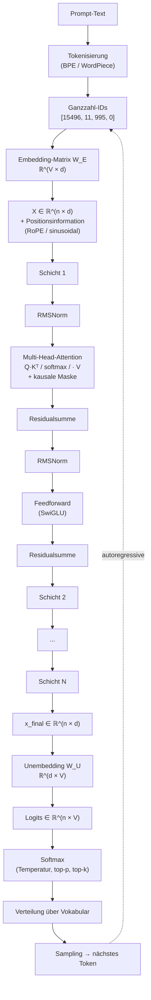

# Was in einem Transformer passiert, wenn du ihm einen Prompt sendest

> Technische Referenz: Architektur, Formeln, Inferenz, Training und die Grenzen dessen, was wir wissen.

---

## §1. Tokenisierung: vom Text zu ganzzahligen Bezeichnern

Wenn ein Modell einen Prompt erhält, liest es den Text nicht einfach. Der Text wird in **Tokens** aufgeteilt — Fragmente, die ganze Wörter, Wortteile, Zeichen oder Byte-Sequenzen sein können — durch einen deterministischen, vorab trainierten Algorithmus, typischerweise **Byte-Pair Encoding (BPE)**, **WordPiece** oder **Unigram**. Jedem Token wird ein eindeutiger ganzzahliger Bezeichner innerhalb eines endlichen Vokabulars zugewiesen.

Die Vokabulargröße, **V**, bestimmt, wie viele verschiedene Tokens das Modell erkennen kann. LLaMA 1 und 2 verwenden V = 32.000. LLaMA 3 erweitert auf V = 128.256. GPT-4 liegt bei ca. V = 100.277. Mehrsprachige Modelle tendieren zu größeren Vokabularen, um nicht-lateinische Zeichen darzustellen, ohne Tokens pro Zeichen zu verschwenden.

Der Tokenizer ist nicht neutral. Derselbe Text kann je nach Algorithmus und Trainingskorpus des Tokenizers mehr oder weniger Tokens ergeben. Anthropic dokumentierte, dass **Claude Opus 4.7 den Tokenizer gegenüber Opus 4.6 änderte** und dass derselbe Input zwischen **1,0× und 1,35× mehr Tokens** erzeugt. Das beeinflusst direkt die API-Kosten, den Verbrauch des Kontextfensters und alle nachgelagerten Operationen, die von der Sequenzlänge abhängen.

Nach der Tokenisierung ist eine Textsequenz eine Folge von Ganzzahlen — etwa `[15496, 11, 995, 0]`. Diese Ganzzahlen sind die Indizes, mit denen auf die Embedding-Matrix zugegriffen wird.

### Karte des vollständigen Ablaufs

Bevor wir in die Details gehen, ist das der Weg, den ein Prompt durch das Modell nimmt. Jeder Block wird in den folgenden Abschnitten erläutert.



Das Wichtigste an dieser Karte: die Form `n × d` bleibt über alle Schichten konstant. Was sich zwischen der Ausgabe einer Schicht und der nächsten ändert, sind die numerischen Werte im Tensor, nicht seine Geometrie. Und am Ende ist die Generierung autoregressive — das gesampelte Token wird an den Input angehängt und der Zyklus beginnt von vorne.

---

## §2. Notation: wie man `W ∈ ℝ^(a × b)` liest

Bevor wir fortfahren, lohnt es sich, die Notation festzulegen, weil sie ständig auftauchen wird.

- **W** — Name einer Matrix. Der Buchstabe W kommt von _weights_ (Gewichte). Die Subskripte (W₁, W_Q) sind interne Nomenklatur; mathematisch würde jeder Name funktionieren.
- **∈** — „gehört zu". Gibt an, dass das Objekt links ein Element der Menge rechts ist.
- **ℝ** — die Menge der reellen Zahlen. In der Praxis wird jede Zahl im Gleitkommaformat gespeichert: `float32`, `float16` oder `bfloat16` während des Trainings; `int8` oder `int4` quantisiert bei optimierter Inferenz.
- **ℝ^(a × b)** — Matrix reeller Zahlen mit `a` Zeilen und `b` Spalten.

Also liest sich `W₁ ∈ ℝ^(d × d_ff)`: „die Matrix W₁ ist eine Matrix reeller Zahlen mit d Zeilen und d_ff Spalten".

> **Konvention in diesem Leitfaden**: Ich verwende Zeilenvektoren. Die Aktivierung eines Tokens wird als `x ∈ ℝ^d` als Zeilenvektor interpretiert, und Transformationen werden als `xW` geschrieben, nicht `Wx`. Das legt die Formen der Matrizen fest: Um einen Vektor der Dimension `a` auf einen der Dimension `b` abzubilden, hat die Matrix die Form `ℝ^(a × b)`. Beispiel: W₁ ∈ ℝ^(d × d_ff) bildet einen Vektor der Dimension d via `xW₁` auf Dimension d_ff ab. Das ist die Konvention, die PyTorch, JAX und Transformer-Paper seit GPT-2 verwenden. Die alternative Konvention mit Spaltenvektoren und `Wx` ist mathematisch äquivalent, invertiert aber die Formen aller Matrizen.

Die Dimensionen, die wir fortlaufend verwenden werden:

| Symbol  | Bedeutung                               | LLaMA 7B | LLaMA 70B | GPT-3 175B |
| ------- | --------------------------------------- | -------- | --------- | ---------- |
| `d`     | Modelldimension (hidden size)           | 4.096    | 8.192     | 12.288     |
| `d_ff`  | interne Feedforward-Dimension           | 11.008   | 28.672    | 49.152     |
| `h`     | Anzahl der Attention-Heads              | 32       | 64        | 96         |
| `d_k`   | Dimension pro Head (= d/h)              | 128      | 128       | 128        |
| `N`     | Anzahl der Schichten                    | 32       | 80        | 96         |
| `V`     | Vokabulargröße                          | 32.000   | 32.000    | ~50.000    |

Diese Zahlen sind nicht beliebig — es sind Architekturentscheidungen. Wenn sich eine davon ändert, ändern sich die Formen aller Matrizen im Modell und damit die Gesamtanzahl der Parameter.

---

## §3. Embeddings: vom ganzzahligen Bezeichner zum Vektor

Die **Token-Embedding-Matrix**, W_E, hat die Form:

```
W_E ∈ ℝ^(V × d)
```

Es ist eine Tabelle mit V Zeilen (eine pro Token im Vokabular) und d Spalten (die Modelldimension). Wenn das Token mit Bezeichner `i` eingeht, wird Zeile `i` von W_E ausgewählt — äquivalent zu einem _Lookup_ oder formal zur Multiplikation des One-Hot-Vektors des Tokens mit W_E. Das Ergebnis ist ein Vektor in ℝ^d.

Für LLaMA 7B: W_E ist 32.000 × 4.096 ≈ 131 Millionen Parameter. Für LLaMA 3 70B mit erweitertem Vokabular: 128.256 × 8.192 ≈ 1.050 Millionen Parameter — allein in der Embedding-Tabelle.

Nach der Konvertierung jedes Tokens in seinen Vektor wird eine Sequenz von n Tokens als Tensor dargestellt:

```
X ∈ ℝ^(n × d)
```

Jede Zeile ist ein Token. Jede Spalte ist eine Dimension des Embedding-Raums. Diese Form `n × d` bleibt über alle Schichten des Modells konstant. Was sich ändert, sind die numerischen Werte im Tensor.

### Positionsinformation

Attention allein ist **permutationsinvariant**: Wenn man die Tokens des Inputs umsortiert, ändern sich die Attention-Scores symmetrisch und das Ergebnis pro Position bewegt sich mit ihnen, aber der Mechanismus kodiert nicht von sich aus „Token 5 kommt nach Token 3". Diese Information muss explizit hinzugefügt werden.

Drei Hauptfamilien:

1. **Gelernte Positions-Embeddings** (GPT-2, klassisches BERT): Es wird eine Matrix P ∈ ℝ^(n_max × d) trainiert und zum Token-Embedding addiert: `x_i = W_E[token_i] + P[i]`. Einschränkung: n_max ist beim Training fest.

2. **Sinusoidale Embeddings** (originaler Transformer, Vaswani et al. 2017): Die Position wird mit Sinus und Kosinus verschiedener Frequenzen kodiert. Erfordert keine gelernten Parameter und extrapoliert theoretisch auf nie gesehene Positionen.

3. **RoPE — Rotary Position Embedding** (Su et al. 2021, verwendet von LLaMA, Mistral, GPT-NeoX, PaLM und den meisten modernen offenen Modellen). Statt zum Embedding zu addieren, rotiert RoPE Queries und Keys in Dimensionspaaren um einen Winkel proportional zur Position. Die Rotation erhält das Skalarprodukt zwischen Vektoren mit festem relativen Abstand, was dem Attention-Mechanismus eine natürliche Sensitivität für relative Abstände zwischen Tokens gibt.

Es gibt auch Varianten wie **ALiBi** (Press et al. 2021, bei einigen BigScience-Modellen), das einen linearen Bias zu den Attention-Scores entsprechend dem Abstand zwischen Tokens addiert.

Die Wahl der Positionskodierung ist wichtig, weil sie bestimmt, wie gut das Modell auf längere Kontexte als die im Training gesehenen extrapoliert. RoPE mit Frequenzinterpolation hat Kontextfenster von 128K, 200K und 1M Tokens in modernen Modellen ohne vollständiges Neutraining möglich gemacht.

---

## §4. Der Schichtenstapel

Eine **Transformer-Schicht** ist ein Operationsblock, der den Tensor der Größe `n × d` empfängt und einen weiteren Tensor derselben Form erzeugt. Die Form bleibt über alle Schichten konstant. Was sich ändert, sind die numerischen Werte.

Der Vektor von Token 5 am Ausgang von Schicht 1 ist nicht derselbe Vektor wie am Ausgang von Schicht 12: er wurde durch die Gewichtsmatrizen jeder Zwischenschicht transformiert.

### Residualverbindung

Jede Schicht hat die Struktur:

```
x_neu = x_alt + Block(x_alt)
```

Diese Summe erfordert, dass beide Terme dieselbe Dimension haben. Deshalb behalten alle Schichten `d` konstant. Die Residualverbindung erfüllt zwei Funktionen:

1. **Stabilisiert den Gradienten** während des Trainings. Ohne sie verschwindet oder explodiert der Gradient bei sehr tiefen Netzen beim Zurückpropagieren durch Dutzende von Schichten.
2. **Lässt jede Schicht Information hinzufügen** zum bestehenden Vektor, nicht ihn ersetzen. Der Vektor, der aus Schicht 30 herauskommt, enthält Spuren dessen, was in Schicht 1 hineinging, plus alle Modifikationen, die die Zwischenschichten angesammelt haben.

### Normalisierung

Vor jedem Sub-Block gibt es außerdem eine **Normalisierungsschicht**, die den Vektor neu skaliert, um seine Magnitude unter Kontrolle zu halten und zu verhindern, dass Werte beim Durchlaufen vieler Schichten explodieren.

- **LayerNorm** (klassische Modelle): Für jeden Vektor x berechnet es den Mittelwert μ und die Standardabweichung σ über die d Dimensionen und skaliert neu: `LN(x) = γ · (x − μ)/σ + β`, wobei γ und β gelernte Parameter sind.
- **RMSNorm** (LLaMA, moderne Modelle): Vereinfachte Variante, die nur durch die quadratische Mittelnorm dividiert, ohne den Mittelwert abzuziehen: `RMSNorm(x) = γ · x / RMS(x)`. Empirisch liefert es äquivalente Ergebnisse zu LayerNorm mit geringerem Rechenaufwand und einem gelernten Parameter weniger.

Die genaue Position der Normalisierung (vor oder nach der Residualverbindung) definiert zwei Architekturen: **post-norm** (originaler Transformer) und **pre-norm** (GPT-2 und nachfolgende, LLaMA, fast alle modernen). Pre-norm ist stabiler beim Training.

---

## §5. Attention: die Mischung zwischen Positionen

Attention ist der Ort, wo Tokens miteinander kommunizieren. Es ist der Mechanismus, der dem Transformer seine Fähigkeit gibt, Kontext zu verarbeiten.

### Die drei Projektionen: Q, K, V

Für jedes Token werden drei verschiedene Projektionen seines Vektors mittels dreier Gewichtsmatrizen berechnet:

```
q = x W_Q      (query)
k = x W_K      (key)
v = x W_V      (value)
```

Wobei `x ∈ ℝ^d` der Vektor des Tokens (Zeile) ist und:

```
W_Q, W_K, W_V ∈ ℝ^(d × d_k)
```

Die drei Projektionen für alle n Tokens gestapelt, mit X ∈ ℝ^(n × d) als Tensor der gesamten Sequenz:

```
Q = X W_Q,   K = X W_K,   V = X W_V       Q, K, V ∈ ℝ^(n × d_k)
```

### Warum drei verschiedene Matrizen und nicht eine?

Wenn Q, K und V ohne Projektion vom selben Vektor x kämen, ist das Skalarprodukt x · x immer hoch — es ist die quadratische Norm des Vektors. Ohne verschiedene Projektionen würde jedes Token hauptsächlich auf sich selbst achten, und der Attention-Mechanismus würde zu einer trivialen Operation kollabieren.

Die Matrizen W_Q und W_K brechen diese Symmetrie. Sie projizieren denselben Vektor auf zwei verschiedene Positionen im gelernten Raum, und das Skalarprodukt zwischen diesen Projektionen kann beliebige Kompatibilitätskriterien lernen. W_V wird getrennt, weil die Information, die ein Token „transportiert", wenn es beachtet wird, nicht mit der Information übereinstimmen muss, die es zur „Ankündigung seiner selbst" verwendet. Die drei Funktionen zu trennen — fragen, sich ankündigen, transportieren — gibt dem Modell die Flexibilität, verschiedene Arten von Beziehungen zwischen Tokens zu lernen.

Formal:

- **W_Q** definiert, wie ein Token eine Frage formuliert.
- **W_K** definiert, wie ein Token sich ankündigt.
- **W_V** definiert, welche Information es transportiert, wenn ein anderes Token ihm Aufmerksamkeit schenkt.

Q und K leben im selben Raum (ℝ^d_k), weil sie durch Skalarprodukt verglichen werden müssen. V kann im Prinzip in einem anderen Raum leben, obwohl es in der Praxis ebenfalls ℝ^d_k ist.

### Die Formel der skalierten Attention

```
Attention(Q, K, V) = softmax( (Q · Kᵀ) / √d_k ) · V
```

Stück für Stück:

**Q · Kᵀ** erzeugt eine Matrix der Größe `n × n`. Mit Zeilenvektoren berechnet `Q · Kᵀ` Skalarprodukte zwischen Zeilen von Q und Zeilen von K: jeder Eintrag (i, j) ist das Skalarprodukt zwischen der Query von Token i (Zeile i von Q) und dem Key von Token j (Zeile j von K). Es ist ein Skalar, der misst, wie kompatibel diese beiden Tokens nach dem Kriterium sind, das W_Q und W_K während des Trainings gelernt haben.

**Division durch √d_k** ist eine numerische Normalisierung. Wenn d_k groß ist, wachsen die Skalarprodukte in Magnitude und drängen den Softmax in Bereiche, wo der Gradient praktisch null ist (Sättigung). Division durch √d_k hält die Werte in einem Bereich, wo der Softmax nützlichen Gradienten hat. Es hat keine semantische Bedeutung — es ist numerische Stabilität.

**Softmax zeilenweise** wandelt jede Zeile in eine Wahrscheinlichkeitsverteilung um, die zu 1 summiert. Zeile i sagt: „Von meiner gesamten Aufmerksamkeit, welchen Anteil widme ich jedem Token j".

**Multiplikation mit V** erzeugt das Ergebnis: der Ausgabevektor von Token i ist eine Linearkombination der Value-Vektoren aller zugänglichen Tokens, gewichtet durch die Attention-Gewichte.

### Kleines numerisches Beispiel

Nehmen wir eine Spielzeugsequenz mit `n = 3` Tokens und Dimension pro Head `d_k = 4`. Angenommen, nach Anwendung von W_Q und W_K erhalten wir:

```
Q = [[ 1.0,  0.0,  1.0,  0.0],     ← Query von Token 1
     [ 0.0,  1.0,  0.0,  1.0],     ← Query von Token 2
     [ 0.5,  0.5,  0.5,  0.5]]     ← Query von Token 3

K = [[ 1.0,  0.0,  1.0,  0.0],     ← Key von Token 1
     [ 0.0,  1.0,  0.0,  1.0],     ← Key von Token 2
     [ 1.0,  1.0,  0.0,  0.0]]     ← Key von Token 3
```

**Schritt 1 — Skalarprodukte** (`Q · Kᵀ`). Jeder Eintrag (i, j) ist das Skalarprodukt zwischen Zeile i von Q und Zeile j von K:

```
         k_1   k_2   k_3
       ┌                 ┐
q_1   │   2.0   0.0   1.0  │
q_2   │   0.0   2.0   1.0  │
q_3   │   1.0   1.0   1.0  │
       └                 ┘
```

Lesart: Query 1 ist sehr kompatibel mit Key 1 (Score 2.0), gar nicht mit Key 2 (0.0) und mittel mit Key 3 (1.0). Query 3 sieht durch seine Symmetrie alle drei Keys als gleich kompatibel.

**Schritt 2 — Skalierung** (`÷ √d_k = ÷ 2`):

```
       ┌                  ┐
       │  1.00  0.00  0.50  │
       │  0.00  1.00  0.50  │
       │  0.50  0.50  0.50  │
       └                  ┘
```

**Schritt 3 — Softmax zeilenweise**. Jede Zeile wird normalisiert, so dass sie zu 1 summiert. Für Zeile 1, `softmax([1.0, 0.0, 0.5]) ≈ [0.506, 0.186, 0.307]`:

```
       ┌                       ┐
       │  0.506  0.186  0.307  │   ← Token 1 beachtet hauptsächlich sich selbst
       │  0.186  0.506  0.307  │   ← Token 2 beachtet hauptsächlich sich selbst
       │  0.333  0.333  0.333  │   ← Token 3 verteilt Aufmerksamkeit gleichmäßig
       └                       ┘
```

Das sind die **Attention-Gewichte**. Jede Zeile ist eine Wahrscheinlichkeitsverteilung über die drei Tokens.

**Schritt 4 — Multiplikation mit V**. Die Ausgabe von Token i ist die gewichtete Kombination der Zeilen von V gemäß Zeile i der Gewichte. Wenn V drei Zeilen v_1, v_2, v_3 hat, ist die Ausgabe von Token 1 `0.506·v_1 + 0.186·v_2 + 0.307·v_3`.

Das, für jeden Head parallel wiederholt, konkateniert und durch W_O projiziert, ist genau das, was in einer Attention-Schicht passiert. Die gesamte Operation sind vier Matrixmultiplikationen und ein Softmax. Alles andere — kausale Maske, Multi-Head, Residual, Normalisierung — sind Hüllen um diesen Kern.

### Die kausale Maske

In generativen Modellen wie GPT, LLaMA oder Claude wird vor dem Softmax eine **kausale Maske** angewendet: An Positionen (i, j) mit j > i wird Score = −∞ gesetzt, was nach dem Softmax Gewicht = 0 ergibt. Das Ergebnis: Token i kann nur auf Positionen j ≤ i achten, nie auf die Zukunft.

Auf das obige Beispiel angewendet, würde die skalierte Matrix vor dem Softmax mit −∞ an Positionen oberhalb der Diagonale lauten:

```
       ┌                  ┐
       │  1.00   −∞    −∞  │
       │  0.00  1.00   −∞  │
       │  0.50  0.50  0.50 │
       └                  ┘
```

Und nach dem Softmax:

```
       ┌                       ┐
       │  1.000  0.000  0.000  │   ← Token 1 sieht nur sich selbst
       │  0.269  0.731  0.000  │   ← Token 2 sieht Token 1 und sich selbst
       │  0.333  0.333  0.333  │   ← Token 3 sieht alle vorherigen und sich selbst
       └                       ┘
```

Das ermöglicht, dass das Modell **autoregressive** ist. Während des Trainings sagt das Modell für die gesamte Sequenz parallel das nächste Token vorher, aber jede Position kann nur Information von vorherigen Positionen nutzen. Würde es „in die Zukunft sehen" können, würde es beim Vorhersagen von dem schummeln, was es bereits vor sich hat.

In bidirektionalen Modellen wie BERT gibt es keine kausale Maske — aber diese Modelle sind nicht generativ; sie sind für andere Aufgaben trainiert (Klassifikation, Masked Language Modeling).

### Multi-Head-Attention

Eine einzelne Attention mit Dimension d_k = d würde das Modell auf ein einziges Muster von Beziehungen zwischen Tokens beschränken. Die Lösung ist, **mehrere Attentions parallel auszuführen**, jede mit eigenem Satz von Q-, K-, V-Matrizen — jeder Satz wird **Head** genannt.

Bei h Heads operiert jeder Head auf Dimension d_k = d / h. Für LLaMA 7B: d = 4.096, h = 32, d_k = 128.

Jeder Head berechnet seine eigene Ausgabe `Attention_i(Q_i, K_i, V_i) ∈ ℝ^(n × d_k)`. Die h Ausgaben werden entlang der Feature-Dimension konkateniert:

```
Concat(Head_1, ..., Head_h) ∈ ℝ^(n × d)
```

Und durch eine finale Matrix, **W_O ∈ ℝ^(d × d)**, projiziert:

```
attention_output = Concat(Head_1, ..., Head_h) · W_O
```

W_O erfüllt zwei Funktionen: Es mischt die Information, die die verschiedenen Heads parallel extrahiert haben, und projiziert sie zurück auf Dimension d, damit sie residual zum Block-Input addiert werden kann.

Warum funktioniert Multi-Head? Weil verschiedene Heads lernen können, auf verschiedene Aspekte des Kontexts zu achten. Ein Head kann sich auf Koreferenzen spezialisieren (welches Pronomen bezieht sich auf welche Entität), ein anderer auf syntaktische Struktur, ein weiterer auf Langstreckenbeziehungen. Die mechanistische Interpretierbarkeit hat konkrete Heads mit spezifischen Funktionen gefunden — _induction heads_, die Muster kopieren, _name mover heads_, die Namensinformation zwischen Positionen verschieben, usw.

---

## §6. Feedforward: die Transformation pro Position

Der zweite Sub-Block jeder Schicht ist der **Feedforward** (FFN oder MLP). Hier gibt es keine Kommunikation zwischen Tokens — jeder Vektor wird isoliert verarbeitet.

### Klassische Version (GPT-2, GPT-3)

```
FFN(x) = GeLU(x W₁) W₂
```

Wobei:

```
W₁ ∈ ℝ^(d × d_ff)
W₂ ∈ ℝ^(d_ff × d)
```

Die Operation expandiert den Vektor von Dimension d auf eine interne Dimension d_ff via `xW₁`, wendet eine komponentenweise Nichtlinearität an und projiziert ihn via `W₂` zurück auf d. Die klassische Konvention ist d_ff = 4·d.

Warum expandieren? Eine lineare Transformation d → d hat maximalen Rang d. Geht man auf eine größere Dimension d_ff > d, gibt man dem Feedforward einen breiteren Raum, in dem die Nichtlinearität angewendet wird, bevor zurückprojiziert wird. Das ermöglicht die Darstellung komplexerer Funktionen als eine einfache Transformation d → d.

### Moderne Version: SwiGLU

Modelle wie LLaMA, PaLM, Mistral verwenden **SwiGLU** (Shazeer 2020), eine Variante mit Gate:

```
FFN_SwiGLU(x) = ( Swish(x W₁) ⊙ (x W₃) ) W₂
```

Wobei:

- `Swish(z) = z · σ(z)`, mit σ der Sigmoid-Funktion. Es ist eine weiche Aktivierung ähnlich GeLU.
- `⊙` ist das elementweise Produkt (Hadamard-Produkt).
- W₁, W₃ ∈ ℝ^(d × d_ff) sind Expansionsmatrizen.
- W₂ ∈ ℝ^(d_ff × d) ist die Kontraktionsmatrix.

Es gibt drei Matrizen, nicht zwei. Die Intuition: Statt eine feste Nichtlinearität auf den projizierten Vektor anzuwenden, werden zwei Projektionen des Inputs berechnet. Eine durchläuft Swish (der _Aktivierungszweig_) und die andere bleibt linear (der _Gate-Zweig_). Sie werden elementweise multipliziert. Diese Multiplikation lässt Teile des Vektors den Informationsfluss dynamisch „öffnen" oder „schließen".

Empirisch performt SwiGLU besser als GeLU bei gleichem Parameterbudget. Da es drei statt zwei Matrizen hat, reduzieren Modelle mit SwiGLU typischerweise d_ff (von 4d auf ~2,7d), um die Gesamtparameteranzahl vergleichbar zu halten. Für LLaMA 7B: d = 4.096, d_ff = 11.008, Verhältnis ≈ 2,69×.

### Die Rolle der Nichtlinearitäten

Die Nichtlinearitäten (GeLU, ReLU, Swish, exaktes GELU) sind **nicht gelernt** — es sind feste Funktionen. Aber sie sind kritisch. Ohne sie würde das Stapeln linearer Schichten mathematisch kollabieren: Die Komposition linearer Funktionen ist eine lineare Funktion, und eine lineare Funktion kann keine Sprache lernen (kann keine bedingten Abhängigkeiten, disjunkte Entscheidungen, Hierarchien modellieren).

Attention hat eine eigene Nichtlinearität (den Softmax), aber von einer anderen Natur — sie operiert zwischen Positionen, nicht innerhalb der Repräsentation eines Tokens. Die Nichtlinearitäten des Feedforwards liefern die Ausdruckskraft pro Position.

---

## §7. Die drei Gewichtsfamilien: Zusammenfassung

Es gibt drei funktionale Kategorien von Gewichten in einem Transformer:

1. **Eingangs- und Ausgangsgewichte** (W_E, W_U): übersetzen zwischen dem diskreten Vokabular und dem kontinuierlichen Vektorraum der Dimension d.
2. **Mischungsgewichte zwischen Positionen** (W_Q, W_K, W_V, W_O): ermöglichen einem Token, Information von anderen aufzunehmen.
3. **Transformationsgewichte pro Position** (W₁, W₂, W₃ in SwiGLU; W₁, W₂ in klassischen Varianten): verarbeiten jeden Vektor isoliert.

Jede Schicht des Modells hat ihren eigenen vollständigen Satz von Gewichten der Kategorien 2 und 3. Sie werden nicht zwischen Schichten geteilt. LLaMA 7B mit N = 32 Schichten hat 32 verschiedene W_Q, 32 W_K, 32 W_V, 32 W_O, 32 Sätze {W₁, W₂, W₃}, alle mit unabhängig während des Trainings gelernten Werten. Die Embeddings W_E und das Unembedding W_U sind einzigartig für das gesamte Modell. In manchen Modellen werden sie _gekoppelt_ (tied embeddings), indem dieselbe Matrix für beide Operationen verwendet wird, um Parameter zu sparen.

---

## §8. Parameteranzahl: eine Schicht von LLaMA 7B

Um die Größenordnung deutlich zu machen. LLaMA 7B mit d = 4.096, d_ff = 11.008, h = 32, d_k = 128:

| Matrix               | Form           | Parameter     |
| -------------------- | -------------- | ------------- |
| W_Q                  | 4.096 × 4.096  | 16,78 M       |
| W_K                  | 4.096 × 4.096  | 16,78 M       |
| W_V                  | 4.096 × 4.096  | 16,78 M       |
| W_O                  | 4.096 × 4.096  | 16,78 M       |
| W₁ (FFN, gate)       | 4.096 × 11.008 | 45,08 M       |
| W₂ (FFN, down)       | 11.008 × 4.096 | 45,08 M       |
| W₃ (FFN, up, SwiGLU) | 4.096 × 11.008 | 45,08 M       |
| **Gesamt pro Schicht**|               | **≈ 202,4 M** |

Multipliziert mit 32 Schichten: ≈ **6.480 Millionen** Parameter allein in Transformer-Blöcken. Der Rest bis zu den tatsächlichen 6.738 Millionen des Modells kommt von der Embedding-Matrix (W_E, ~131 M), den RMSNorm-Parametern (vernachlässigbar) und dem Ausgabe-Head W_U (in LLaMA an W_E gekoppelt).

Diese Struktur skaliert, wenn man von 7B auf 70B geht. Es werden keine neuen Konzepte hinzugefügt — d, h, N, d_ff werden erhöht, und alle Matrizen wachsen proportional.

---

## §9. Unembedding und Sampling: vom Vektor zum Text

Nach N Schichten hat der Ausgabetensor die Form n × d. Um die Vorhersage des nächsten Tokens zu erzeugen, wird die **Unembedding-Matrix** angewendet:

```
W_U ∈ ℝ^(d × V)

logits = x_final W_U
```

Für jede Position in der Sequenz erzeugt diese Operation einen Vektor der Größe V — einen Score für jedes mögliche Token des Vokabulars. Diese Vektoren sind die **Logits**.

Softmax auf die Logits angewendet ergibt eine Wahrscheinlichkeitsverteilung über das Vokabular:

```
P(Token | Kontext) = softmax(logits)
```

Aber diese Verteilung ist kein Text. Um ein konkretes Token zu erzeugen, muss **gesampelt** werden. Hier kommen die Sampling-Parameter ins Spiel:

- **Temperatur T**: skaliert die Logits vor dem Softmax. `softmax(logits / T)`. T < 1 konzentriert die Masse auf die wahrscheinlichsten Tokens (deterministischere Antworten). T > 1 streut die Verteilung (mehr Diversität). T = 0 entspricht dem Argmax (greedy decoding).
- **Top-p (nucleus sampling)**: filtert auf die Tokens, deren kumulative Wahrscheinlichkeit (von größter zu kleinster sortiert) den Schwellenwert p abdeckt. Bei p = 0,9 werden die weniger wahrscheinlichen Tokens verworfen, die zusammen die restlichen 10 % ergeben.
- **Top-k**: schränkt das Sampling auf die k wahrscheinlichsten Tokens ein. Alle anderen werden auf Wahrscheinlichkeit null gesetzt.

Die Wahl des nächsten Tokens ist dann ein zufälliges Sampling aus der gefilterten Verteilung. Einmal gewählt, wird es an den Input angehängt und das Modell erneut ausgeführt, um das nächste vorherzusagen. Das ist die **autoregressive Generierung**.

Manche kommerziellen Modelle beschränken oder fixieren die Sampling-Parameter. Anthropic gibt bei Claude Opus 4.7 einen 400-Fehler zurück, wenn Temperature, top_p oder top_k auf Nicht-Standard-Werte gesetzt werden. Die Kontrolle über die Generierung verschiebt sich vom Sampling hin zum Prompt und den Reasoning-Effort-Stufen des Modells.

---

## §10. Unterschied zwischen Schichten: die emergente Hierarchie

Jede Schicht hat ihren eigenen vollständigen Satz von Gewichten, verschieden von denen jeder anderen Schicht. Empirisch zeigt sich über viele mit Interpretierbarkeitstechniken analysierte Modelle eine ungefähre Hierarchie:

- **Frühe Schichten** (15–20 % der Anfangstiefe): verarbeiten Low-Level-Merkmale — Token-Muster, Orthografie, Spracherkennung, grundlegende syntaktische Struktur.
- **Mittlere Schichten**: erledigen die schwere Verständnisarbeit — kombinieren syntaktische Information zu semantischen Strukturen, lösen Koreferenzen auf, identifizieren Beziehungen zwischen Entitäten.
- **Späte Schichten** (letzten 20–30 %): spezialisieren sich auf die Ausgabe — integrieren alle angesammelten Informationen und leiten sie zu einer konkreten Vorhersage des nächsten Tokens.

Diese Hierarchie ist nicht starr und nicht perfekt trennbar, und die Details unterscheiden sich zwischen Modellen. Aber das Muster ist konsistent. Der Grund, warum das Stapeln vieler Schichten funktioniert: Jede Schicht kann eine relativ einfache Transformation durchführen, und die Komposition vieler einfacher Transformationen ermöglicht den Aufbau zunehmend abstrakterer Repräsentationen.

### Logit Lens: das Modell „entscheidet" Schicht für Schicht

Eine Interpretierbarkeitstechnik namens **Logit Lens** (Nostalgebraist 2020) besteht darin, die intermediären Aktivierungen jeder Schicht mit W_U zu projizieren, als wären sie die finale Ausgabe, um zu sehen, welches Token das Modell vorhersagen würde, wenn es dort aufhörte. Was man beobachtet, ist aufschlussreich: Die „Entscheidung" über das nächste Token bildet sich schrittweise heraus.

- In frühen Schichten ist die Logit-Lens-Verteilung diffus und konzentriert sich auf generische lexikalische Muster.
- In mittleren Schichten beginnt semantisches Commitment — das Modell hat bereits eine ungefähre Idee vom Typ des kommenden Tokens.
- In späten Schichten konvergiert die Verteilung zum finalen Token, oft mehrere Schichten vor dem Ende.

Das bedeutet, das Modell entscheidet nicht im letzten Schritt. Es entscheidet entlang der gesamten Kette, und die letzten Schichten materialisieren eine Entscheidung, die in den Zwischenrepräsentationen bereits getroffen worden war.

---

## §11. Effektive Dimensionalität: warum d ≠ d_real

Die Vektoren des Modells leben in ℝ^d. Für LLaMA 7B sind das 4.096 nominale Dimensionen pro Token in jeder Schicht. Aber die nützliche Information verteilt sich nicht gleichmäßig über diese 4.096 Dimensionen. Sie konzentriert sich in Unterräumen von **effektiv viel geringerer Dimension** als d.

Dies zeigt sich auf drei unabhängige Arten:

**Spektrumanalyse** (SVD-Zerlegung der Aktivierungen über ein Korpus). Das Spektrum der Singulärwerte fällt schnell ab — eine Handvoll Richtungen akkumuliert den größten Teil der Varianz, und der lange Schwanz trägt wenig bei. Die effektive Dimension (definiert als _stable rank_ oder Rang bei 99 % der Varianz) liegt oft ein oder zwei Größenordnungen unter d.

**Interpretierbare Merkmale**. Die Arbeit zu **Sparse Autoencodern** (Anthropic, OpenAI, verschiedene akademische Labore ab 2023–2024) trainiert überparametrisierte Zerlegungen der Aktivierungen. Was auftaucht, sind Tausende oder Zehntausende interpretierbarer „Merkmale" (die Idee der Golden Gate Bridge, Code mit Bugs, unterwürfige Schmeichelei, ein bestimmtes Datum usw.), die in spezifischen Richtungen des Raums leben. Jede Aktivierung ist eine spärliche Superposition weit mehr Merkmale als d, was darauf hindeutet, dass das Modell **Superposition** verwendet: Es kodiert mehr Konzepte als es nominale Dimensionen hat, indem es ausnutzt, dass die meisten Konzepte nicht gleichzeitig aktiviert sind.

**Robustheit gegenüber Pruning**. Das Entfernen signifikanter Anteile der Gewichte (strukturiertes Pruning, Low-Rank-Approximation) degradiert die Leistung typischerweise viel weniger als erwartet. Auf 30–50 % ihrer ursprünglichen Parameter komprimierte Modelle behalten einen Großteil ihrer Kapazität. Das ist nur möglich, wenn die Information nicht gleichmäßig verteilt war — es gab ausnützbare Redundanz.

### Praktische Konsequenzen

- **Kompression und Quantisierung funktionieren**. Die Quantisierung auf int8 oder int4 erhält den Großteil der Qualität, weil die relevanten Freiheitsgrade weniger sind als die offensichtlichen. Moderne Techniken von quantization-aware training (QAT) und post-training quantization (PTQ) nutzen dies systematisch.
- **Destillation funktioniert**. Kleine Modelle, die trainiert werden, die Ausgabeverteilungen (oder Aktivierungen) großer Modelle zu imitieren, erfassen einen Großteil der ursprünglichen Kapazität mit einem Bruchteil der Parameter, weil die „nützliche Kapazität" des großen Modells nicht in seinen d nominalen Dimensionen lag, sondern in strukturierteren Mustern.
- **Mechanistische Interpretierbarkeit ist machbar, aber schwierig**. Dass Information in niedrigdimensionalen Unterräumen lebt, bedeutet nicht, dass diese Unterräume orthogonal oder sauber sind — sie sind in Superposition. Deshalb erfordert ihre Dekodierung Hilfsmodelle (wie SAEs) und ist nicht durch direktes Lesen der Gewichte sichtbar.

Die operative Idee: Wenn man an ein Modell mit „Milliarden von Parametern" denkt, ist das korrekte mentale Bild nicht „Milliarden verschiedener Dinge, die das Modell weiß". Es ist „Milliarden von Parametern, die eine viel kleinere Anzahl effektiver Muster kodieren, in Superposition, über das gesamte Netzwerk verteilt".

---

## §12. Warum diese Architektur für Sprache funktioniert

Bis hierhin haben wir beschrieben, **wie** der Transformer funktioniert. Die natürliche Frage ist **warum** — welche strukturellen Eigenschaften ihn so geeignet für die Modellierung von Sprache machen. Die Antwort ist nicht vollständig: Der empirische Erfolg läuft der Theorie voraus. Aber es gibt mehrere Hypothesen mit guter empirischer Unterstützung.

### Hierarchische Komposition

Sprache ist von Natur aus kompositional: Morpheme → Wörter → Phrasen → Sätze → Absätze → Diskurs. Jede Ebene wird durch Kombination von Elementen der vorherigen Ebene aufgebaut. Der tiefe Schichtenstapel des Transformers erlaubt es jeder Schicht, auf einem leicht höheren Abstraktionsniveau zu operieren als die vorherige. Was empirisch beobachtet wird — frühe Schichten lexikalisch, mittlere semantisch, späte diskursiv — deckt sich mit dieser Struktur der Sprache.

Nicht dass die Transformer-Designer diese Hierarchie kodiert hätten. Sie entstand aus dem Training. Aber die Architektur hat die Tiefe und die Primitiven, um sie darzustellen.

### Lineare/nichtlineare Abwechslung

Jede Schicht wechselt lineare Transformationen (die Attention- und Feedforward-Matrizen) mit Nichtlinearitäten (Softmax, GeLU, SwiGLU) ab. Diese Abwechslung gibt dem Transformer seine Ausdruckskraft. Eine einzelne lineare Transformation bildet Hyperebenen auf Hyperebenen ab. Lineare Schichten ohne Nichtlinearität zu stapeln kollabiert zu einer einzigen Linearen. Aber mit linearer und nichtlinearer Abwechslung bei ausreichender Tiefe erhält man einen **universellen Approximator**: Jede stetige Funktion kann mit ausreichender Genauigkeit approximiert werden.

Das ist allgemeine Theorie neuronaler Netze (Cybenko 1989, Hornik 1991). Was der Transformer gegenüber früheren Architekturen beiträgt, ist nicht die Universalität — RNNs und MLPs hatten sie bereits — sondern die **spezifische Struktur**, die das Lernen stabil, parallelisierbar und rechnerisch effizient macht.

### Attention als dynamisches Routing

Das Kernstück des Transformers ist, dass die Informationsmischung zwischen Tokens **nicht durch die Architektur fixiert** ist. In einem RNN ist der Informationsfluss sequenziell und starr: Information von Token 1 breitet sich zu Token 100 aus, indem sie durch alle 98 Zwischenzustände geht. In einer CNN ist der Fluss lokal und fest: Jedes Token sieht nur seine Nachbarn in einem statischen Fenster.

Bei Attention **lernt das Modell, welche Tokens welchen Tokens Aufmerksamkeit schenken**. Die Matrix Q · Kᵀ wird dynamisch aus dem Inhalt der Sequenz berechnet. Das ist _dynamisches Routing_: Das Kommunikationsmuster zwischen Positionen ist eine Funktion des Inputs, nicht des Systemdesigns. Es ermöglicht beliebig lange Abhängigkeiten (Token 1 kann direkt Token 1000 beachten ohne Propagation) und kontextabhängige Muster (dasselbe Token kann sich in verschiedenen Sätzen sehr unterschiedlich verhalten).

Diese Flexibilität macht den Transformer bei Aufgaben effektiv, wo Abhängigkeiten lang, nicht-lokal und inhaltsabhängig sind — genau der Fall bei Sprache.

### Massiver Parallelismus

RNNs verarbeiten Tokens sequenziell, was sie beim Training in großem Maßstab teuer machte — die Trainingskosten wuchsen linear mit der Sequenzlänge und konnten auf GPUs nicht gut parallelisiert werden. Der Transformer verarbeitet beim Training und Prefill alle Tokens gleichzeitig, weil Attention durch Matrizen vollständig spezifiziert ist, die die GPU parallel multiplizieren kann.

Das ist der **praktische** Grund, warum sie früher als vorherige Architekturen skalierten. Mehr Daten, mehr Parameter, mehr Rechenleistung, alles von bereits verfügbarer Hardware absorbiert. Der Transformer ist nicht die theoretisch eleganteste Architektur — er nutzt moderne Hardware am besten.

### Komposition der vier Eigenschaften

Hierarchische Komposition + lineare/nichtlineare Abwechslung + dynamisches Routing + Parallelismus ist die Kombination, die keine frühere Architektur vollständig hatte. RNNs hatten sequenzielle Komposition aber keinen Parallelismus. MLPs hatten Nichtlinearität aber kein dynamisches Routing. CNNs hatten Parallelismus aber festes Routing. Der Transformer vereint alle vier.

Warum genau diese Kombination die beobachteten emergenten Verhaltensweisen erzeugt — Kettendenken, in-context learning, Generalisierung auf nie gesehene Aufgaben — ist Gegenstand aktiver Forschung. Der Erfolg ist da. Die vollständige Erklärung noch nicht.

---

## §13. Inferenz: Prefill und Decode

Die operative Frage ist, wie viele Tokens gleichzeitig verarbeitet werden. Die Antwort hängt von der Phase ab.

### Prefill: massiver Parallelismus

Wenn man dem Modell einen Prompt mit n Tokens sendet, gehen alle n gleichzeitig in einem einzigen Durchlauf durch den Schichtenstapel. Jede Schicht verarbeitet die gesamte n × d-Matrix auf einmal.

- Matrix-Matrix-Multiplikationen sind auf GPUs massiv parallelisiert.
- Der Feedforward ist trivial parallel pro Position — jedes der n Tokens wird gleichzeitig verarbeitet, ohne Interdependenzen.
- Attention wird ebenfalls parallelisiert: Die Score-Matrix Q · Kᵀ wird auf einmal für alle gültigen Paare (i, j) berechnet, mit Größe n × n.

Diese Phase **sättigt die Hardware**. Hier ist die GPU am nächsten an ihrer Spitzenleistung. Die Kosten pro Prefill-Token sind viel geringer als die Kosten pro Decode-Token.

Hier **skaliert Attention quadratisch** mit der Kontextlänge. Für n = 1.000 sind es eine Million Scores pro Head pro Schicht. Für n = 10.000 hundert Millionen. Für n = 100.000 zehn Milliarden. Pro Schicht. Pro Head.

### Sequenzielle Abhängigkeit zwischen Schichten

Obwohl innerhalb einer Schicht alles Parallelisierbare gleichzeitig ausgeführt wird, **ist die Abhängigkeit zwischen Schichten sequenziell**. Schicht 5 kann nicht beginnen, bevor Schicht 4 fertig ist, weil sie deren Ausgabe als Eingabe benötigt. Der Stapel wird von oben nach unten, Schicht für Schicht, durchlaufen.

### Decode: sequenziell von Natur aus

Die Decode-Phase ist die Ausgabegenerierung. Das Modell erzeugt ein Token nach dem anderen und kann Token n+1 nicht generieren, ohne Token n generiert zu haben — das ist die autoregressive Natur. In jedem Decode-Schritt erzeugt ein einziger Durchlauf durch den gesamten Schichtenstapel ein einziges neues Token.

Die GPU ist während des Decodes **unterausgelastet**, weil sie nur eine Position verarbeitet. Das ist es, was die Generierung im Vergleich zum Prefill langsam macht, und warum Modelle nach dem ersten Moment zu „Zeit brauchen" scheinen.

---

## §14. KV-Cache: die Optimierung, die Decode praktikabel macht

Ohne Optimierung müsste jeder Decode-Schritt den vollständigen Forward-Pass über den gesamten Kontext erneut ausführen, einschließlich der Attention mit n × n-Score-Matrix. Das heißt, jeder einzelne Schritt ist bereits quadratisch in n, und die Gesamtkosten der Generierung von m Tokens würden wie O(m · n²) wachsen — für lange Kontexte nicht praktikabel.

Die Lösung ist der **KV-Cache**:

1. Während des Prefill werden die in jeder Schicht für jedes Token berechneten K und V im GPU-Speicher gespeichert.
2. Während des Decodes werden für das neue Token nur sein eigenes Q, K, V berechnet.
3. Die Attention des neuen Tokens wird zwischen seiner Query und allen akkumulierten K, V im Cache berechnet (alte + neue).
4. Die K und V des neuen Tokens werden dem Cache hinzugefügt.

Ergebnis: Jeder Decode-Schritt geht von O(n²) Attention-Operationen zu **O(n) Operationen** über. Die Attention des neuen Tokens gegen den Kontext ist eine 1 × n-Multiplikation pro Head pro Schicht, nicht n × n.

### Der Preis: Speicher

Der KV-Cache wächst linear mit der Kontextlänge und mit jeder Schicht des Modells. Für klassisches LLaMA 7B mit vollständiger Multi-Head-Attention in fp16:

```
bytes_pro_token = 2 (K und V) × N (Schichten) × h (Heads) × d_k × 2 (Bytes in fp16)
                = 2 × 32 × 32 × 128 × 2
                = 524.288 Bytes
                ≈ 0,5 MB pro Token
```

Für einen Kontext von 100.000 Tokens: **50 GB allein für den Cache**. Für einen Kontext von 1.000.000 Tokens, linear skaliert: 500 GB — unmöglich auf einer einzelnen GPU mit Standardspeicher.

Deshalb sind lange Kontexte in der Produktion teuer — nicht wegen der Rechenarbeit selbst, sondern wegen des Speichers, den der Cache während der gesamten Generierung lebendig halten muss, und wegen der Bandbreite, die benötigt wird, um diese Daten in jedem Decode-Schritt zwischen VRAM und GPU-Registern zu bewegen.

---

## §15. Attention-Varianten: die Ökonomie des KV-Cache

Der KV-Cache ist der praktische Engpass langer Kontexte. Fast alle modernen Attention-Varianten greifen dieses Problem aus verschiedenen Winkeln an.

### Multi-Head Attention (MHA): die Basislinie

Die originale Attention. Jeder Head hat seinen eigenen unabhängigen Satz von W_K und W_V. KV-Cache proportional zu h.

```
Cache MHA = h · n · d_k · 2 Bytes (fp16) · 2 (K und V) · N (Schichten)
```

Für LLaMA 7B: 32 Heads × 128 d_k = 4.096 Cache-K-Dimensionen + 4.096 V pro Schicht pro Token.

### Multi-Query Attention (MQA)

Vorgeschlagen von Shazeer (2019), übernommen in PaLM. Idee: h verschiedene Queries verwenden, aber **ein einzelnes K und ein einzelnes V gemeinsam** für alle Heads.

- W_Q hat weiterhin Größe d × (h · d_k) — erzeugt h Queries.
- W_K und W_V haben Größe d × d_k — erzeugen ein einziges K und ein einziges V.
- Die h Queries achten alle auf dasselbe K, V.

**KV-Cache-Reduktion**: Faktor h. Für LLaMA 7B wäre es 32-mal kleiner.

**Kosten**: Qualitätsverlust. K und V zwischen allen Heads zu teilen begrenzt die Diversität der Attention-Muster, die das Modell lernen kann. Die Heads verlieren die Fähigkeit zur Spezialisierung auf verschiedene Kontextaspekte.

### Grouped-Query Attention (GQA)

Vorgeschlagen von Ainslie et al. (2023). Es ist der Kompromiss zwischen MHA und MQA und ist das, was **LLaMA 2 70B, LLaMA 3, Mistral 7B+ und fast alle modernen Produktionsmodelle** verwenden.

Idee: die h Heads in g Gruppen aufteilen, wobei jede Gruppe K und V teilt. Wenn h = 32 und g = 8, gibt es 32 Queries aber nur 8 Keys und 8 Values; jede Gruppe von 4 Heads teilt ein K und ein V.

**KV-Cache-Reduktion**: Faktor h/g. Für g = 8, h = 32, Reduktion 4×.

**Warum es empirisch funktioniert**: In MHA lernen viele Heads redundante Muster. Sie zu gruppieren erzwingt Effizienz ohne signifikanten Qualitätsverlust. Das ist der aktuelle Standard.

### Sliding Window Attention

Verwendet in Mistral, Longformer und für lange Kontexte optimierten Modellen. Statt dass jedes Token auf alle vorherigen achtet, **achtet jedes Token nur auf ein festes Fenster der W neuesten Tokens**.

- Bei W = 4.096 achtet das Token an Position 10.000 nur auf Tokens 5.904 bis 10.000.
- Attention-Komplexität: von O(n²) zu O(n · W).
- KV-Cache: wird zirkulär. Nur die letzten W Tokens werden behalten.

**Abwägung**: Direkter Zugriff auf sehr entfernte Tokens geht verloren. Aber da Schichten gestapelt werden, propagiert Information indirekt — ein Token in Schicht 10, das innerhalb seines Fensters achtet, absorbiert Information von Tokens, die in früheren Schichten Information von noch weiter entfernten aufgenommen haben. Das nennt sich **receptive field**: Mit genügend Schichten wächst das effektive Fenster.

Mistral 7B verwendete ein Sliding Window von 4.096 mit einem Kontext bis zu 32K, gestützt auf das Receptive Field für lange Abstände.

### Sparse Attention

Familie von Techniken, bei denen nicht alle Positionen auf alle achten. Die n × n-Attention-Matrix wird dünn besetzt — die meisten Einträge sind konstruktionsbedingt null.

Häufige Muster:

- **Block-sparse**: Die Sequenz wird in Blöcke aufgeteilt und Attention wird nur innerhalb jedes Blocks berechnet, plus einige globale Verbindungen.
- **Strided**: Jedes Token achtet auf Positionen in festen Abständen (1, 2, 4, 8, ... zurück).
- **Random**: Jedes Token achtet auf eine feste zufällige Teilmenge von Positionen.
- **Globale Tokens**: Bestimmte bezeichnete Tokens achten auf alle und werden von allen beachtet. Das macht BigBird (Zaheer et al. 2020) und Longformer.

**Abwägung**: Ausdrucksverlust — das Modell kann kein beliebiges Attention-Muster lernen, nur die mit der dünn besetzten Struktur kompatiblen. Dafür skaliert es zu Kontexten von Hunderttausenden oder Millionen Tokens mit handhabaren Kosten.

### Vergleichstabelle

| Variante          | KV-Cache-Größe      | Relative Qualität                                               |
| ----------------- | ------------------- | --------------------------------------------------------------- |
| MHA               | h · n · d_k         | Referenz / maximale Flexibilität                                |
| GQA (g Gruppen)   | g · n · d_k         | In der Praxis fast identisch bei deutlich kleinerem Cache       |
| MQA               | n · d_k             | Etwas schlechter als MHA unter gleichen Bedingungen             |
| Sliding Window    | W · d_k (konstant)  | Gut für lokale Aufgaben, verliert direkte Fernabhängigkeiten    |
| Sparse            | hängt vom Muster ab | Variabel, aufgabenabhängig                                      |

MHA ist die theoretische Basislinie mit maximaler Flexibilität pro Head, aber nicht notwendigerweise die praktische Höchstqualitätsoption: Mit gleichem Parameterbudget und Training übertrifft GQA häufig MHA oder kommt ihm gleich, weil es Kapazität für andere Teile des Modells freisetzt. Der Produktionsstandard ist GQA aus diesem Grund — äquivalente Qualität zu MHA mit einem mehrfach kleinerem Cache.

---

## §16. FlashAttention: Speicheroptimierung, keine Rechenoptimierung

**FlashAttention** (Dao et al. 2022, FlashAttention-2 in 2023, FlashAttention-3 in 2024) ist die andere große moderne Optimierung. **Es reduziert nicht die Anzahl theoretischer Operationen (FLOPs)** — das Ergebnis ist mathematisch identisch mit dem der Standard-Attention. Was es reduziert, ist die **Echtzeit**, indem es die Speicherzugriffe drastisch verringert, die die praktischen Kosten dominieren.

### Das Problem

Bei Standard-Attention wird die Score-Matrix S = Q · Kᵀ / √d_k der Größe n × n im HBM-Speicher materialisiert (dem Haupt-VRAM der GPU). Danach wird Softmax darauf angewendet, was eine weitere n × n-Matrix erzeugt. Danach wird mit V multipliziert. Jeder dieser Schritte liest und schreibt vollständige Matrizen in HBM.

HBM ist langsam verglichen mit On-Chip-SRAM (den Registern und Caches der GPU). Bei großem n ist der Engpass nicht die Anzahl der Gleitkommaoperationen — es ist die Speicherbandbreite. Die GPU wartet die meiste Zeit auf Daten.

### Die Lösung

FlashAttention reorganisiert die Berechnung mittels **Tiling**:

1. Teilt Q, K, V in kleine Blöcke auf, die in SRAM passen.
2. Berechnet für jedes Blockpaar (Q_i, K_j) seinen partiellen Beitrag zur Attention, ohne die vollständige Matrix S zu materialisieren.
3. Akkumuliert Teilergebnisse unter Anwendung eines **Online-Softmax** — ein numerischer Trick, der es ermöglicht, Softmax über eine Folge von Blöcken zu berechnen, ohne alle Werte im Voraus zu kennen.
4. Schreibt das finale Ergebnis O einmal in HBM.

Die Hauptersparnis ist an Zwischenspeicher: Die n × n-Matrix wird nie materialisiert. Die Operationskomplexität bleibt O(n²), aber die Speicherkomplexität geht von O(n²) zu O(n).

**Echte Beschleunigung**: 2× bis 4× in Wanduhrzeit ohne Änderung des mathematischen Ergebnisses. Und Speicherreduktion, die längere Kontexte auf derselben Hardware ermöglicht.

FlashAttention ist orthogonal zu den Attention-Varianten, die den KV-Cache reduzieren. Sie können kombiniert werden: GQA + FlashAttention ist eine Standardkonfiguration in moderner Produktion.

---

## §17. Continuous Batching: die Mehrbenutzer-Ökonomie

In Produktionsservern verarbeiten Modelle keine Konversation nach der anderen. Sie führen **Continuous Batching** aus: Prefills einiger Benutzer mit Decodes anderer mischen, um die GPU maximal zu sättigen.

Das klassische Problem: Wenn eine GPU einen Decode verarbeitet (ein neues Token, unterausgelastet) und ein neuer Prefill eines anderen Benutzers eintrifft, stoppt man den Decode? Wartet man auf dessen Ende? Continuous Batching mischt sie im selben Batch — die GPU verarbeitet gleichzeitig N Prefill-Positionen eines Benutzers und M Decode-Positionen (eine pro Benutzer in der Decode-Phase), wodurch die Leerläufe einzelner Decodes ausgenutzt werden.

Server wie **vLLM**, **TGI** (Text Generation Inference von HuggingFace) und die internen Systeme von OpenAI/Anthropic implementieren Continuous Batching als Standard. Das erklärt, warum die Kosten pro Token in der API **viel geringer** sind als die Kosten, ein Modell dediziert für einen einzelnen Benutzer zu betreiben: Die Ökonomie hängt davon ab, wie stark die GPU über mehrere gleichzeitige Sitzungen amortisiert werden kann.

---

## §18. Speculative Decoding: Decode beschleunigen ohne Qualitätsverlust

Die Decode-Phase ist von Natur aus sequenziell. Man kann Token 5 nicht generieren, ohne Token 4 generiert zu haben. Aber die GPU-Ressourcen sind während des Decodes unterausgelastet (ein Token pro Durchlauf). Kann man diese brachliegende Bandbreite nutzen?

### Die Grundidee

**Speculative Decoding** (Leviathan et al. 2023; Chen et al. 2023) verwendet zwei Modelle:

- Ein **Zielmodell** (target), groß und langsam — das, das man wirklich verwenden möchte.
- Ein **Entwurfsmodell** (draft), klein und schnell — idealerweise vom gleichen Typ und Training wie das Zielmodell.

Der Ablauf:

1. Das Entwurfsmodell generiert **k Tokens** schnell (typischerweise k = 4–8). Das ist günstig, weil der Entwurf leichtgewichtig ist.
2. Das Zielmodell empfängt die vollständige Sequenz mit diesen k vorgeschlagenen Tokens und **evaluiert sie alle gleichzeitig parallel**. Das ist der Schlüssel: Ein einziger Durchlauf durch das große Modell kann k Tokens verifizieren, nicht nur eines, weil die Verifikation wie ein Prefill von k Tokens ist.
3. Für jeden der k vorgeschlagenen Tokens vergleicht das Zielmodell die dem vorgeschlagenen Token zugewiesene Wahrscheinlichkeit unter beiden Verteilungen — `p_target(vorgeschlagenes_token)` vs `p_draft(vorgeschlagenes_token)`.
4. **Akzeptanz**: Mit Wahrscheinlichkeit `min(1, p_target / p_draft)` wird das Token akzeptiert. Wenn es abgelehnt wird, wird es durch Sampling aus der Restverteilung `max(0, p_target − p_draft)` normalisiert ersetzt.
5. Wenn ein Token abgelehnt wird, werden die folgenden vorgeschlagenen verworfen und zurück zu Schritt 1 gegangen.

### Mathematische Äquivalenz

Das Akzeptanzkriterium ist so ausgelegt, dass die **Ausgabeverteilung exakt dieselbe** ist wie die des alleinigen Zielmodells. Es ist keine Approximation. Das Theorem (Leviathan et al. 2023) beweist, dass die Verteilung der mit Speculative Decoding generierten Tokens identisch, in Verteilung, zu der des Zielmodells Token für Token ist.

Man verliert keine Qualität. Man gewinnt Geschwindigkeit.

### Echte Beschleunigung

Wenn der Entwurf hinreichend gut ist, werden im Durchschnitt zwischen 2 und 5 Tokens pro Durchlauf des Zielmodells akzeptiert. Echte Beschleunigung von 2× bis 3× in vielen praktischen Anwendungsfällen.

### Varianten

- **Medusa** (Cai et al. 2024): Statt eines separaten Entwurfsmodells werden zusätzliche Vorhersage-Heads an das Zielmodell angehängt. Jeder Head sagt ein anderes zukünftiges Token parallel vorher. Kein zweites Modell nötig, aber die zusätzlichen Heads müssen trainiert werden.
- **Lookahead Decoding** (Fu et al. 2024): Generiert mehrere Kandidaten parallel mithilfe von n-gram-ähnlichen Strukturen, ohne Entwurfsmodell. Komplizierter, aber eliminiert die Abhängigkeit von einem ausgerichteten Entwurf.
- **Self-Speculative Decoding**: Verwendet das Modell selbst mit weniger Schichten als seinen Entwurf. Schichten während des Drafts zu überspringen ist schneller als das gesamte Modell auszuführen.

---

## §19. Wo liegt der computationale Engpass?

Eine häufige Frage ist, ob die dominanten Kosten der Textgenerierung im finalen Unembedding liegen (die Projektion ins Vokabular, die große Größe hat). Die kurze Antwort: **nein**.

Zählen wir Operationen für LLaMA 7B mit einem Prompt von n = 2.000 Tokens.

### Attention (pro Schicht)

Q · Kᵀ pro Head ist n × d_k × n. Multipliziert mit h Heads:

```
ops_attention_pro_schicht = h · n² · d_k = 32 · 2.000² · 128 ≈ 16,4 Milliarden
```

Multipliziert mit N = 32 Schichten: **≈ 524 Milliarden Operationen** allein in Q·Kᵀ-Produkten. Und das ignoriert die Multiplikationen mit V und die W_O-Projektionen.

### Feedforward (pro Schicht)

Pro Token führt FFN aus:

```
ops_FFN_pro_token = d · d_ff (W₁) + d_ff · d (W₂) + d · d_ff (W₃ in SwiGLU)
                  = 3 · d · d_ff = 3 · 4.096 · 11.008 ≈ 135 Millionen
```

Für n = 2.000 Tokens: 270 Milliarden pro Schicht. Für 32 Schichten: **≈ 8,7 Billionen Operationen**.

Der Feedforward dominiert typischerweise die Rechenarbeit in modernen Modellen.

### Unembedding

Eine einzelne Multiplikation am Ende:

```
ops_unembedding = n · d · V = 2.000 · 4.096 · 32.000 ≈ 262 Milliarden
```

Das ist ein kleiner Bruchteil der Gesamtmenge. **Ungefähr 3 %** der Rechenarbeit eines vollständigen Forward-Passes.

### Der konzeptuelle Engpass

Obwohl Unembedding nicht der Ort der Rechenkosten ist, ist es der Ort, wo etwas qualitativ Unterschiedliches passiert: der **Übergang vom kontinuierlichen zum diskreten Raum**. Das gesamte Modell operiert in ℝ^d, wo Repräsentationen reich sind und Information fließend mischen. Am Ende kollabiert die Projektion zu Logits + Softmax + Sampling diesen Reichtum auf ein einziges diskretes Token des Vokabulars.

Diese Kompression vom Kontinuierlichen zum Symbol ist der Ort, wo Information in jedem Generierungsschritt unwiederbringlich verloren geht. Das Modell „hört auf zu denken" vor der letzten Schicht — die internen Repräsentationen in späten Schichten enthalten bereits alle Information darüber, was herauskommen wird. Die Logit Lens bestätigt das. Die Projektion zu Logits ist nur die finale Dekodierung einer Entscheidung, die bereits getroffen worden war.

---

## §20. Training: wie man zu den Gewichten kommt

Die Architektur definiert, welche Operationen das Modell ausführt. Aber die konkreten numerischen Werte der Gewichte kommen aus dem Training.

### Initialisierung

Vor dem Training werden die Matrizen mit Zufallszahlen gefüllt. Nicht jede Verteilung ist geeignet — die Varianz muss kalibriert sein, damit die Aktivierungen beim Durchlaufen vieler Schichten weder explodieren noch verschwinden.

Gängige Schemata:

- **Xavier (Glorot) Initialisierung**: Varianz ∝ 1 / (fan_in + fan_out). Geeignet für symmetrische Aktivierungen um null.
- **He-Initialisierung**: Varianz ∝ 2 / fan_in. Geeignet für ReLU und Varianten.
- **Transformer-spezifische Varianten**: Gauß'sche oder gleichmäßige Verteilungen, angepasst mit Faktoren, die von der Tiefe N abhängen, um die Magnitude der Aktivierungen über die Schichten zu erhalten.

Am Beginn des Trainings kodieren die Matrizen absolut nichts Nützliches. Sie sind strukturiertes Rauschen.

### Der Trainingsablauf

Training besteht darin, diesen Prozess Milliarden von Mal zu wiederholen:

**Schritt 1 — Forward Pass.** Dem Modell wird eine Sequenz von Tokens eines echten Textes gegeben. Mit seinen aktuellen Gewichten sagt es die Wahrscheinlichkeitsverteilung des nächsten Tokens an jeder Position vorher.

**Schritt 2 — Verlustberechnung.** Die Vorhersage wird mit dem tatsächlich folgenden Token verglichen. Die Standardverlustfunktion ist die **Kreuzentropie**:

```
L = − log P(echtes_token | vorherige_tokens)
```

Wenn das Modell dem richtigen Token hohe Wahrscheinlichkeit zugewiesen hat, ist L niedrig. Bei niedriger Wahrscheinlichkeit ist L hoch. Der Gesamtverlust einer Sequenz ist die Summe (oder der Mittelwert) der Kreuzentropien an allen Positionen.

**Schritt 3 — Backward Pass (Rückpropagation).** Der Gradient von L bezüglich jedes der Milliarden von Parametern des Modells wird berechnet:

```
∂L / ∂W_ij
```

Das gibt an, wie der Verlust sich ändert, wenn Gewicht W_ij leicht erhöht wird. Es wird durch die **Kettenregel der Differentialrechnung** berechnet, indem Ableitungen von der Ausgabe rückwärts durch alle Schichten propagiert werden. Daher der Name „Backpropagation".

**Schritt 4 — Aktualisierung.** Jedes Gewicht wird in Richtung entgegen seinem Gradienten modifiziert:

```
W_ij ← W_ij − η · (∂L / ∂W_ij)
```

Wobei η die **Lernrate** (learning rate) ist, eine kleine Zahl typischerweise zwischen 1e-5 und 1e-3. Wenn der Gradient sagt „dieses Gewicht zu erhöhen erhöht den Verlust", wird es gesenkt. Wenn er sagt „es zu senken erhöht den Verlust", wird es angehoben.

**Schritt 5 — Wiederholen.** Mit einem neuen Text. Und einem weiteren. Und einem weiteren. Milliarden von Mal.

### Optimierer: mehr als reiner Gradientenabstieg

In der Praxis wird kein reiner Gradientenabstieg, sondern Varianten mit Moment und parameterweiser Anpassung verwendet:

- **Adam / AdamW** (Kingma & Ba 2014, Loshchilov & Hutter 2017): Hält gleitende Mittel der Gradienten und ihrer Quadrate, passt die effektive Lernrate pro Parameter an. AdamW ist der Standard für LLMs.
- **Schedules**: Die Lernrate ist nicht konstant. Es gibt anfängliches Aufwärmen (warmup) gefolgt von Abnahme (typischerweise cosine).

### Self-supervised Training

Das Wichtige: Niemand sagt dem Modell, was es lernen soll. Es gibt nirgends kodierte Grammatikregeln. Es gibt keinen Modellteil, der für Englisch bestimmt ist, und einen für Code. Das Einzige, was es gibt, ist das Ziel „sag das nächste Token besser vorher", angewendet auf Berge von Text.

Alles, was das Modell zu „wissen" scheint — Grammatik, Fakten, Stile, Schlussfolgerungen — entstand aus diesem Optimierungsdruck auf die Gewichte. Das nennt sich **self-supervised learning**: Keine menschlichen Labels, nur Rohtext und die Aufgabe, das Folgende vorherzusagen.

### Das Ergebnis: der Prozess, der das Ergebnis erzeugt

Training evaluiert das Ergebnis (die Token-Vorhersage), aber modifiziert den Prozess, der es erzeugt hat (die Gewichte aller Schichten). Der Gradient bleibt nicht auf die letzte Schicht beschränkt — er propagiert durch alle Operationen, die an der Vorhersage beteiligt waren. Jedes Gewicht jeder Schicht erhält ein Anpassungssignal proportional zu seinem Beitrag zum Fehler.

Nach Milliarden von Beispielen sind die Gewichte so organisiert, dass sie Aktivierungen erzeugen, die diesen Verlust reduzieren. Was wir Verstehen, Schlussfolgern, Stil oder Gedächtnis nennen, ist eine emergente Eigenschaft dieser Gewichtsorganisation — keine explizit gespeicherte Darstellung. Es gibt kein internes Notizbuch, wo das Modell aufschreibt, was es weiß. Es gibt eine Geometrie von Transformationen, die tendenziell bessere Vorhersagen erzeugt.

---

## §21. Scaling Laws: wie Loss mit Compute, Daten und Parametern skaliert

Eine zentrale empirische Beobachtung des letzten Jahrzehnts: Wenn man den Maßstab eines Transformers erhöht — mehr Parameter, mehr Daten, mehr Compute — fällt der Trainingsverlust auf vorhersehbare Weise nach Potenzgesetzen ab. Das nennt sich **Scaling Laws**.

### Die ursprünglichen Gesetze (Kaplan et al. 2020, OpenAI)

Die erste systematische Studie zeigte, dass der Verlust L ungefähr folgt:

```
L(N) ≈ (N_c / N)^α_N      mit α_N ≈ 0.076
L(D) ≈ (D_c / D)^α_D      mit α_D ≈ 0.095
L(C) ≈ (C_c / C)^α_C      mit α_C ≈ 0.050
```

Wobei **N** die Anzahl der Parameter, **D** die Anzahl der Trainingstoken und **C** die in FLOPs gemessene Gesamtrechenarbeit ist. N_c, D_c, C_c sind Skalierungskonstanten. Das Verhalten ist ein Potenzgesetz: N zu verdoppeln reduziert den Verlust um einen vorhersehbaren Faktor. Und die Exponenten sind klein — die Erträge nehmen ab, sättigen aber nicht.

Die praktische Schlussfolgerung von Kaplan et al. war, dass **unter festem Compute-Budget mehr für Parameter als für Daten ausgegeben werden sollte**. Das rechtfertigte immer größere Modelle (GPT-3 mit 175B Parametern, trainiert über ~300B Tokens).

### Die Chinchilla-Korrektur (Hoffmann et al. 2022, DeepMind)

Drei Jahre später analysierte DeepMind das Problem mit einem anderen experimentellen Protokoll und kam zu einer gegenteiligen Schlussfolgerung. Um den Verlust unter einem festen Compute-Budget C zu minimieren, sollten Parameter und Daten **ungefähr gleich schnell** skalieren:

```
N_optimal ∝ C^0.5
D_optimal ∝ C^0.5
```

Das bedeutet, dass die meisten früheren großen Modelle **gegenüber ihrem Datenvolumen überparametrisiert** waren — sie hätten mit weniger Parametern und mehr Trainingstoken besser funktioniert. Die praktische Faustregel, die sich herausstellte: ungefähr **20 Trainingstoken pro Parameter** für optimales Compute-Training (am Chinchilla-optimalen Punkt).

LLaMA folgte dieser Philosophie: LLaMA 7B wurde über 1 Billion Tokens trainiert, LLaMA 65B über 1,4 Billionen — Proportionen näher am Chinchilla-Punkt als GPT-3.

### Jenseits des Chinchilla-Optimums

Moderne Produktionsmodelle werden oft **über das Chinchilla-Optimum hinaus trainiert**, weil sich die Ökonomie ändert, wenn man den gesamten Lebenszyklus betrachtet. Ein Modell wird einmal trainiert, aber Milliarden Mal zur Inferenz ausgeführt. Es lohnt sich, mehr Trainings-Compute in ein kleineres Modell zu stecken (trainiert über viel mehr Tokens als Chinchilla-optimal), um dann bei Inferenz zu sparen. LLaMA 2/3 und Mistral folgen dieser Logik: relativ kleine Modelle, trainiert über enorme Datenmengen.

### Das aktuelle Regime: gelten die Gesetze noch?

Mit Modellen von Hunderten von Milliarden bis Billionen von Parametern, trainiert über Dutzende von Billionen Tokens, gibt es aktive Debatten darüber, ob die Skalierungsgesetze noch gültig sind oder ob Plateaus entstehen. Einige neuere Ergebnisse deuten auf Sättigung bei bestimmten Fähigkeiten hin; andere zeigen, dass das Hinzufügen von Compute und Daten weiterhin konsistent verbessert. Die Debatte ist nicht abgeschlossen.

Was robust erscheint:

- **Die Vorhersagbarkeit des Verlustes** bei gegebenem Budget bleibt im aktuellen Maßstab vernünftig. Das ermöglicht es großen Laboren, monatelange Trainingszyklen mit kalibrierten Erwartungen zu planen.
- **Emergente Fähigkeiten** — Verhaltensweisen, die ab einer bestimmten Skala abrupt auftreten (in-context learning, Kettendenken, Befolgen komplexer Anweisungen) — sind nicht direkt aus dem aggregierten Verlust vorhersagbar. Die Verlustkurve ist glatt; die Fähigkeiten manchmal nicht. Es gibt Debatten darüber, ob diese „Emergenz" ein Artefakt der Messung ist oder ein reales Phänomen.
- **Qualitätsdaten sind knapp**. Die Menge an qualitativ hochwertigem menschlichem Text im Internet sättigt sich für aktuelle Budgets. Daher das wachsende Interesse an synthetischen Daten, aggressiverem Filtering und multimodalem Lernen, das das Universum über Text hinaus erweitert.

### Warum das für das Verständnis eines konkreten Modells wichtig ist

Wenn man ein modernes Frontier-Modell betrachtet und denkt „es hat X Parameter und wurde mit Y Tokens trainiert", enthalten diese Zahlen Skalierungsentscheidungen, die von sich entwickelnden empirischen Theorien abhängen. Ein Modell mit 70B Parametern, trainiert über 15 Billionen Tokens (über Chinchilla trainiert), und ein anderes mit 70B, trainiert über 1,4 Billionen (Chinchilla-optimal), sind grundlegend verschieden in Kapazität und Nutzungsprofil, obwohl sie dieselbe nominale Parameteranzahl haben.

Das ist einer der Gründe, warum kommerzielle Modelle nicht allein nach ihrer nominalen Größe vergleichbar sind — und warum die konkreten Trainingsdetails (für Claude, GPT, Gemini nicht veröffentlicht) so entscheidend für das endgültige Verhalten sind.

---

## §22. Post-Training: das Modell, das du verwendest, ist nicht das Basismodell

Die vorherige Architektur beschreibt das **Pre-Training**: Das Modell lernt, Text über enorme Korpora vorherzusagen. Aber das Modell, das Benutzer und Entwickler konsumieren, ist anders. Vor der Bereitstellung durchläuft das Basismodell zusätzliche Phasen:

- **Instruction Tuning (SFT, supervised fine-tuning)**: Training über kuratierte oder von Menschen generierte (Anweisung, Antwort)-Paare. Lehrt das Modell, mit dem Instruction-Following-Format umzugehen.
- **RLHF (Reinforcement Learning from Human Feedback)**: Menschen bewerten oder vergleichen Modellantworten, ein Belohnungsmodell wird mit diesen Präferenzen trainiert, und das Modell wird durch PPO oder andere RL-Algorithmen angepasst, um die Belohnung zu maximieren.
- **RLAIF (Reinforcement Learning from AI Feedback)**: Variante, bei der das Feedback von einem anderen Modell statt von Menschen generiert wird. Anthropic hat Arbeit zu Constitutional AI veröffentlicht, einer Variante von RLAIF.
- **DPO (Direct Preference Optimization)**: Einfachere Alternative zu RLHF, die das Training eines separaten Belohnungsmodells vermeidet.
- **Filtering und Red-Teaming**: Unerwünschte Verhaltensweisen werden identifiziert (Preisgabe sensibler Informationen, Hilfe bei schädlichen Aktivitäten, schwerwiegende Halluzinationen) und die Gewichte werden angepasst, um sie zu unterdrücken.

Jede dieser Phasen modifiziert die Gewichte. Die Architektur ändert sich nicht — es ist weiterhin derselbe Transformer. Aber die Gewichte werden angepasst, um Anweisungen zu folgen, zugewiesene Rollen in Prompts einzuhalten, Formatkonventionen zu respektieren und Verhaltenspräferenzen zu erfüllen.

Das ist wichtig bei der Analyse, was ein Role-Prompt bewirkt. Wenn man „du bist ein Experte für X" schreibt, antwortet das Modell nicht nur aufgrund der Mechanik des reinen Transformers. Es antwortet auch, weil es post-trained wurde, um Anweisungen zu interpretieren, zugewiesene Rollen zu befolgen und Ton und Register an das Angeforderte anzupassen. Role-Prompting entsperrt kein neues Wissen und ändert keine Gewichte — es **aktiviert im Post-Training gelernte Muster**. Der Role-Prompt ändert die Eingabetokens, und in einem für Instruction-Following post-trainierten Modell aktivieren diese Tokens auch gelernte Verhaltensweisen der Rollen-Einhaltung, Formatanpassung und Antwortkriterium.

---

## §23. In-Context Learning: der Prompt kann temporäre Muster induzieren

Ein Prompt gibt nicht nur Kontext. In einigen Fällen kann er vorübergehend ein Muster innerhalb des Kontextfensters lehren.

Das klassische Beispiel: Wenn der Prompt zwei oder drei Eingabe-Ausgabe-Paare zeigt, die eine implizite Regel illustrieren, leitet das Modell diese Regel ab und wendet sie auf den neuen Fall an, **ohne irgendein Gewicht zu aktualisieren**. Das ist **In-Context Learning (ICL)**: Die Aufgabe wird durch Beispiele im Kontext spezifiziert, nicht durch einen Trainingsdatensatz.

Der interne Mechanismus ist derselbe — das Modell sagt das wahrscheinlichste nächste Token bei gegebenem Kontext vorher — aber der Kontext enthält genug Information, damit diese Vorhersage dem Anwenden der impliziten Regel entspricht. Mechanistische Interpretierbarkeitsarbeiten haben **induction heads** identifiziert: Attention-Heads, die Muster der Form „A B ... A → B" erkennen und vervollständigen, was den minimalen neuronalen Mechanismus für ICL darstellt.

Es gibt Debatten darüber, was ICL genau macht. Arbeiten wie Min et al. (2022) zeigen, dass in vielen Fällen die Beispiele eher dazu dienen, Format und Ausgabeverteilung anzuzeigen, als die Regel zu „lehren" — das Modell kennt die Aufgabe bereits aus dem Pre-Training, und die Beispiele aktivieren nur das geeignete Verhalten. In anderen Fällen gibt es echte Induktion neuer Regeln. Das Spektrum ist breit.

Was das für die Prompt-Analyse verändert: Ein Prompt verzerrt nicht nur Vokabular oder Register. Er kann auch eine Aufgabe, ein Format, eine Konvention oder eine lokale Mini-Regel induzieren, der das Modell folgt, solange es im aktiven Kontext ist. Die Regel lebt im Kontext, nicht in den Gewichten.

---

## §24. Attention ist keine Erklärung

Es ist verlockend, besonders nach dem Verständnis der Attention-Mechanik, die Attention-Gewichte als Erklärung dafür zu interpretieren, warum das Modell eine bestimmte Ausgabe erzeugt hat. Wenn das Token „Bank" stark auf das Token „Fluss" achtet, ist die natürliche Interpretation, dass das Modell entschied, dass „Bank" Ufer bedeutet, wegen dieser Beziehung. Aber das ist nicht immer korrekt.

Attention-Gewichte erfassen einen Teil des Informationsflusses, sind aber **keine vollständige Erklärung der Modellentscheidung**. Information breitet sich auch durch Residualverbindungen, MLPs, Normalisierungen und nachfolgende Schichten aus. Attention in Schicht 3 kann Information bestimmter Tokens mischen, aber diese Mischung wird dann vom Feedforward verarbeitet, von nachfolgenden Schichten modifiziert und mit Information kombiniert, die durch die Residualen ankam. Das Token, das schließlich die höchste Wahrscheinlichkeit hat, ist das Ergebnis des gesamten Schaltkreises, nicht eines isolierten Attention-Scores.

Mechanistische Interpretierbarkeit arbeitet genau an diesem Problem: zu verstehen, welche spezifischen Schaltkreise innerhalb des Modells welche Verhaltensweisen erzeugen, ohne anzunehmen, dass Attention der einzige Informationsweg ist. Ergebnisse von Geva et al. (2021, 2022) und Arbeiten zu _key-value memories_ legen nahe, dass das einer Vorhersage zugeordnete „Wissen" oft in den Feedforward-Gewichten lebt, nicht in den Attention-Scores. Attention fungiert hauptsächlich als **Routing-Mechanismus** — welche Information wohin gelangt —, während Feedforward der Ort ist, wo viele dieser Informationen in konkrete Vorhersagen transformiert werden.

---

## §25. Pathologien des Transformers

Die Transformer-Architektur hat mehrere bekannte Versagensarten. Einige manifestieren sich bei Inferenz mit langen Kontexten, andere beim Training tiefer Modelle, andere in der Wechselwirkung zwischen Komponenten. Sie zu kennen hilft, Verhaltensweisen zu diagnostizieren, die sonst magisch frustrierend erscheinen.

### Context Rot

Wenn gesagt wird, dass Modelle bei langen Kontexten „vergessen" oder sich verwirren, ist die häufigste Erklärung, dass zu viele Tokens um Attention konkurrieren. Das ist ein Teil des Problems, aber nicht alles.

**Der mechanische Grund.** Jeder Attention-Softmax verteilt eine **feste Wahrscheinlichkeitsmasse (Summe 1)** über alle zugänglichen Positionen. Bei n Positionen ist das mittlere Gewicht pro Position 1/n. Wenn n wächst, sinkt das mittlere Gewicht — relevante Tokens müssen stärker hervorstechen, um diesen wachsenden Hintergrund zu übertreffen. Selbst wenn W_Q und W_K gelernt haben, Relevanz gut zu unterscheiden, gibt es ein Limit, wie stark sich der Softmax konzentrieren kann, wenn er mit vielen Ablenkern konkurriert.

Das ist nicht nur empirische Intuition. Es ist die Geometrie des Softmax mit variabler Dimension.

**Die Liste der assoziierten Fehler:**

- **Semantische Ablenker**: Information im Kontext, die dem Relevanten thematisch ähnelt, aber falsch ist.
- **Verlust durch Position** („lost in the middle", Liu et al. 2023): Tokens am Anfang und Ende des Kontexts erhalten tendenziell mehr Attention als die in der Mitte. Experimentell an mehreren Modellen dokumentiert.
- **Kontextsättigung**: wenn es so viel Information gibt, dass relevante Signale gegenseitig verdünnt werden.
- **Widersprüchliche Anweisungen** zwischen verschiedenen Teilen des Kontexts.
- **Alter Verlauf, der mit neuen Anweisungen konkurriert**.
- **Schlechte implizite Kompression**: Das Modell hat keinen expliziten Mechanismus für „Was muss ich erinnern". Alle Information tritt gleichermaßen ins Fenster ein.

**Praktische Konsequenz.** Mehr Kontext **entspricht nicht mehr nützlichem Gedächtnis**. Das Modell hat keinen gleichmäßigen Zugriff auf alle Information im Kontext — es hat Zugang zu einer Berechnung über diese Information, mit allem, was das in Bezug auf verstärkte, verdünnte und auslöschende Signale bedeutet.

Das Problem ist nicht nur Länge; es ist **Kuration**.

### Attention Collapse

In manchen Regimen degenerieren Attention-Verteilungen: Eine oder wenige Positionen akkumulieren fast die gesamte Wahrscheinlichkeitsmasse, während der Rest Gewichte nahe null erhält. Das eliminiert effektiv die Informationsmischung zwischen Positionen — Attention hört auf, ihre Arbeit zu tun.

Bekannte Ursachen:

- **Softmax-Sättigung**, wenn die Logits Q · Kᵀ sehr groß sind. Die Skalierung durch √d_k existiert genau dafür, um dies beim Training zu vermeiden, eliminiert es aber nicht vollständig bei Inferenz, besonders wenn das Modell außerhalb der Trainingsverteilung operiert.
- **Attention Sinks** (Xiao et al. 2023): Das Modell lernt, Attention in einem oder zwei anfänglichen Tokens abzulegen — typischerweise die ersten des Prompts — unabhängig von ihrem semantischen Inhalt. Diese Tokens fungieren als „Senken", wo Attention kanalisiert wird, wenn kein anderes Token relevant ist. Das ist ein Verhalten, das konsistent in großen LLMs auftritt und Implikationen dafür hat, wie Kontextfenster gekürzt werden: Die ersten Tokens zu entfernen degradiert das Modell unverhältnismäßig stark.

### Over-Smoothing in tiefen Schichten

Wenn Information sich Schicht für Schicht durch Attention mischt, können die Repräsentationen verschiedener Tokens **zunehmend ähnlicher werden**. Im Grenzfall konvergieren alle Tokens zu fast identischen Vektoren, und spezifische Positionsinformation geht verloren. Das nennt sich **Over-Smoothing** und ist sowohl in tiefen Transformern als auch in Graphnetzwerken gut dokumentiert.

Mechanismus: Jede Attention-Schicht berechnet gewichtete Kombinationen. Die Mischoperation, viele Male ohne Gegengewicht wiederholt, tendiert zur Homogenisierung. **Residualverbindungen** sind die Hauptverteidigung dagegen — sie erhalten das ursprüngliche Signal über den Stapel —, aber der Effekt bleibt vorhanden, besonders in sehr tiefen Modellen. Das ist einer der Gründe, warum die Erhöhung von N (Schichtenanzahl) über einen gewissen Punkt hinaus keine reale Kapazität mehr bringt, und warum moderne Modelle tendenziell mehr in Breite (d) als in Tiefe (N) wachsen.

### Positional Drift bei langen Kontexten

Positionskodierungen — RoPE, sinusoidal, ALiBi — sind für einen konkreten Längenbereich trainiert oder kalibriert. Wenn ein Modell auf Kontexten evaluiert wird, die deutlich länger als die beim Training gesehenen sind, **driften** die Positionsrepräsentationen: Sie verlieren die Fähigkeit, entfernte Positionen klar zu unterscheiden, und Attention degradiert selbst wenn die relevante Information verfügbar ist.

Moderne Techniken wie **RoPE-Interpolation** (Chen et al. 2023, _Position Interpolation_) skalieren die Frequenzen, um den effektiven Bereich zu erweitern. Das hat Sprünge von 4K → 32K → 128K → 1M in Kontextfenstern ohne vollständiges Neutraining möglich gemacht. Aber reine Extrapolation (ein auf 4K trainiertes Modell auf 100K-Inputs ohne Anpassung verwenden) degradiert typischerweise viel schneller als „needle in a haystack"-Benchmarks nahelegen — strengere Tests (multi-needle, lost-in-the-middle adversarial) zeigen, dass das Problem bestehen bleibt.

### Operative Zusammenfassung

Die vier Pathologien teilen eine gemeinsame Wurzel: Der Transformer ist eine Architektur, die **statistisch gut in der Verteilung funktioniert, aber außerhalb fragil ist**. Wenn Kontext, Länge oder Inputstruktur von dem im Training Gesehenen abweichen, beginnen die normalerweise funktionierenden Mechanismen auf vorhersehbare Weise zu degradieren. Das Wissen darüber verhindert, dem Modell Absichten oder Wissen zuzuschreiben, wo es numerische Sättigung oder Positionsdrift gibt.

---

## §26. Vom Modell zum Inferenzsystem zum Agenten

Das Modell ist die eingefrorene mathematische Funktion: Gewichte, Aktivierungen, Attention, Feedforward, Logits. Bei gegebenem Kontext erzeugt es eine Wahrscheinlichkeitsverteilung über das nächste Token. Das ist alles, was das Modell für sich allein tut.

Aber das Modell, das Benutzer und Entwickler konsumieren, operiert nicht allein. Es gibt ein **Inferenzsystem** um es herum. Dieses System umfasst Elemente, die nicht Teil des Modells sind, aber bestimmen, was das Modell erreicht und wie seine Ausgabe interpretiert wird:

- Versteckte System-Prompts
- Sicherheitsrichtlinien und Filter
- Router zwischen Modellvarianten
- Reasoning-Effort-Stufen
- Externe Werkzeuge (tool use)
- Externes Gedächtnis (RAG, vector stores)
- Verlaufs-Truncation und -Kompression
- Persistentes Prompt-Caching
- Continuous Batching
- Speculative Decoding
- Formatregeln
- Vor- und nachgelagerte Generierungsfilter

Die Konsequenz ist, dass eine Antwort nicht nur von _Prompt + Gewichten_ abhängt. Sie hängt ab von:

```
Prompt + System-Prompt + Verlauf + Richtlinien + Router + Werkzeuge
       + Modell + Sampling + Postprocessing
```

Wenn man das Verhalten eines kommerziellen Modells analysiert und das Inferenzsystem ignoriert, ist die Analyse unvollständig — man schreibt dem Modell zu, was möglicherweise Verantwortung des Systems ist, das es umhüllt.

### Agenten: eine Ebene weiter

Ein Agent ist nicht ein Modell mit einem anderen Role-Prompt. Es ist eine **Architektur um das Modell mit eigener Struktur**. Ein echter Agent umfasst:

- Ein explizites Ziel.
- Zwischen Schritten aufrechterhaltenen Zustand.
- Gedächtnis (im Kontext oder extern).
- Verfügbare Werkzeuge.
- Einen Planungs-Ausführungs-Beobachtungs-Zyklus.
- Mechanismen zur Ergebnisverifikation.
- Abbruchkriterien.

Das Modell innerhalb eines Agenten ist die Schlussfolgerungskomponente — eines der Systemelemente, nicht das vollständige System. Ein Role-Prompt verwandelt ein Modell nicht in einen Agenten. Ein Agent entsteht, wenn das Modell innerhalb eines Systems mit Zustand, Werkzeugen, Gedächtnis, Erfolgskriterien und Korrekturschleifen operiert.

Was einen Agenten effektiv macht, ist nicht hauptsächlich die dem Modell zugewiesene Rolle, sondern die Qualität des empfangenen Kontexts, die Werkzeuge, die es verwenden kann, der Zustand, den es zwischen Schritten bewahrt, und wie es verifiziert, ob das Getane funktioniert hat.

---

## §27. Zustand vs. Verlauf

Eine wichtige Unterscheidung beim Aufbau von Systemen mit langen Kontexten oder erweiterten Konversationen: **Verlauf ist nicht dasselbe wie Zustand**.

Der **Verlauf** ist akkumulierter Text: alle Konversationsrunden, alle vorherigen Denkschritte, alles, was vor dem aktuellen Moment passierte. Wenn er ungefiltert in den Kontext eingebracht wird, wächst er unbegrenzt und schleppt alle oben beschriebenen Context-Rot-Probleme mit sich.

Der **Zustand** ist eine kuratierte Darstellung dessen, was für die aktuelle Aufgabe wichtig ist: das laufende Ziel, die bereits getroffenen Entscheidungen, die aktiven Einschränkungen, die bestätigten Fakten, die Ausstehenden, die früheren Fehler. Es ist keine Transkription — es ist eine operative Abstraktion.

Roher Verlauf erhöht Tokens. Kuratierter Zustand erhöht nützliche Kapazität. Ein guter Agent akkumuliert keine Konversation; er **behält operativen Zustand**.

---

## §28. Das Modell optimiert nicht Wahrheit, sondern Wahrscheinlichkeit

Eine Präzision, die alles Vorherige durchdringt: Das Modell optimiert nicht Wahrheit oder Korrektheit im absoluten Sinne. Es optimiert die **Wahrscheinlichkeit des nächsten Tokens bei gegebenem Kontext**.

Dass das mit „Wahrheit" übereinstimmt, hängt ab von:

- Im **Pre-Training**: der Qualität und Diversität des Korpus.
- Im **Post-Training**: den menschlichen und synthetischen Präferenzen, mit denen es angepasst wurde.
- Bei **Inferenz**: dem Kontext, den das System um den Prompt herum aufbaut.

Hohe Wahrscheinlichkeit ist kein Synonym für Korrektheit — sie ist ein Synonym für Kohärenz mit den Trainingsmustern. Diese Unterscheidung ist wichtig, wann immer die Ausgabe eines Modells als „was es weiß" oder „was es glaubt" interpretiert wird. Es ist kohärent mit dem, was es gelernt hat. Nicht unbedingt mit der Realität.

---

## §29. Eine Anmerkung zu kommerziellen Modellen

Alles Vorherige stützt sich auf LLaMA als technische Referenz, weil es eine der am besten dokumentierten offenen Familien ist, mit veröffentlichten Hyperparametern und verifizierbarer Architektur. Wenn über Claude Opus 4.7 oder GPT-5.5 gesprochen wird, ändert sich die Situation. Öffentlich bestätigt ist wenig.

### Claude Opus 4.7

Gestartet von Anthropic am 16. April 2026, verfügbar als `claude-opus-4-7` in der API. Die offizielle Dokumentation bestätigt:

- Kontextfenster von **1 Million Tokens** zum Standard-API-Preis, ohne Aufpreis für langen Kontext.
- Neuer Tokenizer, der zwischen **1,0× und 1,35× mehr Tokens** für denselben Text verwenden kann verglichen mit Opus 4.6.
- **Adaptive Thinking** als Reasoning-Modus. Manuelle Denkbudgets (`budget_tokens`), die in früheren Versionen existierten, wurden entfernt.
- Neue Effort-Stufe `xhigh` zwischen `high` und `max`.
- Blockierung von Nicht-Standard-Werten für `temperature`, `top_p` und `top_k` in der API. Die Sampling-Politik ist intern.

Die Kontrolle über das Reasoning verschwindet nicht — sie verschiebt sich von manuellen Budgets zu Effort-Stufen und Task-Budgets, die das Modell dynamisch interpretiert.

Was die offizielle Dokumentation **nicht veröffentlicht**: Anzahl der Schichten, versteckte Dimension, Anzahl der Heads, Aktivierungsfunktion, Attention-Variante, Parametergröße. Drittseiten wie Modellagregatoren beschreiben Opus 4.7 als „dense transformer with multi-head attention and absolute positional embeddings", aber diese Information erscheint nicht im offiziellen Anthropic-Material — sie kommt aus Community-Inferenzen und Leaks und sollte entsprechend behandelt werden. Externe Analysen nehmen an, dass das Modell Dutzende Milliarden Parameter hat und weiterhin ein dichter Transformer ist (kein mixture-of-experts), aber keiner dieser Punkte ist von Anthropic bestätigt.

### GPT-5.5

Gestartet von OpenAI am 23. April 2026 in ChatGPT und Codex, mit API-Verfügbarkeit ab dem 24. April 2026 (`gpt-5.5-2026-04-23`). Von OpenAI bestätigt:

- **Kontext in der API: 1 Million Tokens** in den Responses- und Chat-Completions-Endpunkten.
- **API-Pricing**: $5 pro Million Input-Tokens, $30 pro Million Output-Tokens. Batch und Flex zum halben Standardtarif; Priority bei 2,5×.
- **gpt-5.5-pro** verfügbar in der API zu $30 Input / $180 Output pro Million Tokens.
- **Reasoning-Effort-Stufen** von `none` (minimale Latenz, kein Reasoning) bis `xhigh` (erweitertes Reasoning für anspruchsvolle Aufgaben).

Laut externen Analysen und Drittvergleichen ist GPT-5.5 **das erste vollständige Retrain seit GPT-4.5** — es ist nicht nur Post-Training auf derselben Basis wie GPT-5.1, 5.2, 5.3 und 5.4. Architektur, Pre-Training-Korpus und agenten-orientierte Ziele sollen reformuliert worden sein, obwohl OpenAI keine konkreten architektonischen Details veröffentlicht hat.

Was **nicht öffentlich** ist: die Parameteranzahl, die Anzahl der Schichten, die interne Dimension, die verwendete Attention-Variante und die interne Struktur des Routers, der Anfragen zwischen Varianten verteilt (geerbt von der GPT-5-Familie).

> Über Aufpreise für langen Kontext: Frühere Versionen der GPT-5-Familie wendeten unterschiedliche Tarife für Prompts an, die bestimmte Schwellenwerte überschritten. Zum Zeitpunkt des Schreibens habe ich keine Bestätigung eines äquivalenten Aufpreises für GPT-5.5 in der aktuellen offiziellen Dokumentation gesehen; es lohnt sich, vor der Abhängigkeit von dieser Struktur für Budgetierungen die OpenAI-Pricing-Seite zu überprüfen.

### Was das bedeutet

Die Mechanik, die wir beschrieben haben, ist die Grundlage, auf der diese Modelle gebaut sind. Aber die konkreten Details jedes einzelnen — wie viele Schichten, wie viele Heads, welche optimierte Attention-Variante sie verwenden, welche Aktivierungsfunktionen, wie sie lange Kontexte zu vernünftigen Kosten genau handhaben, was hinter „adaptive thinking" oder dem Router steckt — liegen unter dem Geschäftsgeheimnis jedes Unternehmens.

Was behauptet werden kann, ist die **Mathematik des Standard-Transformers**, gültig als Basisbesch­reibung. Was nicht behauptet werden kann, sind die spezifischen Zahlen, nicht einmal mit Sicherheit, welche architektonischen Varianten in jedem Frontier-Modell verwendet werden.

Es gibt außerdem neue Technologien, die diese Modelle offenbar verwenden — Attention-Varianten, die die KV-Cache-Kosten reduzieren, Formen von Reasoning durch zusätzliche Schichten, interne Routing-Mechanismen, persistente Prompt-Caching-Techniken —, die in Releases ohne detaillierte technische Dokumentation erwähnt werden. Wir arbeiten mit einem mentalen Modell, das im Grundsätzlichen korrekt und in den Details opak ist.

---

## §30. Schluss

Dieser Post basiert auf dem, was wir derzeit wissen: der 2017 veröffentlichten Transformer-Architektur (Vaswani et al., _Attention Is All You Need_), den in offenen Modellen wie LLaMA, Mistral, GPT-NeoX und MPT dokumentierten Varianten, der Optimierungsliteratur (FlashAttention, GQA, speculative decoding) und der mechanistischen Interpretierbarkeitsliteratur, die teilweise kartiert hat, wie sich das Rechnen zwischen Schichten verteilt.

Was in den geschlossenen Frontier-Modellen passiert, ist eine Erweiterung dieser Basis, aber mit spezifischen Modifikationen, die ihre Entwickler nicht veröffentlicht haben.

Drei Ideen, die alles Vorherige tragen:

**Die Gewichte sind bei Inferenz eingefroren.** Das Einzige, was sich zwischen einem Aufruf und dem nächsten ändert, sind die Vektoren, die den Stapel durchlaufen. Das Reasoning des Modells ist die Kette von Transformationen, die diese Vektoren beim Durchlaufen eingefrorener Matrizen erfahren, Schicht für Schicht.

**Die Form bleibt, die Werte nicht.** Die Dimension n × d ist im gesamten Modell konstant, weil Residualverbindungen es erfordern. Aber die Zahlen innerhalb der Vektoren werden zwischen Schichten radikal transformiert, mischen sich mit Information anderer Tokens und werden durch erlernte nichtlineare Funktionen projiziert.

**Parallelismus ist nach Ebenen.** Innerhalb einer Schicht läuft alles Parallelisierbare gleichzeitig. Zwischen Schichten ist die Sequenzialität streng. Zwischen generierten Tokens ist die Sequenzialität ebenfalls streng — nicht durch Wahl, sondern durch die autoregressive Natur des Modells. Diese Kombination definiert die reale Ökonomie des Inferierens mit einem Transformer.

---

## Minimale Referenzen

- Vaswani et al. (2017). _Attention Is All You Need_. NeurIPS.
- Touvron et al. (2023). _LLaMA: Open and Efficient Foundation Language Models_. arXiv:2302.13971.
- Touvron et al. (2023). _Llama 2: Open Foundation and Fine-Tuned Chat Models_. arXiv:2307.09288.
- Su et al. (2021). _RoFormer: Enhanced Transformer with Rotary Position Embedding_. arXiv:2104.09864.
- Shazeer (2019). _Fast Transformer Decoding: One Write-Head is All You Need_. arXiv:1911.02150.
- Shazeer (2020). _GLU Variants Improve Transformer_. arXiv:2002.05202.
- Ainslie et al. (2023). _GQA: Training Generalized Multi-Query Transformer Models from Multi-Head Checkpoints_. arXiv:2305.13245.
- Dao et al. (2022). _FlashAttention: Fast and Memory-Efficient Exact Attention with IO-Awareness_. NeurIPS.
- Dao (2023). _FlashAttention-2: Faster Attention with Better Parallelism and Work Partitioning_. arXiv:2307.08691.
- Leviathan et al. (2023). _Fast Inference from Transformers via Speculative Decoding_. ICML.
- Chen et al. (2023). _Accelerating Large Language Model Decoding with Speculative Sampling_. arXiv:2302.01318.
- Cai et al. (2024). _Medusa: Simple LLM Inference Acceleration Framework with Multiple Decoding Heads_. arXiv:2401.10774.
- Liu et al. (2023). _Lost in the Middle: How Language Models Use Long Contexts_. arXiv:2307.03172.
- Geva et al. (2021). _Transformer Feed-Forward Layers Are Key-Value Memories_. EMNLP.
- Nostalgebraist (2020). _Interpreting GPT: the Logit Lens_. LessWrong.
- Kaplan et al. (2020). _Scaling Laws for Neural Language Models_. arXiv:2001.08361.
- Hoffmann et al. (2022). _Training Compute-Optimal Large Language Models_ (Chinchilla). arXiv:2203.15556.
- Xiao et al. (2023). _Efficient Streaming Language Models with Attention Sinks_. arXiv:2309.17453.
- Chen et al. (2023). _Extending Context Window of Large Language Models via Positional Interpolation_. arXiv:2306.15595.
- Bricken et al. (2023). _Towards Monosemanticity: Decomposing Language Models With Dictionary Learning_ (Anthropic, sparse autoencoders).
- Cybenko (1989), Hornik (1991). Grundlegende Arbeiten zum universellen Approximationstheorem.
- Anthropic (2026). _What's new in Claude Opus 4.7_. Claude API Documentation.
- OpenAI (2026). _Introducing GPT-5.5_. Release announcement, 23. April 2026.
