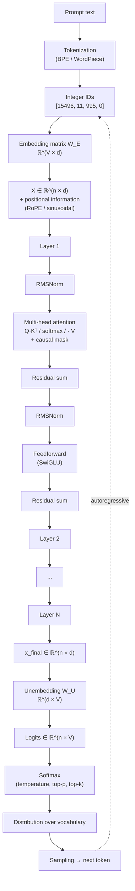

# What happens inside a Transformer when you send it a prompt

> Technical reference guide: architecture, formulas, inference, training and the limits of what we know.

---

## §1. Tokenization: from text to integer identifiers

When a model receives a prompt, the first thing that happens is not that it "reads" the text. The text is split into **tokens** — fragments that can be whole words, pieces of words, symbols or byte sequences — by a deterministic algorithm trained beforehand, typically **Byte-Pair Encoding (BPE)**, **WordPiece** or **Unigram**. Each token is assigned a unique integer identifier within a finite vocabulary.

The vocabulary size, **V**, defines how many distinct tokens the model can recognize. LLaMA 1 and 2 use V = 32,000. LLaMA 3 expands to V = 128,256. GPT-4 is around V = 100,277. Multilingual models tend to have larger vocabularies to represent non-Latin characters without wasting tokens per character.

The tokenizer is not neutral. The same text can convert to more or fewer tokens depending on the algorithm and the tokenizer's training corpus. Anthropic documented that **Claude Opus 4.7 changed the tokenizer relative to Opus 4.6**, and that the same input produces between **1.0× and 1.35× more tokens**. This directly affects API cost, context window consumption and all downstream operations that depend on sequence length.

After tokenization, a text sequence is a sequence of integers — something like `[15496, 11, 995, 0]`. Those integers are the indices used to access the embedding matrix.

### Map of the complete flow

Before going into details, this is the path a prompt takes through the model. Each block is developed in the following sections.



What matters in this map: the shape `n × d` remains constant across all layers. What changes between the output of one layer and the next are the numerical values inside the tensor, not its geometry. And at the end, generation is autoregressive — the sampled token is concatenated to the input and the cycle begins again.

---

## §2. Notation: how to read `W ∈ ℝ^(a × b)`

Before continuing it is useful to fix the notation, because it will appear constantly.

- **W** — name of a matrix. The letter W comes from _weights_. The subscripts (W₁, W_Q) are internal nomenclature; mathematically any name would work.
- **∈** — "belongs to". Indicates that the object on the left is an element of the set on the right.
- **ℝ** — the set of real numbers. In practice, each number is stored in floating-point format: `float32`, `float16` or `bfloat16` during training; `int8` or `int4` quantized during optimized inference.
- **ℝ^(a × b)** — matrix of real numbers with `a` rows and `b` columns.

So `W₁ ∈ ℝ^(d × d_ff)` reads: "the matrix W₁ is a matrix of real numbers with d rows and d_ff columns".

> **Convention in this guide**: row vectors are used. The activation of a token is written `x ∈ ℝ^d` interpreted as a row vector, and transformations are written `xW`, not `Wx`. This fixes the shapes of the matrices: to map a vector of dimension `a` to one of dimension `b`, the matrix has shape `ℝ^(a × b)`. For example, W₁ ∈ ℝ^(d × d_ff) maps a vector of dimension d to one of dimension d_ff via `xW₁`. This is the convention used by PyTorch, JAX and Transformer papers since GPT-2. The alternative convention with column vectors and `Wx` is mathematically equivalent but inverts the shapes of all matrices.

The dimensions we will use continuously:

| Symbol  | Meaning                               | LLaMA 7B | LLaMA 70B | GPT-3 175B |
| ------- | ------------------------------------- | -------- | --------- | ---------- |
| `d`     | model dimension (hidden size)         | 4,096    | 8,192     | 12,288     |
| `d_ff`  | feedforward internal dimension        | 11,008   | 28,672    | 49,152     |
| `h`     | number of attention heads             | 32       | 64        | 96         |
| `d_k`   | dimension per head (= d/h)            | 128      | 128       | 128        |
| `N`     | number of layers                      | 32       | 80        | 96         |
| `V`     | vocabulary size                       | 32,000   | 32,000    | ~50,000    |

These numbers are not arbitrary — they are architecture decisions. When one of them changes, the shapes of all matrices in the model change, and therefore the total parameter count.

---

## §3. Embeddings: from integer to vector

The **token embedding matrix**, W_E, has shape:

```
W_E ∈ ℝ^(V × d)
```

It is a table with V rows (one per token in the vocabulary) and d columns (the model dimension). When the token with identifier `i` enters, the operation is to select row `i` of W_E — equivalent to a _lookup_, or formally, to multiplying the one-hot vector of the token by W_E. The result is a vector in ℝ^d.

For LLaMA 7B: W_E is 32,000 × 4,096 ≈ 131 million parameters. For LLaMA 3 70B with the expanded vocabulary: 128,256 × 8,192 ≈ 1,050 million parameters — just in the embedding table.

Once each token is converted to its vector, a sequence of n tokens is represented as a tensor:

```
X ∈ ℝ^(n × d)
```

Each row is a token. Each column is a dimension of the embedding space. That shape `n × d` remains constant across all layers of the model. What changes are the numerical values inside the tensor.

### Positional information

Attention by itself is **permutation-invariant**: if you reorder the input tokens, the attention scores change symmetrically and the result moves with them by position, but the mechanism does not intrinsically encode "token 5 comes after token 3". That information must be added explicitly.

Three main families:

1. **Learned positional embeddings** (GPT-2, classic BERT): a matrix P ∈ ℝ^(n_max × d) is trained and added to the token embedding: `x_i = W_E[token_i] + P[i]`. Limitation: n_max is fixed at training.

2. **Sinusoidal embeddings** (original Transformer, Vaswani et al. 2017): position is encoded with sines and cosines of different frequencies. Requires no learned parameters and in theory extrapolates to positions never seen.

3. **RoPE — Rotary Position Embedding** (Su et al. 2021, used by LLaMA, Mistral, GPT-NeoX, PaLM and most modern open models). Instead of adding to the embedding, RoPE rotates queries and keys in pairs of dimensions by an angle proportional to the position. The rotation preserves the dot product between vectors that are at a fixed relative distance, giving the attention mechanism a natural sensitivity to relative distance between tokens.

There are also variants like **ALiBi** (Press et al. 2021, used in some BigScience models), which adds a linear bias to attention scores based on the distance between tokens.

The choice of positional encoding matters because it conditions how well the model extrapolates to contexts longer than those seen during training. RoPE with frequency interpolation is what has made 128K, 200K and 1M token windows possible in modern models without full retraining.

---

## §4. The layer stack

A **Transformer layer** is a block of operations that receives the tensor of size `n × d` and produces another tensor of the same shape. The shape remains constant across all layers. What changes are the numerical values.

The vector for token 5 after layer 1 is not the same vector after layer 12: it has been transformed by the weight matrices of each intermediate layer.

### Residual connection

Each layer has the structure:

```
x_new = x_old + Block(x_old)
```

That sum requires the same dimension in both terms. That is why all layers keep `d` constant. The residual connection serves two functions:

1. **Stabilizes the gradient** during training. Without it, in very deep networks the gradient vanishes or explodes when backpropagating through dozens of layers.
2. **Makes each layer add information** to the existing vector, not replace it. The vector coming out of layer 30 contains traces of what entered layer 1, plus all the modifications accumulated by the intermediate layers.

### Normalization

Before each sub-block there is also a **normalization layer** that rescales the vector to keep its magnitude under control and prevent values from exploding as they pass through many layers.

- **LayerNorm** (classical models): for each vector x, computes mean μ and standard deviation σ along the d dimensions, and rescales: `LN(x) = γ · (x − μ)/σ + β`, where γ and β are learned parameters.
- **RMSNorm** (LLaMA, modern models): simplified variant that only divides by the root mean square, without subtracting the mean: `RMSNorm(x) = γ · x / RMS(x)`. Empirically gives results equivalent to LayerNorm with lower computational cost and one fewer learned parameter.

The exact position of the normalization (before or after the residual connection) defines two architectures: **post-norm** (original Transformer) and **pre-norm** (GPT-2 onwards, LLaMA, almost all modern models). Pre-norm is more stable during training.

---

## §5. Attention: the mixing across positions

Attention is where tokens communicate with each other. It is the mechanism that gives the Transformer its ability to process context.

### The three projections: Q, K, V

For each token, three distinct projections of its vector are computed through three weight matrices:

```
q = x W_Q      (query)
k = x W_K      (key)
v = x W_V      (value)
```

Where `x ∈ ℝ^d` is the token vector (row) and:

```
W_Q, W_K, W_V ∈ ℝ^(d × d_k)
```

Stacking the three projections for the n tokens, with X ∈ ℝ^(n × d) the tensor of the whole sequence:

```
Q = X W_Q,   K = X W_K,   V = X W_V       Q, K, V ∈ ℝ^(n × d_k)
```

### Why three separate matrices and not one?

If Q, K and V came from the same vector x without projection, the dot product x · x is always high — it is the squared norm of the vector. Without distinct projections, every token would attend mainly to itself and the attention mechanism would collapse to a trivial operation.

Matrices W_Q and W_K break that symmetry. They project the same vector to two different positions in the learned space, and the dot product between those projections can learn arbitrary compatibility criteria. W_V is separated because the information a token "carries" when it is attended to does not have to coincide with the information it uses to "announce itself". Separating the three functions — ask, announce, carry — gives the model flexibility to learn different types of relationships between tokens.

Formally:

- **W_Q** defines how a token formulates a question.
- **W_K** defines how a token announces itself.
- **W_V** defines what information it carries when another token attends to it.

Q and K live in the same space (ℝ^d_k) because they need to be compared by dot product. V can in principle live in a different space, although in practice it is also ℝ^d_k.

### The scaled attention formula

```
Attention(Q, K, V) = softmax( (Q · Kᵀ) / √d_k ) · V
```

Piece by piece:

**Q · Kᵀ** produces a matrix of size `n × n`. With row vectors, `Q · Kᵀ` computes dot products between rows of Q and rows of K: each entry (i, j) is the dot product between the query of token i (row i of Q) and the key of token j (row j of K). It is a scalar measuring how compatible those two tokens are according to the criterion that W_Q and W_K have learned during training.

**Dividing by √d_k** is a numerical normalization. When d_k is large, dot products grow in magnitude and push softmax toward regions where the gradient is practically zero (saturation). Dividing by √d_k keeps values in a range where softmax has useful gradient. It has no semantic meaning — it is numerical stability.

**Row-wise softmax** converts each row into a probability distribution that sums to 1. Row i says: "of my total attention, what fraction do I dedicate to each token j".

**Multiplying by V** produces the result: the output vector for token i is a linear combination of the value vectors of all accessible tokens, weighted by the attention weights.

### Mini numerical example

To make it concrete, take a toy sequence with `n = 3` tokens and head dimension `d_k = 4`. Suppose that after applying W_Q and W_K we get:

```
Q = [[ 1.0,  0.0,  1.0,  0.0],     ← query of token 1
     [ 0.0,  1.0,  0.0,  1.0],     ← query of token 2
     [ 0.5,  0.5,  0.5,  0.5]]     ← query of token 3

K = [[ 1.0,  0.0,  1.0,  0.0],     ← key of token 1
     [ 0.0,  1.0,  0.0,  1.0],     ← key of token 2
     [ 1.0,  1.0,  0.0,  0.0]]     ← key of token 3
```

**Step 1 — Dot products** (`Q · Kᵀ`). Each entry (i, j) is the dot product between row i of Q and row j of K:

```
         k_1   k_2   k_3
       ┌                 ┐
q_1   │   2.0   0.0   1.0  │
q_2   │   0.0   2.0   1.0  │
q_3   │   1.0   1.0   1.0  │
       └                 ┘
```

Reading: query 1 is very compatible with key 1 (score 2.0), not at all with key 2 (0.0) and medium with key 3 (1.0). Query 3, by its symmetry, sees all three keys as equally compatible.

**Step 2 — Scaling** (`÷ √d_k = ÷ 2`):

```
       ┌                  ┐
       │  1.00  0.00  0.50  │
       │  0.00  1.00  0.50  │
       │  0.50  0.50  0.50  │
       └                  ┘
```

**Step 3 — Row-wise softmax**. Each row is normalized to sum to 1. For row 1, `softmax([1.0, 0.0, 0.5]) ≈ [0.506, 0.186, 0.307]`:

```
       ┌                       ┐
       │  0.506  0.186  0.307  │   ← token 1 attends mostly to itself
       │  0.186  0.506  0.307  │   ← token 2 attends mostly to itself
       │  0.333  0.333  0.333  │   ← token 3 distributes attention uniformly
       └                       ┘
```

Those are the **attention weights**. Each row is a probability distribution over the three tokens.

**Step 4 — Multiplication by V**. The output of token i is the weighted combination of the rows of V according to row i of the weights. If V has three rows v_1, v_2, v_3, then the output of token 1 is `0.506·v_1 + 0.186·v_2 + 0.307·v_3`.

This, repeated for each head in parallel, concatenated and projected by W_O, is exactly what happens in an attention layer. The entire operation is four matrix multiplications and a softmax. Everything else — causal mask, multi-head, residual, normalization — is wrappers around this core.

### The causal mask

In generative models like GPT, LLaMA or Claude, a **causal mask** is applied before the softmax: positions (i, j) with j > i get score = −∞, which after softmax becomes weight = 0. Result: token i can only attend to positions j ≤ i, never to the future.

Applied to the previous example, before softmax the scaled matrix would have −∞ in positions above the diagonal:

```
       ┌                  ┐
       │  1.00   −∞    −∞  │
       │  0.00  1.00   −∞  │
       │  0.50  0.50  0.50 │
       └                  ┘
```

And after softmax:

```
       ┌                       ┐
       │  1.000  0.000  0.000  │   ← token 1 only sees itself
       │  0.269  0.731  0.000  │   ← token 2 sees 1 and itself
       │  0.333  0.333  0.333  │   ← token 3 sees all previous and itself
       └                       ┘
```

This is what allows the model to be **autoregressive**. During training, the model predicts the next token for an entire sequence in parallel, but each position can only use information from previous positions. If it could "see the future", it would be cheating by predicting what is already in front of it.

In bidirectional models like BERT there is no causal mask — but those models are not generative, they are trained for different tasks (classification, masked language modeling).

### Multi-head attention

A single attention with dimension d_k = d would limit the model to a single pattern of relationships between tokens. The solution is to run **multiple attentions in parallel**, each with its own set of Q, K, V matrices — each set is called a **head**.

If there are h heads, each head operates in dimension d_k = d / h. For LLaMA 7B: d = 4,096, h = 32, d_k = 128.

Each head computes its own output `Attention_i(Q_i, K_i, V_i) ∈ ℝ^(n × d_k)`. The h outputs are concatenated along the feature dimension:

```
Concat(head_1, ..., head_h) ∈ ℝ^(n × d)
```

And projected by a final matrix, **W_O ∈ ℝ^(d × d)**:

```
attention_output = Concat(head_1, ..., head_h) · W_O
```

W_O serves two functions: it mixes the information that the different heads extracted in parallel, and projects it back to dimension d so that it can be added residually to the block input.

Why does multi-head work? Because different heads can learn to attend to different aspects of the context. One head can specialize in coreferences (which pronoun refers to which entity), another in syntactic structure, another in long-range relations. Mechanistic interpretability has found specific heads with specific functions — _induction heads_ that copy patterns, _name mover heads_ that move name information between positions, etc.

---

## §6. Feedforward: the transformation by position

The second sub-block of each layer is the **feedforward** (FFN or MLP). Here there is no communication between tokens — each vector is processed in isolation.

### Classic version (GPT-2, GPT-3)

```
FFN(x) = GeLU(x W₁) W₂
```

Where:

```
W₁ ∈ ℝ^(d × d_ff)
W₂ ∈ ℝ^(d_ff × d)
```

The operation expands the vector of dimension d to an internal dimension d_ff via `xW₁`, applies a nonlinearity component by component, and projects back to d via `W₂`. By classical convention, d_ff = 4·d.

Why expand? A linear transformation d → d has maximum rank d. If you move to a larger dimension d_ff > d, you give the feedforward a wider space in which to apply the nonlinearity before projecting back. This allows representing more complex functions than a simple d → d transformation.

### Modern version: SwiGLU

Models like LLaMA, PaLM, Mistral use **SwiGLU** (Shazeer 2020), a variant with gating:

```
FFN_SwiGLU(x) = ( Swish(x W₁) ⊙ (x W₃) ) W₂
```

Where:

- `Swish(z) = z · σ(z)`, with σ the sigmoid. It is a smooth activation similar to GeLU.
- `⊙` is the element-wise product (Hadamard product).
- W₁, W₃ ∈ ℝ^(d × d_ff) are expansion matrices.
- W₂ ∈ ℝ^(d_ff × d) is the contraction matrix.

There are three matrices, not two. The intuition: instead of applying a fixed nonlinearity to the projected vector, two projections of the input are computed. One passes through Swish (the _activation branch_) and the other stays linear (the _gate branch_). They are multiplied element-wise. That multiplication allows parts of the vector to "open" or "close" information flow dynamically.

Empirically SwiGLU performs better than GeLU for the same parameter budget. Since it has three matrices instead of two, models with SwiGLU usually reduce d_ff (from 4d to ~2.7d) to keep the total parameter count comparable. For LLaMA 7B: d = 4,096, d_ff = 11,008, ratio ≈ 2.69×.

### The role of nonlinearities

Nonlinearities (GeLU, ReLU, Swish, exact GELU) are **not learned** — they are fixed functions. But they are critical. Without them, stacking linear layers would collapse mathematically: the composition of linear functions is a linear function, and a linear function cannot learn language (it cannot model conditional dependencies, disjunctive decisions, hierarchies).

Attention does have its own nonlinearity (the softmax), but of a different nature — it operates between positions, not inside the representation of a token. The nonlinearities of the feedforward are what contribute expressive capacity per position.

---

## §7. The three families of weights: summary

There are three functional categories of weights in a Transformer:

1. **Input and output weights** (W_E, W_U): translate between the discrete vocabulary and the continuous vector space of dimension d.
2. **Cross-position mixing weights** (W_Q, W_K, W_V, W_O): allow a token to absorb information from others.
3. **Per-position transformation weights** (W₁, W₂, W₃ in SwiGLU; W₁, W₂ in classic variants): process each vector in isolation.

Each layer of the model has its own complete set of weights from categories 2 and 3. They are not shared across layers. LLaMA 7B with N = 32 layers has 32 distinct W_Q, 32 W_K, 32 W_V, 32 W_O, 32 sets {W₁, W₂, W₃}, all with independent values learned during training. Embeddings W_E and unembedding W_U are unique for the whole model. In some models they are _tied_ (tied embeddings), using the same matrix for both operations to save parameters.

---

## §8. Parameter count: one layer of LLaMA 7B

To make the order of magnitude clear. LLaMA 7B with d = 4,096, d_ff = 11,008, h = 32, d_k = 128:

| Matrix               | Shape          | Parameters    |
| -------------------- | -------------- | ------------- |
| W_Q                  | 4,096 × 4,096  | 16.78 M       |
| W_K                  | 4,096 × 4,096  | 16.78 M       |
| W_V                  | 4,096 × 4,096  | 16.78 M       |
| W_O                  | 4,096 × 4,096  | 16.78 M       |
| W₁ (FFN, gate)       | 4,096 × 11,008 | 45.08 M       |
| W₂ (FFN, down)       | 11,008 × 4,096 | 45.08 M       |
| W₃ (FFN, up, SwiGLU) | 4,096 × 11,008 | 45.08 M       |
| **Total per layer**  |                | **≈ 202.4 M** |

Multiplied by 32 layers: ≈ **6,480 million** parameters just in Transformer blocks. The rest, up to the real 6,738 million of the model, comes from the embedding matrix (W_E, ~131 M), RMSNorm parameters (negligible), and the output head W_U (in LLaMA it is tied with W_E).

That structure is what scales when going from 7B to 70B. No new concepts are added — d, h, N, d_ff are increased, and all matrices grow proportionally.

---

## §9. Unembedding and sampling: from vector to text

After N layers, the output tensor has shape n × d. To produce the prediction of the next token, the **unembedding matrix** is applied:

```
W_U ∈ ℝ^(d × V)

logits = x_final W_U
```

For each position in the sequence, this operation produces a vector of size V — a score for each possible token in the vocabulary. Those vectors are the **logits**.

Applying softmax over the logits gives a probability distribution over the vocabulary:

```
P(token | context) = softmax(logits)
```

But this distribution is not text. To produce a concrete token, the model has to **sample** from it. Here the sampling parameters come in:

- **Temperature T**: scales the logits before softmax. `softmax(logits / T)`. T < 1 concentrates mass on the most likely tokens (more deterministic responses). T > 1 spreads the distribution (more diversity). T = 0 is equivalent to argmax (greedy decoding).
- **Top-p (nucleus sampling)**: filters to tokens whose cumulative probability (sorted from highest to lowest) covers threshold p. If p = 0.9, tokens that together sum the remaining 10% are discarded.
- **Top-k**: restricts sampling to the k most likely tokens. The rest are discarded by setting their probability to zero.

The choice of the next token is then a random sample from the filtered distribution. Once chosen, it is concatenated to the input and the model runs again to predict the next one. That is **autoregressive generation**.

Some commercial models restrict or fix sampling parameters. Anthropic, in Claude Opus 4.7, returns error 400 if you attempt to set temperature, top_p or top_k to non-default values. Control over generation shifts from sampling toward the prompt and the reasoning effort levels the model exposes.

---

## §10. Difference between layers: the emergent hierarchy

Each layer has its own complete set of weights, distinct from those of any other layer. Empirically, across many models analyzed with interpretability techniques, an approximate hierarchy is observed:

- **Early layers** (15–20% of initial depth): process low-level features — token patterns, spelling, language identification, basic syntactic structure.
- **Middle layers**: do the heavy work of understanding — combine syntactic information into semantic structures, resolve coreferences, identify relationships between entities.
- **Late layers** (final 20–30%): specialize in producing the output — integrate all accumulated information and channel it toward a concrete prediction of the next token.

This hierarchy is not rigid or perfectly separable, and the details change between models. But the pattern is consistent. The reason stacking many layers works is that each layer can perform a relatively simple transformation, and the composition of many simple transformations allows progressively more abstract representations to be built.

### Logit lens: the model "decides" layer by layer

An interpretability technique called **logit lens** (Nostalgebraist 2020) consists in taking the intermediate activations of each layer and projecting them with W_U as if they were the final output, seeing what token the model would predict if it stopped there. What is observed is revealing: the "decision" about the next token forms gradually.

- In early layers, the logit lens distribution is diffuse and concentrates on generic lexical patterns.
- In middle layers, there starts to be semantic commitment — the model already has a rough idea of what type of token is coming.
- In late layers, the distribution converges to the final token, often several layers before the end.

This means the model does not decide in the last step. It decides throughout the whole chain, and the last layers materialize a decision that was already taken in the intermediate representations.

---

## §11. Effective dimensionality: why d ≠ d_real

Model vectors live in ℝ^d. For LLaMA 7B, that is 4,096 nominal dimensions per token in each layer. But the useful information does not distribute uniformly across those 4,096 dimensions. It concentrates in subspaces of **effective dimension much smaller than d**.

This is observed in three independent ways:

**Spectrum analysis** (SVD decomposition of activations over a corpus). The singular value spectrum decays quickly — a handful of directions accumulate most of the variance, and the long tail contributes little. The effective dimension (defined as the _stable rank_ or rank at 99% variance) is usually one or two orders of magnitude below d.

**Interpretable features**. Work on **sparse autoencoders** (Anthropic, OpenAI, various academic labs from 2023–2024) trains over-parameterized decompositions of activations. What appears are thousands or tens of thousands of interpretable "features" (the idea of the Golden Gate Bridge, code with bugs, obsequious flattery, a specific date, etc.) that live in specific directions of the space. Each activation is a sparse superposition of many more features than d, suggesting the model uses **superposition**: it encodes more concepts than fit in its nominal dimensions, exploiting the fact that most concepts do not activate at the same time.

**Pruning robustness**. Removing significant fractions of weights (structured pruning, low-rank approximation) usually degrades performance much less than expected. Models compressed to 30–50% of their original parameters maintain much of their capacity. That is only possible if the information was not uniformly distributed — there was exploitable redundancy.

### Practical consequences

- **Compression and quantization work**. Quantization to int8 or int4 preserves most of the quality because the relevant degrees of freedom are fewer than apparent. Modern quantization-aware training (QAT) and post-training quantization (PTQ) techniques exploit this systematically.
- **Distillation works**. Small models trained to imitate the output distributions (or activations) of large models capture much of the original capacity with a fraction of the parameters, because the "useful capacity" of the large model was not in its d nominal dimensions but in more structured patterns.
- **Mechanistic interpretability is viable, but hard**. That information lives in low-dimensional subspaces does not mean those subspaces are orthogonal or clean — they are in superposition. Decoding them requires auxiliary models (like SAEs) and cannot be seen directly by reading the weights.

The operational idea: when thinking about a model with "billions of parameters", the correct mental image is not "billions of distinct things the model knows". It is "billions of parameters that encode a much smaller number of effective patterns, in superposition, distributed throughout the network".

---

## §12. Why this architecture works for language

So far we have described **how** the Transformer works. The natural question is **why** it works — what structural properties make it so suited to modeling language. The answer is not complete: empirical success goes ahead of theory. But there are several hypotheses with good empirical support.

### Hierarchical composition

Language is compositional by nature: morphemes → words → phrases → sentences → paragraphs → discourse. Each level is built by combining elements from the previous level. The deep layer stack of the Transformer allows each layer to operate at a slightly higher level of abstraction than the previous. What is observed empirically — early lexical layers, middle semantic layers, late discourse layers — coincides with that structure of language.

It is not that the Transformer designers encoded this hierarchy. It emerged from training. But the architecture has the depth and primitives necessary to represent it.

### Linear / non-linear alternation

Each layer alternates linear transformations (the attention and feedforward matrices) with nonlinearities (softmax, GeLU, SwiGLU). That alternation is what gives the Transformer its expressive power. A single linear transformation maps hyperplanes to hyperplanes. Stacking linears without nonlinearity collapses to a single linear. But alternating linear and non-linear with sufficient depth produces a **universal approximator**: any continuous function can be approximated with sufficient precision.

That is general neural network theory (Cybenko 1989, Hornik 1991). What the Transformer contributes over previous architectures is not universality — RNNs and MLPs already had it — but the **particular structure** that makes learning stable, parallelizable and computationally efficient.

### Attention as dynamic routing

The key piece of the Transformer is that the mixing of information between tokens **is not fixed by the architecture**. In an RNN, the information flow is sequential and rigid: information from token 1 propagates to token 100 passing through 98 intermediate states. In a CNN, the flow is local and fixed: each token only sees its neighbors in a static window.

In attention, **the model learns which tokens attend to which tokens**. The matrix Q · Kᵀ is computed dynamically from the content of the sequence. That is _dynamic routing_: the communication pattern between positions is a function of the input, not of the system design. It allows arbitrarily long dependencies (token 1 can attend directly to token 1000 without propagation) and context-dependent patterns (the same token can attend very differently in different sentences).

That flexibility is what makes the Transformer effective in tasks where dependencies are long, non-local and content-dependent — exactly the case of language.

### Massive parallelism

RNNs process tokens sequentially, which made them expensive to train at scale — the training cost grew linearly with sequence length and could not be well parallelized on GPU. The Transformer, during training and prefill, processes all tokens simultaneously because attention is fully specified by matrices that the GPU can multiply in parallel.

That is the **practical reason** they scaled before previous architectures. More data, more parameters, more compute, all absorbed by already available hardware. The Transformer is not the most theoretically elegant architecture — it is the one that best uses modern hardware.

### Composition of the four properties

Hierarchical composition + linear/non-linear alternation + dynamic routing + parallelism is the combination that no previous architecture had complete. RNNs had sequential composition but not parallelism. MLPs had non-linearity but not dynamic routing. CNNs had parallelism but fixed routing. The Transformer combines all four.

Why exactly that combination produces the emergent behaviors we see — chain-of-thought reasoning, in-context learning, generalization to unseen tasks — remains an active area of research. The success is there. The complete explanation is not.

---

## §13. Inference: prefill and decode

The operational question is how many tokens are processed at the same time. The answer depends on the phase.

### Prefill: massive parallelism

When you send an n-token prompt to the model, all n enter simultaneously in a single pass through the layer stack. Each layer processes the whole n × d matrix at once.

- Matrix-matrix multiplications are massively parallelized on GPU.
- The feedforward is trivially parallel by position — each of the n tokens is processed at the same time, without interdependencies.
- Attention is also parallelized: the score matrix Q · Kᵀ is calculated at once for all valid pairs (i, j), of size n × n.

This phase **saturates the hardware**. It is where the GPU is closest to its peak performance. The cost per token of prefill is much lower than the cost per token of decode.

This is where attention **scales quadratically** with context length. For n = 1,000, one million scores per head per layer. For n = 10,000, one hundred million. For n = 100,000, ten billion. Per layer. Per head.

### Sequential dependency between layers

Although inside a layer everything that can be parallelized is done in parallel, **between layers the dependency is sequential**. Layer 5 cannot start before layer 4 finishes, because it needs its output as input. The stack is traversed from top to bottom, layer by layer.

### Decode: sequential by construction

The decode phase is output generation. The model produces one token at a time, and it cannot generate token n+1 without having generated token n — that is the autoregressive nature. At each decode step, a single pass through the whole layer stack produces one new token.

The GPU is **underutilized** during decode because it processes a single position. That is what makes generation slow compared to prefill, and why models seem to "take time" after the first moment.

---

## §14. KV cache: the optimization that makes decode viable

Without optimization, each decode step would have to re-run the full forward pass over the entire context, including attention with an n × n score matrix. That is, each individual step is already quadratic in n, and the total cost of generating m tokens would grow as O(m · n²) — unviable for long contexts.

The solution is the **KV cache**:

1. During prefill, the K and V computed in each layer for each token are stored in GPU memory.
2. During decode, for the new token only its own Q, K, V are computed.
3. The attention of the new token is computed between its query and all the K, V accumulated in cache (the old ones + the new one).
4. The K and V of the new token are added to the cache.

Result: each decode step goes from O(n²) attention operations to **O(n) operations**. The attention of the new token against the context is a 1 × n multiplication per head per layer, not n × n.

### The price: memory

The KV cache grows linearly with context length and with each layer of the model. For classic LLaMA 7B with full multi-head attention in fp16:

```
bytes_per_token = 2 (K and V) × N (layers) × h (heads) × d_k × 2 (bytes in fp16)
                = 2 × 32 × 32 × 128 × 2
                = 524,288 bytes
                ≈ 0.5 MB per token
```

For a context of 100,000 tokens: **50 GB just in cache**. For a context of 1,000,000 tokens, linear scaling: 500 GB — impossible on a single GPU with standard memory.

That is why long contexts are expensive in production — not because of compute itself, but because of the memory the cache requires to keep alive throughout the entire generation, and the bandwidth needed to move that data between VRAM and GPU registers at each decode step.

---

## §15. Attention variants: the economics of KV cache

The KV cache is the practical bottleneck of long contexts. Almost all modern attention variants attack that problem from different angles.

### Multi-Head Attention (MHA): the baseline

The original attention. Each head has its own independent set of W_K and W_V. KV cache proportional to h.

```
Cache MHA = h · n · d_k · 2 bytes (fp16) · 2 (K and V) · N (layers)
```

For LLaMA 7B: 32 heads × 128 d_k = 4,096 K cache dimensions + 4,096 V cache dimensions per layer per token.

### Multi-Query Attention (MQA)

Proposed by Shazeer (2019), adopted in PaLM. Idea: use h distinct queries, but **a single K and a single V shared** across all heads.

- W_Q remains of size d × (h · d_k) — produces h queries.
- W_K and W_V are of size d × d_k — produce a single K and a single V.
- All h queries attend to the same K, V.

**KV cache reduction**: factor h. For LLaMA 7B that would be 32 times smaller.

**Cost**: loses quality. Sharing K and V across all heads limits the diversity of attention patterns the model can learn. Heads can no longer specialize in different aspects of the context.

### Grouped-Query Attention (GQA)

Proposed by Ainslie et al. (2023). It is the compromise between MHA and MQA, and is what **LLaMA 2 70B, LLaMA 3, Mistral 7B+, and almost all modern production models** use.

Idea: group the h heads into g groups, where each group shares K and V. If h = 32 and g = 8, there are 32 queries but only 8 keys and 8 values; each group of 4 heads shares one K and one V.

**KV cache reduction**: factor h/g. For g = 8, h = 32, reduction 4×.

**Why it works empirically**: in MHA many heads learn redundant patterns. Grouping them forces efficiency without significant quality loss. It is the current standard.

### Sliding Window Attention

Used in Mistral, Longformer and models optimized for long contexts. Instead of each token attending to all previous tokens, **each token only attends to a fixed window of the W most recent tokens**.

- If W = 4,096, the token at position 10,000 only attends to tokens 5,904 to 10,000.
- Attention complexity: from O(n²) to O(n · W).
- KV cache: becomes circular. Only the last W tokens are maintained.

**Trade-off**: direct access to very distant tokens is lost. But as layers stack, information propagates indirectly — a token in layer 10 that attends within its window absorbs information from tokens that in previous layers absorbed information from even further back. That is called **receptive field**: with enough layers, the effective window grows.

Mistral 7B used sliding window of 4,096 with a context of up to 32K, relying on the receptive field for long distances.

### Sparse Attention

Family of techniques where not all positions attend to all others. The n × n attention matrix becomes sparse — most entries are zero by construction.

Common patterns:

- **Block-sparse**: the sequence is divided into blocks and attention is only computed within each block, plus some global connections.
- **Strided**: each token attends to positions at fixed distances (1, 2, 4, 8, ... back).
- **Random**: each token attends to a fixed random subset of positions.
- **Global tokens**: certain designated tokens attend to all and are attended by all. This is what BigBird (Zaheer et al. 2020) and Longformer do.

**Trade-off**: loss of expressiveness — the model cannot learn any attention pattern, only those compatible with the sparse structure. In exchange, it scales to contexts of hundreds of thousands or millions of tokens at manageable cost.

### Comparative table

| Variant        | KV cache size       | Relative quality                                                 |
| -------------- | ------------------- | ---------------------------------------------------------------- |
| MHA            | h · n · d_k         | Reference / maximum flexibility                                  |
| GQA (g groups) | g · n · d_k         | Nearly identical in practice with much smaller cache             |
| MQA            | n · d_k             | Somewhat worse than MHA under equal conditions                   |
| Sliding window | W · d_k (constant)  | Good for local tasks, loses direct long-range dependencies       |
| Sparse         | depends on pattern  | Variable, depends on task                                        |

MHA is the theoretical baseline with maximum flexibility per head, but not necessarily the highest practical quality option: with the same parameter budget and training, GQA usually matches or surpasses MHA because it frees capacity for other parts of the model. The production standard is GQA for that reason — quality equivalent to MHA with a several-times smaller cache.

---

## §16. FlashAttention: memory optimization, not compute

**FlashAttention** (Dao et al. 2022, FlashAttention-2 in 2023, FlashAttention-3 in 2024) is the other great modern optimization. **It does not reduce the number of theoretical operations (FLOPs)** — the result is mathematically identical to standard attention. What it reduces is **real time**, by drastically decreasing the memory accesses that dominate practical cost.

### The problem

In standard attention, the score matrix S = Q · Kᵀ / √d_k of size n × n is materialized in HBM memory (the main VRAM of the GPU). Then softmax is applied, producing another n × n matrix. Then it is multiplied by V. Each of these steps reads and writes full matrices in HBM.

HBM is slow compared to on-chip SRAM (the registers and caches of the GPU). For large n, the bottleneck is not the number of floating-point operations — it is memory bandwidth. The GPU is waiting for data most of the time.

### The solution

FlashAttention reorganizes the computation using **tiling**:

1. Divides Q, K, V into small blocks that fit in SRAM.
2. For each pair of blocks (Q_i, K_j), computes its partial contribution to attention without materializing the full matrix S.
3. Accumulates partial results applying **online softmax** — a numerical trick that allows computing softmax over a sequence of blocks without needing all values in advance.
4. Writes the final result O to HBM once.

The main saving is in intermediate memory: the n × n matrix is never materialized. The operation complexity stays O(n²), but the memory complexity goes from O(n²) to O(n).

**Real speedup**: 2× to 4× in wall time without changing the mathematical result. And memory reduction that allows longer contexts on the same hardware.

FlashAttention is orthogonal to the attention variants that reduce the KV cache. They can be combined: GQA + FlashAttention is a standard configuration in modern production.

---

## §17. Continuous batching: multi-user economics

In production servers, models do not process one conversation at a time. They run **continuous batching**: mixing prefills from some users with decodes from others to saturate the GPU as much as possible.

The classic problem: if you have a GPU processing a decode (one new token, underutilized) and a new prefill arrives from another user, do you stop the decode? Wait for it to finish? Continuous batching mixes them in the same batch — the GPU simultaneously processes N prefill positions from one user and M decode positions (one per user in decode phase), exploiting the idleness of individual decodes.

Servers like **vLLM**, **TGI** (Text Generation Inference by HuggingFace) and the internal systems of OpenAI/Anthropic implement continuous batching by default. That explains why the cost per token in the API is **much lower** than the cost of serving a model dedicated to a single user: the economics depend on how much the GPU can be amortized across multiple simultaneous sessions.

---

## §18. Speculative decoding: accelerating decode without losing quality

The decode phase is sequential by construction. You cannot generate token 5 without having generated token 4. But GPU resources are underutilized during decode (one token per pass). Can that idle bandwidth be used?

### The fundamental idea

**Speculative decoding** (Leviathan et al. 2023; Chen et al. 2023) uses two models:

- A **target model**, large and slow — the one you actually want to use.
- A **draft model**, small and fast — ideally of the same type and training as the target.

The loop:

1. The draft model generates **k tokens** quickly (typically k = 4–8). This is cheap because the draft is lightweight.
2. The target model receives the complete sequence with those k proposed tokens and **evaluates them all at once in parallel**. This is key: a single pass through the large model can verify k tokens, not just one, because verification is like a prefill of k tokens.
3. For each of the k proposed tokens, the target model compares the probability assigned to the proposed token under both distributions — `p_target(proposed_token)` vs `p_draft(proposed_token)`.
4. **Acceptance**: with probability `min(1, p_target / p_draft)` the token is accepted. If rejected, it is resampled from the residual distribution `max(0, p_target − p_draft)` normalized.
5. When a token is rejected, subsequent proposed tokens are discarded and the loop returns to step 1.

### Mathematical equivalence

The acceptance criterion is designed so that the **output distribution is exactly the same** as the target model alone. It is not an approximation. The theorem (Leviathan et al. 2023) proves that the distribution of tokens generated with speculative decoding is identical, in distribution, to the target model applied token by token.

You lose no quality. You gain speed.

### Real speedup

If the draft is reasonably good, on average between 2 and 5 tokens are accepted per pass of the target model. Real speedup of 2× to 3× in many practical use cases.

### Variants

- **Medusa** (Cai et al. 2024): instead of a separate draft model, extra prediction heads are added to the target model. Each head predicts a different future token in parallel. No need for two models, but the additional heads need to be trained.
- **Lookahead decoding** (Fu et al. 2024): generates multiple candidates in parallel using n-gram-like structures, without a draft model. More complex, but eliminates dependence on an aligned draft.
- **Self-speculative decoding**: uses the model itself with fewer layers as its draft. Skipping layers during the draft is faster than running the full model.

---

## §19. Where is the computational bottleneck?

A common question is whether the dominant cost of generating text is in the final unembedding (the projection to the vocabulary, which has large size). The short answer: **no**.

Let's count operations for LLaMA 7B with a prompt of n = 2,000 tokens.

### Attention (per layer)

Q · Kᵀ per head is n × d_k × n. Multiplied by h heads:

```
ops_attention_per_layer = h · n² · d_k = 32 · 2,000² · 128 ≈ 16.4 billion
```

Multiplied by N = 32 layers: **≈ 524 billion operations** just in the Q·Kᵀ products. And that ignores the multiplications by V and the W_O projections.

### Feedforward (per layer)

For each token, FFN performs:

```
ops_FFN_per_token = d · d_ff (W₁) + d_ff · d (W₂) + d · d_ff (W₃ in SwiGLU)
                  = 3 · d · d_ff = 3 · 4,096 · 11,008 ≈ 135 million
```

For n = 2,000 tokens: 270 billion per layer. For 32 layers: **≈ 8.7 trillion operations**.

The feedforward usually dominates compute in modern models.

### Unembedding

A single multiplication at the end:

```
ops_unembedding = n · d · V = 2,000 · 4,096 · 32,000 ≈ 262 billion
```

It is a small fraction of the total. **Approximately 3%** of the compute of a full forward pass.

### The conceptual bottleneck

Although the unembedding is not where the computational cost lies, it is where something qualitatively different happens: the **transition from the continuous to the discrete space**. The entire model operates in ℝ^d, where representations are rich and mix information fluidly. At the end, the projection to logits + softmax + sampling collapses that richness to a single discrete token from the vocabulary.

That compression from continuous to symbol is where information is irrecoverably lost at each generation step. The model "finishes thinking" before the last layer — the internal representations in the late layers already contain all the information about what is going to come out. The logit lens confirms this. The projection to logits is just the final decoding of a decision that was already made.

---

## §20. Training: how weights are obtained

The architecture defines what operations the model performs. But the specific numerical values of the weights come from training.

### Initialization

Before training, matrices are filled with random numbers. Not any distribution will do — the variance must be calibrated so activations neither explode nor vanish as they pass through many layers.

Common schemes:

- **Xavier (Glorot) initialization**: variance ∝ 1 / (fan_in + fan_out). Suitable for activations symmetric around zero.
- **He initialization**: variance ∝ 2 / fan_in. Suitable for ReLU and variants.
- **Transformer-specific variants**: Gaussian or uniform distributions adjusted with factors that depend on depth N to preserve activation magnitude across layers.

At the start of training, the matrices encode absolutely nothing useful. They are structured noise.

### The training loop

Training consists of repeating this process billions of times:

**Step 1 — Forward pass.** The model is given a sequence of tokens from a real text. With its current weights, it predicts the probability distribution of the next token at each position.

**Step 2 — Loss computation.** The prediction is compared with the real token that follows. The standard loss function is **cross-entropy**:

```
L = − log P(correct_token | previous_tokens)
```

If the model assigned high probability to the correct token, L is low. If it assigned low probability, L is high. The total loss for a sequence is the sum (or mean) of the cross-entropies at all positions.

**Step 3 — Backward pass (backpropagation).** The gradient of L with respect to each of the billions of model parameters is computed:

```
∂L / ∂W_ij
```

This indicates how the loss changes if weight W_ij is slightly increased. It is computed via the **chain rule of differential calculus**, propagating derivatives from the output back through all layers. Hence the name "backpropagation".

**Step 4 — Update.** Each weight is modified in the direction opposite to its gradient:

```
W_ij ← W_ij − η · (∂L / ∂W_ij)
```

Where η is the **learning rate**, a small number typically between 1e-5 and 1e-3. If the gradient says "increasing this weight increases the loss", it is decreased. If it says "decreasing it increases the loss", it is increased.

**Step 5 — Repeat.** With new text. And more. And more. Billions of times.

### Optimizers: more than pure gradient descent

In practice, pure gradient descent is not used but variants with momentum and per-parameter adaptation:

- **Adam / AdamW** (Kingma & Ba 2014, Loshchilov & Hutter 2017): maintains moving averages of gradients and their squares, adjusting the effective learning rate per parameter. AdamW is the standard for LLMs.
- **Schedules**: the learning rate is not constant. There is an initial warmup followed by decay (typically cosine).

### Self-supervised training

What matters: nobody tells the model what to learn. There are no grammar rules written anywhere. There is no section of the model dedicated to English and another to code. The only thing there is is the objective "predict the next token better" applied over mountains of text.

Everything the model seems to "know" — grammar, facts, styles, reasoning — emerged from that optimization pressure on the weights. This is called **self-supervised learning**: there are no human labels, just raw text and the task of predicting what comes next.

### The result: the process that produces the result

Training evaluates the result (the token prediction), but modifies the process that produced it (the weights of all layers). The gradient is not confined to the last layer — it backpropagates through all the operations that participated in producing that prediction. Every weight in every layer receives an adjustment signal proportional to how much it contributed to the error.

After billions of examples, the weights end up organized to produce activations that reduce that loss. What we call comprehension, reasoning, style or memory is an emergent property of that weight organization — not an explicitly stored representation. There is no internal notebook where the model writes down what it knows. There is a geometry of transformations that tends to produce better predictions.

---

## §21. Scaling laws: how loss scales with compute, data and parameters

A central empirical observation of the last decade: when you increase the scale of a Transformer — more parameters, more data, more compute — the training loss decays predictably following power laws. This is known as **scaling laws**.

### The original laws (Kaplan et al. 2020, OpenAI)

The first systematic study showed that loss L follows approximately:

```
L(N) ≈ (N_c / N)^α_N      with α_N ≈ 0.076
L(D) ≈ (D_c / D)^α_D      with α_D ≈ 0.095
L(C) ≈ (C_c / C)^α_C      with α_C ≈ 0.050
```

Where **N** is the number of parameters, **D** the number of training tokens, and **C** the total compute measured in FLOPs. N_c, D_c, C_c are scaling constants. The behavior is a power law: doubling N reduces loss by a predictable factor. And the exponents are small — returns diminish, but do not saturate.

The practical conclusion of Kaplan et al. was that **under a fixed compute budget, it is better to spend more on parameters than on data**. This justified ever-larger models (GPT-3 with 175B parameters trained on ~300B tokens).

### The Chinchilla correction (Hoffmann et al. 2022, DeepMind)

Three years later, DeepMind reanalyzed the problem with a different experimental protocol and reached the opposite conclusion. To minimize loss under a fixed compute budget C, parameters and data must scale **at approximately the same rate**:

```
N_optimal ∝ C^0.5
D_optimal ∝ C^0.5
```

This implies that most previous large models were **over-parameterized relative to their data volume** — they would have worked better with fewer parameters and more training tokens. The practical rule that emerged: approximately **20 training tokens per parameter** for a compute-optimal training (at the Chinchilla-optimal point).

LLaMA followed this philosophy: LLaMA 7B was trained on 1 trillion tokens, LLaMA 65B on 1.4 trillion — ratios closer to the Chinchilla point than GPT-3.

### Beyond Chinchilla optimal

Modern production models often **overtrain** beyond the Chinchilla point, because the economics change when the full lifecycle is considered. A model is trained once but runs at inference billions of times. It is worth spending more training compute on a smaller model (trained on many more tokens than Chinchilla-optimal) to then save on inference. LLaMA 2/3 and Mistral follow this logic: relatively small models trained on enormous amounts of data.

### The current regime: do the laws still hold?

With models from hundreds of billions to trillions of parameters, trained on tens of trillions of tokens, there is active debate about whether scaling laws remain valid or whether plateaus are emerging. Some recent results suggest saturation in certain capabilities; others show that adding compute and data continues to improve consistently. The debate is not closed.

What does seem robust:

- **The predictability of loss** given a budget remains reasonable at the current scale. It allows large labs to plan training cycles of months with calibrated expectations.
- **Emergent capabilities** — behaviors that appear abruptly above a certain scale (in-context learning, chain-of-thought reasoning, following complex instructions) — are not directly predictable from aggregate loss. The loss curve is smooth; capabilities sometimes are not. There is debate about whether that "emergence" is an artifact of how it is measured, or a real phenomenon.
- **Quality data is scarce**. The amount of high-quality human text available on the internet is close to saturation for current budgets. Hence the growing interest in synthetic data, more aggressive filtering, and multimodal learning that extends the universe beyond text.

### Why this matters for understanding a specific model

When looking at a modern frontier model and thinking "it has X parameters and was trained with Y tokens", those numbers contain scaling decisions that depend on evolving empirical theories. A 70B parameter model trained on 15 trillion tokens (overtrained beyond Chinchilla) and another trained on 1.4 trillion (Chinchilla-optimal) are fundamentally different in capability and usage profile, even though they have the same parameter count.

That is one reason why commercial models are not comparable on nominal size alone — and why the specific training details (not published for Claude, GPT, Gemini) are so determinative of final behavior.

---

## §22. Post-training: the model you use is not the base model

The architecture above describes **pretraining**: the model learns to predict text over enormous corpora. But the model that users and developers consume is different. Before being deployed, the base model goes through additional stages:

- **Instruction tuning (SFT, supervised fine-tuning)**: training on curated or human-generated (instruction, response) pairs. Teaches the model to handle the instruction-following format.
- **RLHF (Reinforcement Learning from Human Feedback)**: humans rate or compare model responses, a reward model is trained on those preferences, and the model is adjusted via PPO or other RL algorithms to maximize the reward.
- **RLAIF (Reinforcement Learning from AI Feedback)**: variant where feedback is generated by another model instead of humans. Anthropic has published work on Constitutional AI, a variant of RLAIF.
- **DPO (Direct Preference Optimization)**: simpler alternative to RLHF that avoids training a separate reward model.
- **Filtering and red-teaming**: undesired behaviors are identified (sensitive information disclosure, help with harmful activities, severe hallucinations) and weights are adjusted to suppress them.

Each of those stages modifies the weights. The architecture does not change — it is still the same Transformer. But the weights end up adjusted to follow instructions, obey roles assigned in prompts, respect format conventions and satisfy behavioral preferences.

This matters when analyzing what a role prompt does. When a prompt says "you are an expert in X", the model does not respond solely because of the pure Transformer mechanics. It also responds because it was post-trained to interpret instructions, follow assigned roles and adapt tone and register to what was requested. Role prompting does not unlock new knowledge or change the weights — but **activates patterns learned during post-training**. The role prompt changes the input tokens and, in a model post-trained to follow instructions, those tokens also activate learned behaviors of role compliance, format adjustment and response criteria.

---

## §23. In-context learning: the prompt can induce temporary patterns

A prompt does not only give context. In some cases it can temporarily teach a pattern within the context window.

The classic example: if the prompt shows two or three input-output pairs illustrating an implicit rule, the model infers that rule and applies it to the new case, **without updating any weights**. That is **in-context learning (ICL)**: the task is specified through examples in the context, not through a training dataset.

The internal mechanism remains the same — the model predicts the next most likely token given the context — but the context contains enough information for that prediction to be equivalent to applying the implicit rule. Mechanistic interpretability work has identified **induction heads**: attention heads that detect patterns of the form "A B ... A → B" and complete them, constituting the minimum neural mechanism for ICL.

There is active debate about what ICL actually does. Work like Min et al. (2022) shows that in many cases examples serve more to indicate the output format and task distribution than to "teach" the rule — the model already knows the task from pretraining, and the examples just activate the appropriate behavior. In other cases there is genuine induction of new rules. The spectrum is wide.

What this changes in the analysis of prompting: a prompt does not only bias vocabulary or register. It can also induce a task, a format, a convention or a local mini-rule that the model will follow as long as it remains in the active context. The rule lives in the context, not in the weights.

---

## §24. Attention is not explanation

It is tempting, especially after understanding the mechanics of attention, to interpret attention weights as an explanation of why the model produced a certain output. If the token "bank" strongly attends to the token "river", the natural interpretation is that the model decided "bank" means riverbank because of that relationship. But that is not always correct.

Attention weights capture part of the information flow, but **they are not a complete explanation of the model's decision**. Information also propagates through residual connections, MLPs, normalizations and subsequent layers. Attention in layer 3 may mix information from certain tokens, but that mix is then processed by the feedforward, modified by subsequent layers and combined with information that arrived through the residuals. The token that finally has the highest probability is the result of that entire circuit, not of an isolated attention score.

Mechanistic interpretability works precisely on this problem: understanding which specific circuits inside the model produce which behaviors, without assuming that attention is the only path of information. Results from Geva et al. (2021, 2022) and work on _key-value memories_ suggest that the "knowledge" associated with a prediction often lives in the feedforward weights, not in the attention scores. Attention operates mainly as a **routing** mechanism — which information reaches which position —, while the feedforward is where much of that information is transformed into a concrete prediction.

---

## §25. Transformer pathologies

The Transformer architecture has several known failure modes. Some manifest at inference with long contexts, others during training of deep models, others in the interaction between components. Knowing them helps diagnose behaviors that would otherwise seem magically frustrating.

### Context rot

When people say models "forget" or get confused with long contexts, the most common explanation is that there are too many tokens competing for attention. That is part of the problem, but not all.

**The mechanical reason.** Each attention softmax distributes a **fixed probability mass (sums to 1)** across all accessible positions. If there are n positions, the average weight per position is 1/n. As n grows, the average weight decreases — relevant tokens have to stand out more to overcome that growing background. Even if W_Q and W_K have learned well to distinguish relevance, there is a limit to how much softmax can concentrate when competing with many distractors.

That is not just empirical intuition. It is geometry of softmax with variable dimension.

**The list of associated failures:**

- **Semantic distractors**: information in the context that is thematically similar to the relevant but incorrect.
- **Positional loss** ("lost in the middle", Liu et al. 2023): tokens at the beginning and end of the context tend to receive more attention than those in the middle. Experimentally documented in multiple models.
- **Context saturation**: when there is so much information that relevant signals dilute among themselves.
- **Contradictory instructions** between different parts of the context.
- **Old history competing with new instructions**.
- **Poor implicit compression**: the model has no explicit mechanism for "what should I remember". All information enters the window equally.

**Practical consequence.** More context **does not equal more useful memory**. The model does not have uniform access to all the information in the context — it has access to a computation over that information, with everything that implies in terms of signals being amplified, diluted or cancelled.

The problem is not just length; it is **curation**.

### Attention collapse

In some regimes, attention distributions **degenerate**: one or few positions accumulate almost all the probability mass while the rest receive weights very close to zero. That effectively eliminates the mixing of information between positions — attention stops doing its job.

Known causes:

- **Softmax saturation** when Q · Kᵀ logits are very large. The scaling by √d_k exists precisely to avoid this during training, but does not eliminate it completely at inference, especially when the model operates outside its training distribution.
- **Attention sinks** (Xiao et al. 2023): the model learns to deposit attention on one or two initial tokens — typically the first ones of the prompt — regardless of their semantic content. Those tokens function as "drains" where attention is channeled when no other token is relevant. This behavior appears consistently in large LLMs and has implications for how context windows are truncated: cutting the first tokens degrades the model disproportionately.

### Over-smoothing in deep layers

As information mixes layer by layer through attention, the representations of different tokens can become **progressively more similar to each other**. In the limit, all tokens converge to nearly identical vectors, and specific positional information is lost. This is called **over-smoothing** and is well documented in both deep Transformers and graph networks.

Mechanics: each attention layer computes weighted combinations. The mixing operation, repeated many times without counterbalance, tends to homogenize. **Residual connections** are the main defense against this — they preserve the original signal along the stack — but the effect persists, especially in very deep models. It is one reason why increasing N (number of layers) beyond a certain point stops contributing real capacity, and why modern models tend to grow more in width (d) than in depth (N).

### Positional drift in long contexts

Positional encodings — RoPE, sinusoidal, ALiBi — are trained or calibrated for a specific range of lengths. When a model is evaluated on contexts significantly longer than those seen during training, positional representations **drift**: they lose the ability to cleanly distinguish distant positions, and attention degrades even when the relevant information is available.

Modern techniques like **RoPE interpolation** (Chen et al. 2023, _Position Interpolation_) rescale the frequencies to extend the effective range. This is what has made the jumps from 4K → 32K → 128K → 1M in context windows possible without full retraining. But pure extrapolation (using a model trained at 4K on 100K inputs without adjustment) usually degrades much faster than "needle in a haystack" benchmarks suggest — stricter tests (multi-needle, adversarial lost-in-the-middle) show the problem persists.

### Operational summary

The four pathologies share a common root: the Transformer is an architecture **statistically well-behaved in distribution, but fragile outside it**. When the context, length or structure of the input moves away from what was seen in training, the mechanisms that normally work start to degrade in predictable ways. Knowing them avoids attributing to the model intentions or knowledge where there is numerical saturation or positional drift.

---

## §26. From model to inference system to agent

The model is the frozen mathematical function: weights, activations, attention, feedforward, logits. Given a context, it produces a probability distribution over the next token. That is all the model does by itself.

But the model that users and developers consume does not operate alone. There is an **inference system** around it. That system includes elements that are not part of the model but determine what reaches the model and how its output is interpreted:

- Hidden system prompts
- Safety policies and filters
- Routers between model variants
- Reasoning levels (effort levels)
- External tools (tool use)
- External memory (RAG, vector stores)
- History truncation and compression
- Persistent prompt cache
- Continuous batching
- Speculative decoding
- Format rules
- Pre- and post-generation filters

The consequence is that a response does not depend only on _prompt + weights_. It depends on:

```
prompt + system_prompt + history + policies + router + tools
       + model + sampling + postprocessing
```

When you analyze the behavior of a commercial model while ignoring the inference system, the analysis is incomplete — you attribute to the model what may be the responsibility of the system surrounding it.

### Agents: one more level

An agent is not a model with a different role prompt. It is an **architecture around the model with its own structure**. A real agent includes:

- An explicit objective.
- A state maintained across steps.
- Memory (in-context or external).
- Available tools.
- A plan-execute-observe cycle.
- Result verification mechanisms.
- Stopping criteria.

The model inside an agent is the reasoning component — one of the elements of the system, not the system itself. A role prompt does not turn a model into an agent. An agent appears when the model operates within a system with state, tools, memory, success criteria and correction loops.

What makes an agent effective is not primarily the role assigned to the model, but the quality of the context it receives, the tools it can use, the state it maintains across steps and how it verifies whether what it did worked.

---

## §27. State vs history

A distinction that matters when building systems with long contexts or extended conversations: **history is not the same as state**.

**History** is accumulated text: all the turns of the conversation, all the previous reasoning steps, everything that happened before the current moment. If fed into the context unfiltered, it grows indefinitely and drags all the context rot problems described above.

**State** is a curated representation of what matters for the current task: the ongoing objective, decisions already taken, active constraints, confirmed facts, pending items, previous errors. It is not a transcript — it is an operational abstraction.

Raw history increases tokens. Curated state increases useful capacity. A good agent does not accumulate conversation; **maintains operational state**.

---

## §28. The model does not optimize truth, it optimizes probability

A clarification that runs through everything above: the model does not optimize truth or correctness in any absolute sense. It optimizes the **probability of the next token given the context**.

Whether that coincides with "truth" depends on:

- In **pretraining**: the quality and diversity of the corpus.
- In **post-training**: the human and synthetic preferences used to fine-tune it.
- In **inference**: the context the system builds around the prompt.

High probability is not synonymous with correctness — it is synonymous with coherence with training patterns. That distinction matters every time a model's output is interpreted as "what it knows" or "what it believes". It is coherent with what it learned. Not necessarily with reality.

---

## §29. A note on commercial models

Everything above is grounded in LLaMA as the technical reference because it is one of the best-documented open families, with published hyperparameters and verifiable architecture. When talking about Claude Opus 4.7 or GPT-5.5, the situation changes. What is publicly confirmed is limited.

### Claude Opus 4.7

Released by Anthropic on April 16, 2026, available as `claude-opus-4-7` in the API. Official documentation confirms:

- Context window of **1 million tokens** at the standard API price, with no long-context surcharge.
- New tokenizer that can use between **1.0× and 1.35× more tokens** for the same text compared to Opus 4.6.
- **Adaptive thinking** as reasoning mode. Manual thinking budgets (`budget_tokens`) that existed in earlier versions are removed.
- New effort level `xhigh` between `high` and `max`.
- Non-default values of `temperature`, `top_p` and `top_k` are blocked in the API. The sampling policy is internal.

Control over reasoning does not disappear — it shifts from manual budgets toward effort levels and task budgets that the model interprets dynamically.

What the official documentation **does not publish**: number of layers, hidden dimension, number of heads, activation function, attention variant, parameter count. Third-party pages such as model aggregators describe Opus 4.7 as a "dense transformer with multi-head attention and absolute positional embeddings", but that information does not appear in Anthropic's official material — it comes from community inferences and leaks. External analyses assume the model has tens of billions of parameters and remains a dense transformer (not a mixture-of-experts), but none of those points is confirmed.

### GPT-5.5

Released by OpenAI on April 23, 2026 in ChatGPT and Codex, with API availability announced from April 24, 2026 (`gpt-5.5-2026-04-23`). Confirmed by OpenAI:

- **API context: 1 million tokens** in the Responses and Chat Completions endpoints.
- **API pricing**: $5 per million input tokens, $30 per million output tokens. Batch and Flex at half the standard rate; Priority at 2.5×.
- **gpt-5.5-pro** available in the API at $30 input / $180 output per million tokens.
- **Reasoning effort levels** from `none` (minimal latency, no reasoning) to `xhigh` (extended reasoning for demanding tasks).

According to external analyses and third-party comparisons, GPT-5.5 is **the first complete retrain since GPT-4.5** — not just post-training on the same base as GPT-5.1, 5.2, 5.3 and 5.4. The architecture, pretraining corpus and agent-oriented objectives would have been reformulated, although OpenAI has not published concrete architectural details.

What **is not public**: the parameter count, number of layers, internal dimension, attention variant used and the internal structure of the router that distributes queries between variants (inherited from the GPT-5 family).

> On long-context surcharges: earlier versions of the GPT-5 family applied different rates for prompts exceeding certain thresholds. At the time of writing, I have not seen confirmation of an equivalent surcharge for GPT-5.5 in the current official documentation; it is worth verifying against the OpenAI pricing page before depending on that structure for budgets.

### What this means

The mechanics described here are the base on which these models are built. But the concrete details of each one — how many layers, how many heads, which optimized attention variant they use, which activation functions, how they handle long contexts at reasonable cost, what is behind the "adaptive thinking" or the router — are under each company's trade secrecy.

What we can affirm is the **mathematics of the standard Transformer**, valid as a base description. What cannot be affirmed are the specific numbers, not even with certainty which architectural variants are used in each frontier model.

There are also new technologies these models seem to be using — attention variants that reduce KV cache cost, forms of reasoning through extra layers, internal routing mechanisms, persistent prompt-caching techniques — mentioned in releases without detailed technical documentation. We work with a mental model that is correct in its fundamentals and opaque in its details.

---

## §30. Closing

This post is based on what we currently know: the Transformer architecture published in 2017 (Vaswani et al., _Attention Is All You Need_), the variants documented in open models like LLaMA, Mistral, GPT-NeoX and MPT, the optimization literature (FlashAttention, GQA, speculative decoding) and the mechanistic interpretability literature that has partially mapped how computation is distributed across layers.

What happens inside closed frontier models is an extension of that base, but with specific modifications their developers have not published.

Three ideas that underlie everything above:

**Weights are fixed at inference.** The only thing that changes between one call and the next are the vectors traversing the stack. The model's reasoning is the chain of transformations those vectors undergo as they pass through frozen matrices, layer by layer.

**Shape stays constant, values do not.** The n × d dimension is constant across the model because residual connections require it. But the numbers inside the vectors are radically transformed between layers, mixing with information from other tokens and being projected by learned nonlinear functions.

**Parallelism is by level.** Within a layer, everything that can run simultaneously runs simultaneously. Between layers, sequentiality is strict. Between generated tokens, sequentiality is also strict — not by choice, but by the autoregressive nature of the model. That combination defines the real economics of inferring with a Transformer.

---

## Minimal references

- Vaswani et al. (2017). _Attention Is All You Need_. NeurIPS.
- Touvron et al. (2023). _LLaMA: Open and Efficient Foundation Language Models_. arXiv:2302.13971.
- Touvron et al. (2023). _Llama 2: Open Foundation and Fine-Tuned Chat Models_. arXiv:2307.09288.
- Su et al. (2021). _RoFormer: Enhanced Transformer with Rotary Position Embedding_. arXiv:2104.09864.
- Shazeer (2019). _Fast Transformer Decoding: One Write-Head is All You Need_. arXiv:1911.02150.
- Shazeer (2020). _GLU Variants Improve Transformer_. arXiv:2002.05202.
- Ainslie et al. (2023). _GQA: Training Generalized Multi-Query Transformer Models from Multi-Head Checkpoints_. arXiv:2305.13245.
- Dao et al. (2022). _FlashAttention: Fast and Memory-Efficient Exact Attention with IO-Awareness_. NeurIPS.
- Dao (2023). _FlashAttention-2: Faster Attention with Better Parallelism and Work Partitioning_. arXiv:2307.08691.
- Leviathan et al. (2023). _Fast Inference from Transformers via Speculative Decoding_. ICML.
- Chen et al. (2023). _Accelerating Large Language Model Decoding with Speculative Sampling_. arXiv:2302.01318.
- Cai et al. (2024). _Medusa: Simple LLM Inference Acceleration Framework with Multiple Decoding Heads_. arXiv:2401.10774.
- Liu et al. (2023). _Lost in the Middle: How Language Models Use Long Contexts_. arXiv:2307.03172.
- Geva et al. (2021). _Transformer Feed-Forward Layers Are Key-Value Memories_. EMNLP.
- Nostalgebraist (2020). _Interpreting GPT: the Logit Lens_. LessWrong.
- Kaplan et al. (2020). _Scaling Laws for Neural Language Models_. arXiv:2001.08361.
- Hoffmann et al. (2022). _Training Compute-Optimal Large Language Models_ (Chinchilla). arXiv:2203.15556.
- Xiao et al. (2023). _Efficient Streaming Language Models with Attention Sinks_. arXiv:2309.17453.
- Chen et al. (2023). _Extending Context Window of Large Language Models via Positional Interpolation_. arXiv:2306.15595.
- Bricken et al. (2023). _Towards Monosemanticity: Decomposing Language Models With Dictionary Learning_ (Anthropic, sparse autoencoders).
- Cybenko (1989), Hornik (1991). Foundational works on the universal approximation theorem.
- Anthropic (2026). _What's new in Claude Opus 4.7_. Claude API Documentation.
- OpenAI (2026). _Introducing GPT-5.5_. Release announcement, April 23, 2026.
