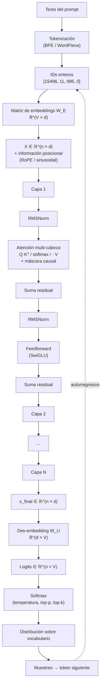

# Qué pasa dentro de un Transformer cuando le mandas un prompt

> Guía técnica de referencia: arquitectura, fórmulas, inferencia, entrenamiento y los límites de lo que sabemos.

---

## §1. Tokenización: del texto a identificadores enteros

Cuando un modelo recibe un prompt, lo primero que ocurre no es que "lea" el texto. El texto se parte en **tokens** — fragmentos que pueden ser palabras enteras, trozos de palabra, signos o secuencias de bytes — mediante un algoritmo determinista entrenado previamente, típicamente **Byte-Pair Encoding (BPE)**, **WordPiece** o **Unigram**. Cada token tiene asignado un identificador entero único dentro de un vocabulario finito.

El tamaño del vocabulario, **V**, define cuántos tokens distintos puede reconocer el modelo. LLaMA 1 y 2 usan V = 32 000. LLaMA 3 amplía a V = 128 256. GPT-4 está en torno a V = 100 277. Modelos multilingües tienden a tener vocabularios mayores para representar caracteres no latinos sin desperdiciar tokens por carácter.

El tokenizador no es neutral. El mismo texto puede convertirse en más o menos tokens según el algoritmo y el corpus de entrenamiento del tokenizador. Anthropic documentó que **Claude Opus 4.7 cambió el tokenizador respecto a Opus 4.6**, y que el mismo input produce entre **1,0× y 1,35× más tokens**. Eso afecta directamente al coste de la API, al consumo de la ventana de contexto y a todas las operaciones downstream que dependen de la longitud de la secuencia.

Después de la tokenización, una secuencia de texto es una secuencia de enteros — algo como `[15496, 11, 995, 0]`. Esos enteros son los índices con los que se accede a la matriz de embeddings.

### Mapa del flujo completo

Antes de entrar en los detalles, este es el recorrido que hace un prompt a través del modelo. Cada bloque se desarrolla en las secciones siguientes.



Lo importante de este mapa: la forma `n × d` se mantiene constante a lo largo de todas las capas. Lo que cambia entre la salida de una capa y la siguiente son los valores numéricos dentro del tensor, no su geometría. Y al final, la generación es autorregresiva — el token muestreado se concatena al input y el ciclo vuelve a empezar.

---

## §2. Notación: cómo se lee `W ∈ ℝ^(a × b)`

Antes de seguir conviene fijar la notación, porque va a aparecer todo el rato.

- **W** — nombre de una matriz. La letra W viene de _weights_ (pesos). Los subíndices (W₁, W_Q) son nomenclatura interna; matemáticamente cualquier nombre serviría.
- **∈** — "pertenece a". Indica que el objeto a la izquierda es elemento del conjunto a la derecha.
- **ℝ** — el conjunto de los números reales. En la práctica, cada número se almacena en formato de coma flotante: `float32`, `float16` o `bfloat16` durante entrenamiento; `int8` o `int4` cuantizados durante inferencia optimizada.
- **ℝ^(a × b)** — matriz de números reales con `a` filas y `b` columnas.

Entonces `W₁ ∈ ℝ^(d × d_ff)` se lee: "la matriz W₁ es una matriz de números reales con d filas y d_ff columnas".

> **Convención de esta guía**: uso vectores fila. La activación de un token se escribe `x ∈ ℝ^d` interpretada como vector fila, y las transformaciones se escriben `xW`, no `Wx`. Eso fija las formas de las matrices: para mapear un vector de dimensión `a` a uno de dimensión `b`, la matriz tiene forma `ℝ^(a × b)`. Por ejemplo, W₁ ∈ ℝ^(d × d_ff) lleva un vector de dimensión d a uno de dimensión d_ff vía `xW₁`. Es la convención que usan PyTorch, JAX y los papers de Transformers desde GPT-2. La convención alternativa con vectores columna y `Wx` es matemáticamente equivalente pero invierte las formas de todas las matrices.

Las dimensiones que vamos a usar continuamente:

| Símbolo | Significado                        | LLaMA 7B | LLaMA 70B | GPT-3 175B |
| ------- | ---------------------------------- | -------- | --------- | ---------- |
| `d`     | dimensión del modelo (hidden size) | 4 096    | 8 192     | 12 288     |
| `d_ff`  | dimensión interna del feedforward  | 11 008   | 28 672    | 49 152     |
| `h`     | número de cabezas de atención      | 32       | 64        | 96         |
| `d_k`   | dimensión por cabeza (= d/h)       | 128      | 128       | 128        |
| `N`     | número de capas                    | 32       | 80        | 96         |
| `V`     | tamaño del vocabulario             | 32 000   | 32 000    | ~50 000    |

Estos números no son arbitrarios — son decisiones de arquitectura. Cuando una de ellas cambia, cambian las formas de todas las matrices del modelo y, por tanto, el conteo total de parámetros.

---

## §3. Embeddings: del entero al vector

La **matriz de embeddings de tokens**, W_E, tiene forma:

```
W_E ∈ ℝ^(V × d)
```

Es una tabla con V filas (una por cada token del vocabulario) y d columnas (la dimensión del modelo). Cuando entra el token con identificador `i`, la operación es seleccionar la fila `i` de W*E — equivalente a un \_lookup* o, formalmente, a multiplicar el vector one-hot del token por W_E. El resultado es un vector en ℝ^d.

Para LLaMA 7B: W_E es 32 000 × 4 096 ≈ 131 millones de parámetros. Para LLaMA 3 70B con vocabulario expandido: 128 256 × 8 192 ≈ 1 050 millones de parámetros — solo en la tabla de embeddings.

Una vez convertido cada token en su vector, una secuencia de n tokens se representa como un tensor:

```
X ∈ ℝ^(n × d)
```

Cada fila es un token. Cada columna es una dimensión del espacio de embedding. Esa forma `n × d` se mantiene constante a lo largo de todas las capas del modelo. Lo que cambia son los valores numéricos dentro del tensor.

### Información posicional

La atención por sí sola es **invariante a permutaciones**: si reordenas los tokens del input, los scores de atención cambian de forma simétrica y el resultado por posición se mueve con ellos, pero el mecanismo no codifica intrínsecamente "el token 5 viene después del token 3". Hay que añadir esa información explícitamente.

Tres familias principales:

1. **Embeddings posicionales aprendidos** (GPT-2, BERT clásico): se entrena una matriz P ∈ ℝ^(n_max × d) y se suma al embedding del token: `x_i = W_E[token_i] + P[i]`. Limitación: n_max es fijo en entrenamiento.

2. **Embeddings sinusoidales** (Transformer original, Vaswani et al. 2017): la posición se codifica con senos y cosenos de distintas frecuencias. No requiere parámetros aprendidos y extrapola en teoría a posiciones nunca vistas.

3. **RoPE — Rotary Position Embedding** (Su et al. 2021, usado por LLaMA, Mistral, GPT-NeoX, PaLM y la mayoría de modelos modernos abiertos). En lugar de sumar al embedding, RoPE rota las queries y keys en pares de dimensiones por un ángulo proporcional a la posición. La rotación preserva el producto punto entre vectores que están a una distancia relativa fija, lo que da al mecanismo de atención una sensibilidad natural a distancia relativa entre tokens.

Existen también variantes como **ALiBi** (Press et al. 2021, usado en algunos modelos de BigScience), que añade un sesgo lineal a los scores de atención según la distancia entre tokens.

La elección de codificación posicional importa porque condiciona qué tan bien el modelo extrapola a contextos más largos que los vistos en entrenamiento. RoPE con interpolación de frecuencia es lo que ha hecho posibles las ventanas de 128 K, 200 K y 1 M tokens en modelos modernos sin reentrenar desde cero.

---

## §4. La pila de capas

Una **capa de Transformer** es un bloque de operaciones que recibe el tensor de tamaño `n × d` y produce otro tensor de la misma forma. La forma se mantiene a lo largo de todas las capas. Lo que cambia son los valores numéricos.

El vector del token 5 al salir de la capa 1 no es el mismo vector que al salir de la capa 12: ha sido transformado por las matrices de pesos de cada capa intermedia.

### Conexión residual

Cada capa tiene la estructura:

```
x_nueva = x_vieja + Bloque(x_vieja)
```

Esa suma exige que ambos términos tengan la misma dimensión. Por eso todas las capas mantienen `d` constante. La conexión residual cumple dos funciones:

1. **Estabiliza el gradiente** durante el entrenamiento. Sin ella, en redes muy profundas el gradiente se desvanece o explota al retropropagarse por decenas de capas.
2. **Hace que cada capa añada información** al vector existente, no lo reemplace. El vector que sale de la capa 30 contiene rastros de lo que entró en la capa 1, más todas las modificaciones que las capas intermedias acumularon.

### Normalización

Antes de cada sub-bloque hay además una **capa de normalización** que reescala el vector para mantener la magnitud bajo control y evitar que los valores se disparen al pasar por muchas capas.

- **LayerNorm** (modelos clásicos): para cada vector x, calcula la media μ y la desviación típica σ a lo largo de las d dimensiones, y reescala: `LN(x) = γ · (x − μ)/σ + β`, donde γ y β son parámetros aprendidos.
- **RMSNorm** (LLaMA, modelos modernos): variante simplificada que solo divide por la raíz cuadrática media, sin restar la media: `RMSNorm(x) = γ · x / RMS(x)`. Empíricamente da resultados equivalentes a LayerNorm con menor coste computacional y un parámetro aprendido menos.

La posición exacta de la normalización (antes o después de la conexión residual) define dos arquitecturas: **post-norm** (Transformer original) y **pre-norm** (GPT-2 en adelante, LLaMA, casi todos los modernos). Pre-norm es más estable durante entrenamiento.

---

## §5. Atención: la mezcla entre posiciones

La atención es donde los tokens se comunican entre sí. Es el mecanismo que da al Transformer su capacidad de procesar contexto.

### Las tres proyecciones: Q, K, V

Para cada token, se calculan tres proyecciones distintas de su vector mediante tres matrices de pesos:

```
q = x W_Q      (query)
k = x W_K      (key)
v = x W_V      (value)
```

Donde `x ∈ ℝ^d` es el vector del token (fila) y:

```
W_Q, W_K, W_V ∈ ℝ^(d × d_k)
```

Apilando las tres proyecciones para los n tokens, con X ∈ ℝ^(n × d) el tensor de la secuencia entera:

```
Q = X W_Q,   K = X W_K,   V = X W_V       Q, K, V ∈ ℝ^(n × d_k)
```

### ¿Por qué tres matrices distintas y no una?

Si Q, K y V vinieran del mismo vector x sin proyección, el producto punto x · x es siempre alto — es la norma al cuadrado del vector. Sin proyecciones distintas, todo token atendería principalmente a sí mismo y el mecanismo de atención colapsaría a una operación trivial.

Las matrices W_Q y W_K rompen esa simetría. Proyectan el mismo vector a dos posiciones distintas del espacio aprendido, y el producto punto entre esas proyecciones puede aprender criterios de compatibilidad arbitrarios. W_V se separa porque la información que un token "transporta" cuando es atendido no tiene por qué coincidir con la información que usa para "anunciarse". Separar las tres funciones — preguntar, anunciarse, transportar — le da al modelo flexibilidad para aprender distintos tipos de relaciones entre tokens.

Formalmente:

- **W_Q** define cómo un token formula una pregunta.
- **W_K** define cómo un token se anuncia.
- **W_V** define qué información transporta cuando otro token le presta atención.

Q y K viven en el mismo espacio (ℝ^d_k) porque hay que compararlos por producto punto. V puede vivir en otro espacio en principio, aunque en la práctica también es ℝ^d_k.

### La fórmula de la atención escalada

```
Atención(Q, K, V) = softmax( (Q · Kᵀ) / √d_k ) · V
```

Vamos pieza por pieza:

**Q · Kᵀ** produce una matriz de tamaño `n × n`. Con vectores fila, `Q · Kᵀ` calcula productos punto entre filas de Q y filas de K: cada entrada (i, j) es el producto punto entre la query del token i (fila i de Q) y la key del token j (fila j de K). Es un escalar que mide qué tan compatibles son esos dos tokens según el criterio que W_Q y W_K han aprendido durante el entrenamiento.

**Dividir por √d_k** es una normalización numérica. Cuando d_k es grande, los productos punto crecen en magnitud y empujan al softmax hacia regiones donde el gradiente es prácticamente cero (saturación). Dividir por √d_k mantiene los valores en un rango donde el softmax tiene gradiente útil. No tiene significado semántico — es estabilidad numérica.

**Softmax por filas** convierte cada fila en una distribución de probabilidad que suma 1. La fila i dice: "del total de mi atención, qué fracción dedico a cada token j".

**Multiplicar por V** produce el resultado: el vector de salida del token i es una combinación lineal de los vectores value de todos los tokens accesibles, ponderada por los pesos de atención.

### Mini ejemplo numérico

Para aterrizarlo, tomemos una secuencia de juguete con `n = 3` tokens y dimensión por cabeza `d_k = 4`. Supongamos que tras aplicar W_Q y W_K obtenemos:

```
Q = [[ 1.0,  0.0,  1.0,  0.0],     ← query del token 1
     [ 0.0,  1.0,  0.0,  1.0],     ← query del token 2
     [ 0.5,  0.5,  0.5,  0.5]]     ← query del token 3

K = [[ 1.0,  0.0,  1.0,  0.0],     ← key del token 1
     [ 0.0,  1.0,  0.0,  1.0],     ← key del token 2
     [ 1.0,  1.0,  0.0,  0.0]]     ← key del token 3
```

**Paso 1 — Productos punto** (`Q · Kᵀ`). Cada entrada (i, j) es el producto punto entre la fila i de Q y la fila j de K:

```
         k_1   k_2   k_3
       ┌                 ┐
q_1   │   2.0   0.0   1.0  │
q_2   │   0.0   2.0   1.0  │
q_3   │   1.0   1.0   1.0  │
       └                 ┘
```

Lectura: la query 1 es muy compatible con la key 1 (score 2.0), nada con la key 2 (0.0) y media con la key 3 (1.0). La query 3, por su simetría, ve las tres keys como igualmente compatibles.

**Paso 2 — Escalado** (`÷ √d_k = ÷ 2`):

```
       ┌                  ┐
       │  1.00  0.00  0.50  │
       │  0.00  1.00  0.50  │
       │  0.50  0.50  0.50  │
       └                  ┘
```

**Paso 3 — Softmax por filas**. Cada fila se normaliza para que sume 1. Para la fila 1, `softmax([1.0, 0.0, 0.5]) ≈ [0.506, 0.186, 0.307]`:

```
       ┌                       ┐
       │  0.506  0.186  0.307  │   ← token 1 atiende mayormente a sí mismo
       │  0.186  0.506  0.307  │   ← token 2 atiende mayormente a sí mismo
       │  0.333  0.333  0.333  │   ← token 3 distribuye atención uniforme
       └                       ┘
```

Esa matriz son los **pesos de atención**. Cada fila es una distribución de probabilidad sobre los tres tokens.

**Paso 4 — Multiplicación por V**. La salida del token i es la combinación ponderada de las filas de V según la fila i de los pesos. Si V tiene tres filas v_1, v_2, v_3, entonces la salida del token 1 es `0.506·v_1 + 0.186·v_2 + 0.307·v_3`.

Esto, repetido por cada cabeza en paralelo, concatenado y proyectado por W_O, es exactamente lo que ocurre en una capa de atención. La operación entera son cuatro multiplicaciones de matrices y un softmax. Todo lo demás — máscara causal, multi-cabeza, residual, normalización — son envoltorios alrededor de este núcleo.

### La máscara causal

En modelos generativos como GPT, LLaMA o Claude, antes del softmax se aplica una **máscara causal**: a las posiciones (i, j) con j > i se les pone score = −∞, lo que tras el softmax se convierte en peso = 0. El resultado: el token i solo puede atender a posiciones j ≤ i, nunca al futuro.

Aplicado al ejemplo anterior, antes del softmax la matriz escalada quedaría con −∞ en las posiciones por encima de la diagonal:

```
       ┌                  ┐
       │  1.00   −∞    −∞  │
       │  0.00  1.00   −∞  │
       │  0.50  0.50  0.50 │
       └                  ┘
```

Y tras el softmax:

```
       ┌                       ┐
       │  1.000  0.000  0.000  │   ← token 1 solo se ve a sí mismo
       │  0.269  0.731  0.000  │   ← token 2 ve a 1 y a sí mismo
       │  0.333  0.333  0.333  │   ← token 3 ve a todos los anteriores y a sí mismo
       └                       ┘
```

Esto es lo que permite que el modelo sea **autorregresivo**. Durante el entrenamiento, el modelo predice el siguiente token de toda una secuencia en paralelo, pero cada posición solo puede usar información de posiciones anteriores. Si pudiera "ver el futuro", estaría haciendo trampa al predecir lo que ya tiene delante.

En modelos bidireccionales como BERT no hay máscara causal — pero esos modelos no son generativos, están entrenados para tareas distintas (classification, masked language modeling).

### Atención multi-cabeza

Una sola atención con dimensión d_k = d limitaría al modelo a un único patrón de relaciones entre tokens. La solución es ejecutar **múltiples atenciones en paralelo**, cada una con su propio conjunto de matrices Q, K, V — cada conjunto se llama una **cabeza** (head).

Si hay h cabezas, cada cabeza opera en dimensión d_k = d / h. Para LLaMA 7B: d = 4 096, h = 32, d_k = 128.

Cada cabeza calcula su propia salida `Atención_i(Q_i, K_i, V_i) ∈ ℝ^(n × d_k)`. Las h salidas se concatenan a lo largo de la dimensión de features:

```
Concat(cabeza_1, ..., cabeza_h) ∈ ℝ^(n × d)
```

Y se proyectan mediante una matriz final, **W_O ∈ ℝ^(d × d)**:

```
salida_atención = Concat(cabeza_1, ..., cabeza_h) · W_O
```

W_O cumple dos funciones: mezcla la información que las distintas cabezas extrajeron en paralelo, y la proyecta de vuelta a la dimensión d para que pueda sumarse residualmente al input del bloque.

¿Por qué funciona la multi-cabeza? Porque cabezas distintas pueden aprender a atender a aspectos distintos del contexto. Una cabeza puede especializarse en correferencias (qué pronombre se refiere a qué entidad), otra en estructura sintáctica, otra en relaciones de larga distancia. La interpretabilidad mecanicista ha encontrado cabezas concretas con funciones específicas — _induction heads_ que copian patrones, _name mover heads_ que mueven información de nombres entre posiciones, etc.

---

## §6. Feedforward: la transformación por posición

El segundo sub-bloque de cada capa es el **feedforward** (FFN o MLP). Aquí no hay comunicación entre tokens — cada vector se procesa aisladamente.

### Versión clásica (GPT-2, GPT-3)

```
FFN(x) = GeLU(x W₁) W₂
```

Donde:

```
W₁ ∈ ℝ^(d × d_ff)
W₂ ∈ ℝ^(d_ff × d)
```

La operación expande el vector de dimensión d a una dimensión interna d_ff vía `xW₁`, le aplica una no-linealidad componente a componente, y lo proyecta de vuelta a d vía `W₂`. Por convención clásica, d_ff = 4·d.

¿Por qué expandir? Una transformación lineal d → d tiene rango máximo d. Si pasas a una dimensión mayor d_ff > d, le das al feedforward un espacio más amplio donde aplicar la no-linealidad antes de proyectar de vuelta. Eso permite representar funciones más complejas que una simple transformación d → d.

### Versión moderna: SwiGLU

Modelos como LLaMA, PaLM, Mistral usan **SwiGLU** (Shazeer 2020), una variante con compuerta:

```
FFN_SwiGLU(x) = ( Swish(x W₁) ⊙ (x W₃) ) W₂
```

Donde:

- `Swish(z) = z · σ(z)`, con σ la sigmoide. Es una activación suave parecida a GeLU.
- `⊙` es el producto elemento a elemento (Hadamard product).
- W₁, W₃ ∈ ℝ^(d × d_ff) son matrices de expansión.
- W₂ ∈ ℝ^(d_ff × d) es la matriz de contracción.

Hay tres matrices, no dos. La intuición: en lugar de aplicar una no-linealidad fija al vector proyectado, se calculan dos proyecciones del input. Una pasa por Swish (la _rama de activación_) y la otra queda lineal (la _rama de compuerta_). Se multiplican elemento a elemento. Esa multiplicación permite que partes del vector "abran" o "cierren" el paso de información dinámicamente.

Empíricamente SwiGLU rinde mejor que GeLU para el mismo presupuesto de parámetros. Como tiene tres matrices en lugar de dos, los modelos con SwiGLU suelen reducir d_ff (de 4d a ~2,7d) para mantener el conteo total de parámetros comparable. Para LLaMA 7B: d = 4 096, d_ff = 11 008, proporción ≈ 2,69×.

### El papel de las no-linealidades

Las no-linealidades (GeLU, ReLU, Swish, GELU exacto) **no son aprendidas** — son funciones fijas. Pero son críticas. Sin ellas, apilar capas lineales colapsaría matemáticamente: la composición de funciones lineales es una función lineal, y una función lineal no puede aprender lenguaje (no puede modelar dependencias condicionales, decisiones disjuntas, jerarquías).

La atención sí tiene una no-linealidad propia (el softmax), pero es de una naturaleza distinta — opera entre posiciones, no dentro de la representación de un token. Las no-linealidades del feedforward son las que aportan la capacidad expresiva por posición.

---

## §7. Las tres familias de pesos: resumen

Hay tres categorías funcionales de pesos en un Transformer:

1. **Pesos de entrada y salida** (W_E, W_U): traducen entre el vocabulario discreto y el espacio vectorial continuo de dimensión d.
2. **Pesos de mezcla entre posiciones** (W_Q, W_K, W_V, W_O): permiten que un token absorba información de otros.
3. **Pesos de transformación por posición** (W₁, W₂, W₃ en SwiGLU; W₁, W₂ en variantes clásicas): procesan cada vector aislado.

Cada capa del modelo tiene su propio conjunto completo de pesos de las categorías 2 y 3. No se comparten entre capas. LLaMA 7B con N = 32 capas tiene 32 W*Q distintas, 32 W_K, 32 W_V, 32 W_O, 32 conjuntos {W₁, W₂, W₃}, todas con valores independientes aprendidos durante el entrenamiento. Los embeddings W_E y la des-embedding W_U son únicos para todo el modelo. En algunos modelos se \_atan* (tied embeddings), usando la misma matriz para ambas operaciones con el fin de ahorrar parámetros.

---

## §8. Conteo de parámetros: una capa de LLaMA 7B

Para que el orden de magnitud quede claro. LLaMA 7B con d = 4 096, d_ff = 11 008, h = 32, d_k = 128:

| Matriz               | Forma          | Parámetros    |
| -------------------- | -------------- | ------------- |
| W_Q                  | 4 096 × 4 096  | 16,78 M       |
| W_K                  | 4 096 × 4 096  | 16,78 M       |
| W_V                  | 4 096 × 4 096  | 16,78 M       |
| W_O                  | 4 096 × 4 096  | 16,78 M       |
| W₁ (FFN, gate)       | 4 096 × 11 008 | 45,08 M       |
| W₂ (FFN, down)       | 11 008 × 4 096 | 45,08 M       |
| W₃ (FFN, up, SwiGLU) | 4 096 × 11 008 | 45,08 M       |
| **Total por capa**   |                | **≈ 202,4 M** |

Multiplicado por 32 capas: ≈ **6 480 millones** de parámetros solo en bloques Transformer. El resto, hasta llegar a los 6 738 millones reales del modelo, viene de la matriz de embeddings (W_E, ~131 M), los parámetros de RMSNorm (despreciables), y la cabeza de salida W_U (en LLaMA está atada con W_E).

Esa estructura es lo que escala cuando aumentas de 7B a 70B. No se añaden conceptos nuevos — se aumentan d, h, N, d_ff, y todas las matrices crecen proporcionalmente.

---

## §9. Des-embedding y muestreo: del vector al texto

Después de N capas, el tensor de salida tiene forma n × d. Para producir la predicción del siguiente token, se aplica la **matriz de des-embedding**:

```
W_U ∈ ℝ^(d × V)

logits = x_final W_U
```

Para cada posición de la secuencia, esta operación produce un vector de tamaño V — un score para cada token posible del vocabulario. Esos vectores son los **logits**.

Aplicando softmax sobre los logits se obtiene una distribución de probabilidad sobre el vocabulario:

```
P(token | contexto) = softmax(logits)
```

Pero esta distribución no es texto. Para producir un token concreto hay que **muestrear** de ella. Aquí entran los parámetros de sampling:

- **Temperatura T**: escala los logits antes del softmax. `softmax(logits / T)`. T < 1 concentra la masa en los tokens más probables (genera respuestas más deterministas). T > 1 dispersa la distribución (más diversidad). T = 0 es equivalente a tomar el argmax (greedy decoding).
- **Top-p (nucleus sampling)**: filtra a los tokens cuya probabilidad acumulada (ordenando de mayor a menor) cubre el umbral p. Si p = 0,9, se descartan los tokens menos probables que en conjunto suman el 10 % restante.
- **Top-k**: restringe el muestreo a los k tokens más probables. Se descartan el resto poniéndoles probabilidad cero.

La elección del siguiente token es entonces un muestreo aleatorio de la distribución filtrada. Una vez elegido, se concatena al input y se vuelve a ejecutar el modelo para predecir el siguiente. Eso es la **generación autorregresiva**.

Algunos modelos comerciales restringen o fijan los parámetros de muestreo. Anthropic, en Claude Opus 4.7, devuelve error 400 si se intenta poner temperatura, top_p o top_k a valores no-default. El control sobre la generación se desplaza desde el muestreo hacia el prompt y los niveles de esfuerzo de razonamiento que el modelo expone.

---

## §10. Diferencia entre capas: la jerarquía emergente

Cada capa tiene su propio conjunto completo de pesos, distintos de los de cualquier otra capa. Empíricamente, a través de muchos modelos analizados con técnicas de interpretabilidad, se observa una jerarquía aproximada:

- **Capas tempranas** (15–20 % de profundidad inicial): procesan características de bajo nivel — patrones tokénicos, ortografía, identificación de idioma, estructura sintáctica básica.
- **Capas medias**: hacen el trabajo pesado de comprensión — combinan información sintáctica en estructuras semánticas, resuelven correferencias, identifican relaciones entre entidades.
- **Capas tardías** (20–30 % final): se especializan en producir la salida — integran toda la información acumulada y la canalizan hacia una predicción concreta del siguiente token.

Esta jerarquía no es rígida ni perfectamente separable, y los detalles cambian entre modelos. Pero el patrón es consistente. La razón por la que apilar muchas capas funciona es que cada capa puede hacer una transformación relativamente simple, y la composición de muchas transformaciones simples permite construir representaciones progresivamente más abstractas.

### Logit lens: el modelo "decide" capa a capa

Una técnica de interpretabilidad llamada **logit lens** (Nostalgebraist 2020) consiste en tomar las activaciones intermedias de cada capa y proyectarlas con W_U como si fueran la salida final, viendo qué token predeciría el modelo si se detuviera ahí. Lo que se observa es revelador: la "decisión" sobre el siguiente token se va formando gradualmente.

- En capas tempranas, la distribución logit lens es difusa y se concentra en patrones léxicos genéricos.
- En capas medias, empieza a haber compromiso semántico — el modelo ya tiene una idea aproximada del tipo de token que viene.
- En capas tardías, la distribución converge al token final, a menudo varias capas antes del final.

Esto significa que el modelo no decide en el último paso. Decide a lo largo de toda la cadena, y las últimas capas materializan una decisión que ya estaba tomada en las representaciones intermedias.

---

## §11. Dimensionalidad efectiva: por qué d ≠ d real

Los vectores del modelo viven en ℝ^d. Para LLaMA 7B, eso son 4 096 dimensiones nominales por token en cada capa. Pero la información útil no se distribuye uniformemente por esas 4 096 dimensiones. Se concentra en subespacios de **dimensión efectiva mucho menor** que d.

Esto se observa de tres formas independientes:

**Análisis de espectro** (descomposición SVD de las activaciones a lo largo de un corpus). El espectro de valores singulares decae rápido — un puñado de direcciones acumulan la mayor parte de la varianza, y la cola larga aporta poco. La dimensión efectiva (definida como la _stable rank_ o el rank al 99 % de varianza) suele ser uno o dos órdenes de magnitud inferior a d.

**Características interpretables**. El trabajo de **sparse autoencoders** (Anthropic, OpenAI, varios laboratorios académicos a partir de 2023–2024) entrena descomposiciones sobreparametrizadas de las activaciones. Lo que aparece son miles o decenas de miles de "características" interpretables (la idea del Golden Gate Bridge, código con bugs, halagos serviles, una fecha concreta, etc.) que viven en direcciones específicas del espacio. Cada activación es una superposición esparsa de muchas más características que d, lo que sugiere que el modelo usa **superposición**: codifica más conceptos de los que le caben en sus dimensiones nominales aprovechando que la mayoría de conceptos no se activan a la vez.

**Robustez al pruning**. Eliminar fracciones significativas de los pesos (pruning estructurado, low-rank approximation) suele degradar el rendimiento mucho menos de lo que cabría esperar. Modelos comprimidos al 30–50 % de sus parámetros originales mantienen gran parte de su capacidad. Eso es solo posible si la información no estaba distribuida uniformemente — había redundancia explotable.

### Consecuencias prácticas

- **Compresión y cuantización funcionan**. La cuantización a int8 o int4 conserva la mayor parte de la calidad porque los grados de libertad relevantes son menos que los aparentes. Las técnicas modernas de quantization-aware training (QAT) y post-training quantization (PTQ) explotan esto sistemáticamente.
- **Distillation funciona**. Modelos pequeños entrenados a imitar las distribuciones de salida (o las activaciones) de modelos grandes capturan gran parte de la capacidad original con una fracción de los parámetros, porque la "capacidad útil" del modelo grande no estaba en sus d dimensiones nominales sino en patrones más estructurados.
- **Interpretabilidad mecanicista es viable, pero difícil**. Que la información viva en subespacios de baja dimensión no significa que esos subespacios sean ortogonales o limpios — están en superposición. Por eso decodificarlos requiere modelos auxiliares (como los SAE) y no se ven directamente leyendo los pesos.

La idea operativa: cuando se piensa en un modelo de "billones de parámetros", la imagen mental correcta no es "billones de cosas distintas que el modelo sabe". Es "billones de parámetros que codifican un número mucho menor de patrones efectivos, en superposición, distribuidos por toda la red".

---

## §12. Por qué esta arquitectura funciona para lenguaje

Hasta aquí hemos descrito **cómo** funciona el Transformer. La pregunta natural es **por qué** funciona — qué propiedades estructurales lo hacen tan adecuado para modelar lenguaje. La respuesta no es completa: el éxito empírico va por delante de la teoría. Pero hay varias hipótesis con buen respaldo empírico.

### Composición jerárquica

El lenguaje es composicional por naturaleza: morfemas → palabras → frases → oraciones → párrafos → discurso. Cada nivel se construye combinando elementos del nivel anterior. La pila profunda de capas del Transformer permite que cada capa opere en un nivel de abstracción ligeramente mayor que la anterior. Lo que se observa empíricamente — capas tempranas léxicas, capas medias semánticas, capas tardías discursivas — coincide con esa estructura del lenguaje.

No es que los diseñadores del Transformer codificaran esta jerarquía. Emergió del entrenamiento. Pero la arquitectura tiene la profundidad y las primitivas necesarias para representarla.

### Alternancia lineal / no-lineal

Cada capa alterna transformaciones lineales (las matrices de atención y feedforward) con no-linealidades (softmax, GeLU, SwiGLU). Esa alternancia es lo que da al Transformer su poder expresivo. Una sola transformación lineal mapea hiperplanos a hiperplanos. Apilar lineales sin no-linealidad colapsa a una sola lineal. Pero alternando lineal y no-lineal con suficiente profundidad, se obtiene un **aproximador universal**: cualquier función continua puede ser aproximada con suficiente precisión.

Eso es teoría general de redes neuronales (Cybenko 1989, Hornik 1991). Lo que el Transformer aporta sobre arquitecturas anteriores no es la universalidad — RNNs y MLPs ya la tenían — sino la **estructura particular** que hace que el aprendizaje sea estable, paralelizable y eficiente en cómputo.

### Atención como routing dinámico

La pieza clave del Transformer es que la mezcla de información entre tokens **no está fijada por la arquitectura**. En una RNN, el flujo de información es secuencial y rígido: la información del token 1 se propaga al token 100 pasando por los 98 estados intermedios. En una CNN, el flujo es local y fijo: cada token solo ve a sus vecinos en una ventana estática.

En la atención, **el modelo aprende qué tokens atienden a qué tokens**. La matriz Q · Kᵀ se calcula dinámicamente a partir del contenido de la secuencia. Eso es _routing dinámico_: el patrón de comunicación entre posiciones es función del input, no del diseño del sistema. Permite dependencias arbitrariamente largas (el token 1 puede atender directamente al token 1000 sin propagación) y patrones que dependen del contexto (un mismo token puede atender de forma muy distinta en frases distintas).

Esa flexibilidad es lo que hace al Transformer eficaz en tareas donde las dependencias son largas, no locales y dependen del contenido — exactamente el caso del lenguaje.

### Paralelismo masivo

Las RNNs procesan tokens secuencialmente, lo que las hacía caras de entrenar a escala — el coste de entrenamiento crecía linealmente con la longitud de secuencia y no se podía paralelizar bien en GPU. El Transformer, durante el entrenamiento y el prefill, procesa todos los tokens simultáneamente porque la atención está completamente especificada por matrices que la GPU puede multiplicar en paralelo.

Eso es la razón **práctica** por la que escalaron antes que las arquitecturas anteriores. Más datos, más parámetros, más cómputo, todo absorbido por hardware ya disponible. El Transformer no es la arquitectura más teóricamente elegante — es la que mejor usa el hardware moderno.

### Composición de las cuatro propiedades

Composición jerárquica + alternancia lineal/no-lineal + routing dinámico + paralelismo es la combinación que ninguna arquitectura previa tenía completa. Las RNNs tenían composición secuencial pero no paralelismo. Los MLPs tenían no-linealidad pero no routing dinámico. Las CNNs tenían paralelismo pero routing fijo. El Transformer junta las cuatro.

Por qué exactamente esa combinación produce los comportamientos emergentes que vemos — razonamiento en cadena, in-context learning, generalización a tareas no vistas — sigue siendo objeto activo de investigación. El éxito está. La explicación completa, no.

---

## §13. Inferencia: prefill y decode

La pregunta operativa es cuántos tokens se procesan al mismo tiempo. La respuesta depende de la fase.

### Prefill: paralelismo masivo

Cuando le mandas un prompt de n tokens al modelo, los n entran simultáneamente en una sola pasada por la pila de capas. Cada capa procesa la matriz n × d entera de una vez.

- Las multiplicaciones matriz-matriz están masivamente paralelizadas en GPU.
- El feedforward es trivialmente paralelo por posición — cada uno de los n tokens se procesa al mismo tiempo, sin interdependencias.
- La atención también se paraleliza: la matriz de scores Q · Kᵀ se calcula de una vez para todos los pares (i, j) válidos, con tamaño n × n.

Esta fase **satura el hardware**. Es donde la GPU está más cerca de su pico de rendimiento. El coste por token de prefill es mucho menor que el coste por token de decode.

Es aquí donde la atención **escala cuadráticamente** con la longitud del contexto. Para n = 1 000 son un millón de scores por cabeza por capa. Para n = 10 000, cien millones. Para n = 100 000, diez mil millones. Por capa. Por cabeza.

### Dependencia secuencial entre capas

Aunque dentro de una capa todo lo paralelizable se hace en paralelo, **entre capas la dependencia es secuencial**. La capa 5 no puede empezar antes de que la capa 4 termine, porque necesita su salida como entrada. La pila se recorre de arriba a abajo, capa por capa.

### Decode: secuencial por construcción

La fase de decode es la generación del output. El modelo produce un token a la vez, y no puede generar el token n+1 sin haber generado el n — es la naturaleza autorregresiva. En cada paso de decode, una sola pasada por toda la pila de capas produce un único token nuevo.

La GPU queda **infrautilizada** durante decode porque procesa una sola posición. Eso es lo que hace que la generación sea lenta comparada con el prefill, y por qué los modelos parecen "tardar" después del primer momento.

---

## §14. KV cache: la optimización que hace viable el decode

Sin optimización, cada paso de decode tendría que ejecutar de nuevo el forward completo sobre todo el contexto, incluyendo la atención con matriz de scores n × n. Es decir, cada paso individual ya es cuadrático en n, y el coste total de generar m tokens crecería como O(m · n²) — inviable para contextos largos.

La solución es el **KV cache**:

1. Durante el prefill, las K y V calculadas en cada capa para cada token se guardan en memoria GPU.
2. Durante el decode, para el token nuevo solo se calculan su propia Q, K, V.
3. La atención del nuevo token se computa entre su query y todas las K, V acumuladas en cache (las antiguas + la nueva).
4. Las K y V del nuevo token se añaden al cache.

Resultado: cada paso de decode pasa de O(n²) operaciones de atención a **O(n) operaciones**. La atención del token nuevo contra el contexto es una multiplicación 1 × n por cabeza por capa, no n × n.

### El precio: memoria

El KV cache crece linealmente con la longitud del contexto y con cada capa del modelo. Para LLaMA 7B clásico con atención multi-cabeza completa en fp16:

```
bytes_por_token = 2 (K y V) × N (capas) × h (cabezas) × d_k × 2 (bytes en fp16)
                = 2 × 32 × 32 × 128 × 2
                = 524 288 bytes
                ≈ 0,5 MB por token
```

Para un contexto de 100 000 tokens: **50 GB solo de cache**. Para un contexto de 1 000 000 de tokens, escalado lineal: 500 GB — imposible en una sola GPU con memoria estándar.

Por eso los contextos largos son caros en producción — no por el cómputo en sí, sino por la memoria que el cache exige mantener viva durante toda la generación, y por el ancho de banda necesario para mover esos datos entre VRAM y los registros de la GPU en cada paso de decode.

---

## §15. Variantes de atención: la economía del KV cache

El KV cache es el cuello de botella práctico de los contextos largos. Casi todas las variantes modernas de atención atacan ese problema desde distintos ángulos.

### Multi-Head Attention (MHA): la línea base

La atención original. Cada cabeza tiene su propio conjunto independiente de W_K y W_V. KV cache proporcional a h.

```
Cache MHA = h · n · d_k · 2 bytes (fp16) · 2 (K y V) · N (capas)
```

Para LLaMA 7B: 32 cabezas × 128 d_k = 4 096 dimensiones de cache K + 4 096 de V por capa por token.

### Multi-Query Attention (MQA)

Propuesta por Shazeer (2019), adoptada en PaLM. Idea: usar h queries distintas, pero **una sola K y una sola V compartidas** entre todas las cabezas.

- W_Q sigue siendo de tamaño d × (h · d_k) — produce h queries.
- W_K y W_V son de tamaño d × d_k — producen una sola K y una sola V.
- Las h queries atienden todas a la misma K, V.

**Reducción de KV cache**: factor h. Para LLaMA 7B sería 32 veces más pequeño.

**Coste**: pierde calidad. Compartir K y V entre todas las cabezas limita la diversidad de patrones de atención que el modelo puede aprender. Las cabezas dejan de poder especializarse en aspectos distintos del contexto.

### Grouped-Query Attention (GQA)

Propuesta por Ainslie et al. (2023). Es el compromiso entre MHA y MQA, y es lo que usan **LLaMA 2 70B, LLaMA 3, Mistral 7B+, y casi todos los modelos modernos en producción**.

Idea: agrupar las h cabezas en g grupos, donde cada grupo comparte K y V. Si h = 32 y g = 8, hay 32 queries pero solo 8 keys y 8 values; cada grupo de 4 cabezas comparte una K y una V.

**Reducción de KV cache**: factor h/g. Para g = 8, h = 32, reducción 4×.

**Por qué funciona empíricamente**: en MHA muchas cabezas aprenden patrones redundantes. Agruparlas fuerza eficiencia sin pérdida significativa de calidad. Es el estándar actual.

### Sliding Window Attention

Usada en Mistral, Longformer y modelos optimizados para contextos largos. En lugar de que cada token atienda a todos los anteriores, **cada token solo atiende a una ventana fija de los W tokens más recientes**.

- Si W = 4 096, el token en la posición 10 000 solo atiende a los tokens 5 904 a 10 000.
- Complejidad de atención: de O(n²) a O(n · W).
- KV cache: se vuelve circular. Solo se mantienen los últimos W tokens.

**Compensación**: se pierde acceso directo a tokens muy lejanos. Pero como las capas se apilan, la información se propaga indirectamente — un token de la capa 10 que atiende dentro de su ventana absorbe información de tokens que en capas anteriores absorbieron información de aún más atrás. Eso se llama **receptive field**: con suficientes capas, la ventana efectiva crece.

Mistral 7B usó sliding window de 4 096 con un contexto de hasta 32 K, apoyándose en el receptive field para distancias largas.

### Sparse Attention

Familia de técnicas donde no todas las posiciones atienden a todas. La matriz de atención n × n se vuelve dispersa — la mayoría de entradas son cero por construcción.

Patrones comunes:

- **Block-sparse**: la secuencia se divide en bloques y solo se computa atención dentro de cada bloque, más algunas conexiones globales.
- **Strided**: cada token atiende a posiciones a distancias fijas (1, 2, 4, 8, ... atrás).
- **Random**: cada token atiende a un subconjunto aleatorio fijo de posiciones.
- **Global tokens**: ciertos tokens designados atienden a todos y son atendidos por todos. Es lo que hace BigBird (Zaheer et al. 2020) y Longformer.

**Compensación**: pérdida de expresividad — el modelo no puede aprender cualquier patrón de atención, solo los compatibles con la estructura dispersa. A cambio, escala a contextos de cientos de miles o millones de tokens con coste manejable.

### Tabla comparativa

| Variante       | Tamaño KV cache     | Calidad relativa                                                |
| -------------- | ------------------- | --------------------------------------------------------------- |
| MHA            | h · n · d_k         | Referencia / máxima flexibilidad                                |
| GQA (g grupos) | g · n · d_k         | Casi idéntica en práctica con mucho menor cache                 |
| MQA            | n · d_k             | Algo peor que MHA en igualdad de condiciones                    |
| Sliding window | W · d_k (constante) | Buena para tareas locales, pierde dependencias lejanas directas |
| Sparse         | depende del patrón  | Variable, depende de la tarea                                   |

MHA es la línea base teórica con mayor flexibilidad por cabeza, pero no necesariamente la opción de mayor calidad práctica: con mismo presupuesto de parámetros y entrenamiento, GQA suele igualar o superar a MHA porque libera capacidad para otras partes del modelo. El estándar en producción es GQA por esa razón — calidad equivalente a MHA con un cache varias veces menor.

---

## §16. FlashAttention: optimización de memoria, no de cómputo

**FlashAttention** (Dao et al. 2022, FlashAttention-2 en 2023, FlashAttention-3 en 2024) es la otra gran optimización moderna. **No reduce el número de operaciones teóricas (FLOPs)** — el resultado es matemáticamente idéntico al de la atención estándar. Lo que reduce es el **tiempo real**, al disminuir drásticamente los accesos a memoria que dominan el coste práctico.

### El problema

En la atención estándar, la matriz de scores S = Q · Kᵀ / √d_k de tamaño n × n se materializa en memoria HBM (la VRAM principal de la GPU). Después se le aplica softmax, lo que produce otra matriz n × n. Después se multiplica por V. Cada uno de estos pasos lee y escribe matrices completas en HBM.

HBM es lenta comparada con la SRAM on-chip (los registros y caches de la GPU). Para n grande, el cuello de botella no es el número de operaciones de coma flotante — es el ancho de banda de memoria. La GPU está esperando datos la mayor parte del tiempo.

### La solución

FlashAttention reorganiza el cálculo usando **tiling**:

1. Divide Q, K, V en bloques pequeños que caben en SRAM.
2. Para cada par de bloques (Q_i, K_j), calcula su contribución parcial a la atención sin materializar la matriz completa S.
3. Acumula los resultados parciales aplicando un **softmax online** — un truco numérico que permite calcular softmax sobre una secuencia de bloques sin necesitar todos los valores de antemano.
4. Escribe el resultado final O en HBM una sola vez.

El ahorro principal es de memoria intermedia: la matriz n × n nunca se materializa. La complejidad de operaciones sigue siendo O(n²), pero la complejidad de memoria pasa de O(n²) a O(n).

**Aceleración real**: 2× a 4× en tiempo de pared sin cambiar el resultado matemático. Y reducción de uso de memoria que permite contextos más largos en el mismo hardware.

FlashAttention es ortogonal a las variantes de atención que reducen el KV cache. Se pueden combinar: GQA + FlashAttention es una configuración estándar en producción moderna.

---

## §17. Continuous batching: la economía multi-usuario

En servidores de producción, los modelos no procesan una conversación a la vez. Ejecutan **continuous batching**: mezclar prefills de unos usuarios con decodes de otros para saturar la GPU al máximo.

El problema clásico: si tienes una GPU procesando un decode (un token nuevo, infrautilizada) y llega un prefill nuevo de otro usuario, ¿paras el decode? ¿Esperas a que termine? Continuous batching los mezcla en el mismo batch — la GPU procesa simultáneamente N posiciones de prefill de un usuario y M posiciones de decode (una por cada usuario en fase de decode), aprovechando la ociosidad de los decodes individuales.

Servidores como **vLLM**, **TGI** (Text Generation Inference de HuggingFace) y los sistemas internos de OpenAI/Anthropic implementan continuous batching como default. Eso explica por qué el coste por token en la API es **mucho menor** que el coste de servir un modelo dedicado a un solo usuario: la economía depende de cuánto se logra amortizar la GPU entre múltiples sesiones simultáneas.

---

## §18. Speculative decoding: acelerar el decode sin perder calidad

La fase de decode es secuencial por construcción. No puedes generar el token 5 sin haber generado el 4. Pero los recursos de la GPU están infrautilizados durante decode (un solo token por pasada). ¿Se puede usar ese ancho de banda ocioso?

### La idea fundamental

**Speculative decoding** (Leviathan et al. 2023; Chen et al. 2023) usa dos modelos:

- Un **modelo objetivo** (target), grande y lento — el que de verdad quieres usar.
- Un **modelo borrador** (draft), pequeño y rápido — idealmente del mismo tipo y entrenamiento que el objetivo.

El bucle:

1. El modelo borrador genera **k tokens** rápidamente (típicamente k = 4–8). Esto es barato porque el borrador es liviano.
2. El modelo objetivo recibe la secuencia completa con esos k tokens propuestos y los **evalúa todos a la vez en paralelo**. Esto es clave: una sola pasada por el modelo grande puede verificar k tokens, no solo uno, porque la verificación es como un prefill de k tokens.
3. Para cada uno de los k tokens propuestos, el modelo objetivo compara la probabilidad asignada al token propuesto bajo ambas distribuciones — `p_target(token_propuesto)` vs `p_draft(token_propuesto)`.
4. **Aceptación**: con probabilidad `min(1, p_target / p_draft)` se acepta el token. Si se rechaza, se reemplaza muestreando de la distribución residual `max(0, p_target − p_draft)` normalizada.
5. Cuando se rechaza un token, los siguientes propuestos se descartan y se vuelve al paso 1.

### Equivalencia matemática

El criterio de aceptación está diseñado para que la **distribución de salida sea exactamente la misma** que la del modelo objetivo solo. No es una aproximación. El teorema (Leviathan et al. 2023) demuestra que la distribución de tokens generados con speculative decoding es idéntica, en distribución, a la del modelo objetivo aplicado token a token.

No pierdes calidad. Ganas velocidad.

### Aceleración real

Si el borrador es razonablemente bueno, en promedio se aceptan entre 2 y 5 tokens por pasada del modelo objetivo. Aceleración real de 2× a 3× en muchos casos prácticos de uso.

### Variantes

- **Medusa** (Cai et al. 2024): en lugar de un modelo borrador separado, se añaden cabezas de predicción extra al modelo objetivo. Cada cabeza predice un token futuro distinto en paralelo. No hace falta dos modelos, pero sí entrenar las cabezas adicionales.
- **Lookahead decoding** (Fu et al. 2024): genera múltiples candidatos en paralelo usando estructuras tipo n-gram, sin modelo borrador. Más complicado, pero elimina la dependencia de un borrador alineado.
- **Self-speculative decoding**: usa el propio modelo con menos capas como su borrador. Saltarse capas durante el draft es más rápido que ejecutar el modelo entero.

---

## §19. ¿Dónde está el cuello de botella computacional?

Una pregunta común es si el coste dominante de generar texto está en la des-embedding final (la proyección al vocabulario, que tiene tamaño grande). La respuesta corta: **no**.

Vamos a contar operaciones para LLaMA 7B con un prompt de n = 2 000 tokens.

### Atención (por capa)

Q · Kᵀ por cabeza es n × d_k × n. Multiplicado por h cabezas:

```
ops_atención_por_capa = h · n² · d_k = 32 · 2 000² · 128 ≈ 16,4 mil millones
```

Multiplicado por las N = 32 capas: **≈ 524 mil millones de operaciones** solo en los productos Q·Kᵀ. Y eso ignora las multiplicaciones por V y las proyecciones W_O.

### Feedforward (por capa)

Por cada token, FFN realiza:

```
ops_FFN_por_token = d · d_ff (W₁) + d_ff · d (W₂) + d · d_ff (W₃ en SwiGLU)
                  = 3 · d · d_ff = 3 · 4 096 · 11 008 ≈ 135 millones
```

Para n = 2 000 tokens: 270 mil millones por capa. Para 32 capas: **≈ 8,7 billones de operaciones**.

El feedforward suele dominar el cómputo en modelos modernos.

### Des-embedding

Una sola multiplicación al final:

```
ops_des-embedding = n · d · V = 2 000 · 4 096 · 32 000 ≈ 262 mil millones
```

Es una fracción pequeña del total. **Aproximadamente el 3 %** del cómputo de un forward pass completo.

### El cuello de botella conceptual

Aunque el des-embedding no es donde está el coste computacional, sí es donde ocurre algo cualitativamente distinto: la **transición del espacio continuo al discreto**. Todo el modelo opera en ℝ^d, donde las representaciones son ricas y mezclan información de manera fluida. Al final, la proyección a logits + softmax + muestreo colapsa esa riqueza a un único token discreto del vocabulario.

Esa compresión del continuo al símbolo es donde se pierde información irrecuperablemente en cada paso de generación. El modelo "termina de pensar" antes de la última capa — las representaciones internas en las capas tardías ya contienen toda la información sobre lo que va a salir. El logit lens lo confirma. La proyección a logits es solo la decodificación final de una decisión que ya estaba tomada.

---

## §20. Entrenamiento: cómo se llega a los pesos

La arquitectura define qué operaciones realiza el modelo. Pero los valores numéricos concretos de los pesos vienen del entrenamiento.

### Inicialización

Antes de entrenar, las matrices se rellenan con números aleatorios. No cualquier distribución sirve — la varianza tiene que estar calibrada para que las activaciones no exploten ni se desvanezcan al pasar por muchas capas.

Esquemas comunes:

- **Xavier (Glorot) initialization**: varianza ∝ 1 / (fan_in + fan_out). Adecuada para activaciones simétricas alrededor de cero.
- **He initialization**: varianza ∝ 2 / fan_in. Adecuada para ReLU y variantes.
- **Variantes específicas para Transformers**: distribuciones gaussianas o uniformes ajustadas con factores que dependen de la profundidad N para preservar la magnitud de las activaciones a lo largo de las capas.

Al inicio del entrenamiento, las matrices no codifican absolutamente nada útil. Son ruido estructurado.

### El bucle de entrenamiento

El entrenamiento consiste en repetir miles de millones de veces este proceso:

**Paso 1 — Forward pass.** Se le da al modelo una secuencia de tokens de un texto real. Con sus pesos actuales, predice la distribución de probabilidad del siguiente token en cada posición.

**Paso 2 — Cálculo de la pérdida.** Se compara la predicción con el token real que viene a continuación. La función de pérdida estándar es la **cross-entropy**:

```
L = − log P(token_real | tokens_anteriores)
```

Si el modelo asignó alta probabilidad al token correcto, L es bajo. Si asignó baja probabilidad, L es alto. La pérdida total de una secuencia es la suma (o media) de las cross-entropies en todas las posiciones.

**Paso 3 — Backward pass (retropropagación).** Se calcula el gradiente de L respecto a cada uno de los miles de millones de parámetros del modelo:

```
∂L / ∂W_ij
```

Eso indica cómo cambia la pérdida si se aumenta ligeramente el peso W_ij. Se calcula mediante la **regla de la cadena del cálculo diferencial**, propagando derivadas desde la salida hacia atrás a través de todas las capas. De ahí el nombre "backpropagation".

**Paso 4 — Actualización.** Cada peso se modifica en dirección opuesta a su gradiente:

```
W_ij ← W_ij − η · (∂L / ∂W_ij)
```

Donde η es la **tasa de aprendizaje** (learning rate), un número pequeño típicamente entre 1e-5 y 1e-3. Si el gradiente dice "subir este peso aumenta la pérdida", se baja. Si dice "bajarlo aumenta la pérdida", se sube.

**Paso 5 — Repetir.** Con un nuevo texto. Y otro. Y otro. Billones de veces.

### Optimizadores: más que gradient descent puro

En la práctica no se usa gradient descent puro sino variantes con momento y adaptación por parámetro:

- **Adam / AdamW** (Kingma & Ba 2014, Loshchilov & Hutter 2017): mantiene medias móviles de los gradientes y de sus cuadrados, ajustando el learning rate efectivo por parámetro. AdamW es el estándar para LLMs.
- **Schedules**: el learning rate no es constante. Hay calentamiento (warmup) inicial seguido de decaimiento (típicamente coseno).

### Entrenamiento self-supervised

Lo importante: nadie le dice al modelo qué tiene que aprender. No hay reglas gramaticales escritas en ninguna parte. No hay una sección del modelo dedicada al inglés y otra al código. Lo único que hay es el objetivo "predice mejor el siguiente token" aplicado sobre montañas de texto.

Todo lo que parece "saber" el modelo — gramática, hechos, estilos, razonamiento — emergió de esa presión optimizadora sobre los pesos. Esto se llama **aprendizaje self-supervised**: no hay etiquetas humanas, solo texto en bruto y la tarea de predecir lo que viene.

### El resultado: el proceso que produce el resultado

El entrenamiento evalúa el resultado (la predicción del token), pero modifica el proceso que lo produjo (los pesos de todas las capas). El gradiente no queda confinado en la última capa — se retropropaga por todas las operaciones que participaron en producir esa predicción. Cada peso de cada capa recibe una señal de ajuste proporcional a cuánto contribuyó al error.

Después de billones de ejemplos, los pesos quedan organizados para producir activaciones que reducen esa pérdida. Lo que llamamos comprensión, razonamiento, estilo o memoria es una propiedad emergente de esa organización de pesos — no una representación explícita almacenada. No hay una libreta interna donde el modelo anota lo que sabe. Hay una geometría de transformaciones que tiende a producir mejores predicciones.

---

## §21. Scaling laws: cómo escala la pérdida con cómputo, datos y parámetros

Una observación empírica central de la última década: cuando aumentas la escala de un Transformer — más parámetros, más datos, más cómputo — la pérdida de entrenamiento decae de forma predecible siguiendo leyes de potencia. Esto se conoce como **scaling laws**.

### Las leyes originales (Kaplan et al. 2020, OpenAI)

El primer estudio sistemático mostró que la pérdida L sigue aproximadamente:

```
L(N) ≈ (N_c / N)^α_N      con α_N ≈ 0.076
L(D) ≈ (D_c / D)^α_D      con α_D ≈ 0.095
L(C) ≈ (C_c / C)^α_C      con α_C ≈ 0.050
```

Donde **N** es el número de parámetros, **D** el número de tokens de entrenamiento, y **C** el cómputo total medido en FLOPs. N_c, D_c, C_c son constantes de escala. El comportamiento es ley de potencia: doblar N reduce la pérdida por un factor predecible. Y los exponentes son pequeños — los retornos disminuyen, pero no se saturan.

La conclusión práctica de Kaplan et al. fue que **bajo presupuesto de cómputo fijo, conviene gastar más en parámetros que en datos**. Eso justificó modelos cada vez más grandes (GPT-3 con 175B parámetros entrenados sobre ~300B tokens).

### La corrección de Chinchilla (Hoffmann et al. 2022, DeepMind)

Tres años más tarde, DeepMind reanalizó el problema con un protocolo experimental distinto y llegó a una conclusión opuesta. Para minimizar la pérdida bajo un presupuesto de cómputo fijo C, los parámetros y los datos deben escalar **aproximadamente al mismo ritmo**:

```
N_óptimo ∝ C^0.5
D_óptimo ∝ C^0.5
```

Lo que implica que la mayoría de modelos grandes anteriores estaban **sobreparametrizados respecto a su volumen de datos** — habrían funcionado mejor con menos parámetros y más tokens de entrenamiento. La regla práctica que emergió: aproximadamente **20 tokens de entrenamiento por parámetro** para un entrenamiento óptimo en cómputo (a Chinchilla-optimal point).

LLaMA siguió esta filosofía: LLaMA 7B se entrenó sobre 1 billón de tokens, LLaMA 65B sobre 1.4 billones — proporciones más cercanas al punto Chinchilla que GPT-3.

### Más allá del Chinchilla óptimo

Los modelos modernos en producción a menudo se **sobreentrenan** respecto al punto Chinchilla, porque la economía cambia cuando se considera todo el ciclo de vida. Un modelo se entrena una vez pero se ejecuta en inferencia miles de millones de veces. Conviene gastar más cómputo de entrenamiento en un modelo más pequeño (entrenado sobre muchos más tokens que los Chinchilla-óptimos) para luego ahorrar en inferencia. LLaMA 2/3 y Mistral siguen esta lógica: modelos relativamente pequeños entrenados sobre cantidades enormes de datos.

### El régimen actual: ¿siguen valiendo las leyes?

Con modelos de cientos de miles de millones a billones de parámetros, entrenados sobre decenas de billones de tokens, hay debate activo sobre si las leyes de escalado siguen siendo válidas o si están emergiendo plateaus. Algunos resultados recientes sugieren saturación en ciertas capacidades; otros muestran que añadir cómputo y datos sigue mejorando consistentemente. El debate no está cerrado.

Lo que sí parece robusto:

- **La predictibilidad de la pérdida** dado un presupuesto sigue siendo razonable a la escala actual. Permite a los grandes laboratorios planificar ciclos de entrenamiento de meses con expectativas calibradas.
- **Las capacidades emergentes** — comportamientos que aparecen abruptamente a partir de cierta escala (in-context learning, razonamiento en cadena, seguimiento de instrucciones complejas) — no son predecibles directamente desde la pérdida agregada. La curva de pérdida es suave; las capacidades a veces no lo son. Hay debate sobre si esa "emergencia" es un artefacto de cómo se mide, o un fenómeno real.
- **Los datos de calidad escasean**. La cantidad de texto humano de alta calidad disponible en internet está cerca de saturarse para los presupuestos actuales. De ahí el creciente interés en datos sintéticos, en filtrado más agresivo, y en aprendizaje multimodal que extiende el universo más allá del texto.

### Por qué importa para entender un modelo concreto

Cuando se mira un modelo de frontera moderno y se piensa "tiene X parámetros y se entrenó con Y tokens", esos números encierran decisiones de scaling que dependen de teorías empíricas en evolución. Un modelo de 70B parámetros entrenado sobre 15 billones de tokens (sobreentrenado respecto a Chinchilla) y otro de 70B entrenado sobre 1.4 billones (Chinchilla-óptimo) son fundamentalmente distintos en capacidad y en perfil de uso, aunque tengan el mismo conteo de parámetros.

Esa es una de las razones por las que los modelos comerciales no son comparables solo por tamaño nominal — y por las que los detalles concretos del entrenamiento (no publicados para Claude, GPT, Gemini) son tan determinantes del comportamiento final.

---

## §22. Post-entrenamiento: el modelo que usas no es el modelo base

La arquitectura anterior describe el **preentrenamiento**: el modelo aprende a predecir texto sobre enormes corpora. Pero el modelo que usuarios y desarrolladores consumen es diferente. Antes de ser desplegado, el modelo base pasa por etapas adicionales:

- **Instruction tuning (SFT, supervised fine-tuning)**: entrenamiento sobre pares (instrucción, respuesta) curados o generados por humanos. Enseña al modelo a tratar el formato instruction-following.
- **RLHF (Reinforcement Learning from Human Feedback)**: humanos puntúan o comparan respuestas del modelo, se entrena un modelo de recompensa con esas preferencias, y el modelo se ajusta mediante PPO u otros algoritmos de RL para maximizar la recompensa.
- **RLAIF (Reinforcement Learning from AI Feedback)**: variante donde el feedback se genera con otro modelo en lugar de humanos. Anthropic ha publicado trabajo sobre Constitutional AI, una variante de RLAIF.
- **DPO (Direct Preference Optimization)**: alternativa más simple a RLHF que evita entrenar un modelo de recompensa separado.
- **Filtrado y red-teaming**: se identifican comportamientos no deseados (revelación de información sensible, ayuda a actividades dañinas, alucinaciones graves) y se ajustan los pesos para suprimirlos.

Cada una de esas etapas modifica los pesos. La arquitectura no cambia — sigue siendo el mismo Transformer. Pero los pesos quedan ajustados para seguir instrucciones, obedecer roles asignados en prompts, respetar convenciones de formato y satisfacer preferencias de comportamiento.

Esto importa cuando se analiza qué hace un role prompt. Cuando se escribe "eres un experto en X", el modelo no responde solo por la mecánica del Transformer puro. Responde también porque fue post-entrenado para interpretar instrucciones, seguir roles asignados y adaptar el tono y el registro a lo solicitado. El role prompting no desbloquea conocimiento nuevo ni cambia los pesos — pero **activa patrones aprendidos durante el post-entrenamiento**. El role prompt cambia los tokens de entrada y, en un modelo post-entrenado para seguir instrucciones, esos tokens también activan comportamientos aprendidos de obediencia al rol, ajuste de formato y criterio de respuesta.

---

## §23. In-context learning: el prompt puede inducir patrones temporales

Un prompt no solo da contexto. En algunos casos puede enseñar temporalmente un patrón dentro de la ventana de contexto.

El ejemplo clásico: si el prompt muestra dos o tres pares entrada-salida que ilustran una regla implícita, el modelo infiere esa regla y la aplica al nuevo caso, **sin actualizar ningún peso**. Eso es **in-context learning (ICL)**: la tarea se especifica mediante ejemplos en el contexto, no mediante un dataset de entrenamiento.

El mecanismo interno sigue siendo el mismo — el modelo predice el siguiente token más probable dado el contexto — pero el contexto contiene suficiente información para que esa predicción sea equivalente a aplicar la regla implícita. Trabajos de interpretabilidad mecanicista han identificado **induction heads**: cabezas de atención que detectan patrones de la forma "A B ... A → B" y los completan, lo que constituye el mecanismo neuronal mínimo para ICL.

Hay debate sobre qué hace exactamente ICL. Trabajos como Min et al. (2022) muestran que en muchos casos los ejemplos sirven más para indicar formato y distribución de salida que para "enseñar" la regla — el modelo ya conoce la tarea por preentrenamiento, y los ejemplos solo activan el comportamiento adecuado. En otros casos hay verdadera inducción de reglas nuevas. El espectro es amplio.

Lo que esto cambia en el análisis del prompting: un prompt no solo sesga el vocabulario o el registro. También puede inducir una tarea, un formato, una convención o una mini-regla local que el modelo seguirá mientras permanezca en el contexto activo. La regla vive en el contexto, no en los pesos.

---

## §24. Atención no es explicación

Es tentador, especialmente después de entender la mecánica de la atención, interpretar los pesos de atención como una explicación de por qué el modelo produjo cierta salida. Si el token "banco" atiende fuertemente al token "río", la interpretación natural es que el modelo decidió que "banco" significa orilla por esa relación. Pero eso no siempre es correcto.

Los pesos de atención capturan una parte del flujo de información, pero **no son una explicación completa de la decisión del modelo**. La información también se propaga a través de las conexiones residuales, los MLPs, las normalizaciones y las capas posteriores. La atención en la capa 3 puede mezclar información de ciertos tokens, pero esa mezcla es procesada luego por el feedforward, modificada por las capas siguientes y combinada con información que llegó por las residuales. El token que finalmente tiene la mayor probabilidad es el resultado de todo ese circuito, no de un score de atención aislado.

La interpretabilidad mecanicista trabaja precisamente en este problema: entender qué circuitos específicos dentro del modelo producen qué comportamientos, sin asumir que la atención es la única vía de información. Resultados de Geva et al. (2021, 2022) y trabajos sobre _key-value memories_ sugieren que el "conocimiento" asociado a una predicción a menudo vive en los pesos del feedforward, no en los scores de atención. La atención opera principalmente como un mecanismo de **routing** — qué información llega a qué posición —, mientras que el feedforward es donde mucha de esa información se transforma en predicción concreta.

---

## §25. Patologías del Transformer

La arquitectura del Transformer tiene varios modos de fallo conocidos. Algunos se manifiestan en inferencia con contextos largos, otros en entrenamiento de modelos profundos, otros en la interacción entre componentes. Saberlos ayuda a diagnosticar comportamientos que de otra forma parecen mágicamente frustrantes.

### Context rot

Cuando se dice que los modelos "olvidan" o se confunden con contextos largos, la explicación más común es que hay demasiados tokens compitiendo por la atención. Eso es parte del problema, pero no todo.

**La razón mecánica.** Cada softmax de atención reparte una **masa de probabilidad fija (suma 1)** entre todas las posiciones accesibles. Si hay n posiciones, el peso medio por posición es 1/n. Cuando n crece, el peso medio se reduce — los tokens relevantes tienen que destacar más para superar ese fondo creciente. Incluso si W_Q y W_K han aprendido bien a distinguir relevancia, hay un límite en cuánto puede concentrarse el softmax cuando compite con muchos distractores.

Eso no es solo intuición empírica. Es geometría del softmax con dimensión variable.

**La lista de fallos asociados:**

- **Distractores semánticos**: información en el contexto que es temáticamente parecida a la relevante pero incorrecta.
- **Pérdida por posición** ("lost in the middle", Liu et al. 2023): los tokens al inicio y al final del contexto tienden a recibir más atención que los del medio. Documentado experimentalmente en múltiples modelos.
- **Saturación del contexto**: cuando hay tanta información que las señales relevantes se diluyen entre sí.
- **Instrucciones contradictorias** entre distintas partes del contexto.
- **Historial viejo que compite con instrucciones nuevas**.
- **Compresión implícita pobre**: el modelo no tiene un mecanismo explícito de "qué debo recordar". Toda la información entra por igual a la ventana.

**Consecuencia práctica.** Más contexto **no equivale a más memoria útil**. El modelo no tiene acceso uniforme a toda la información en el contexto — tiene acceso a una computación sobre esa información, con todo lo que eso implica en términos de señales que se amplifican, señales que se diluyen y señales que se anulan entre sí.

El problema no es solo longitud; es **curaduría**.

### Attention collapse

En algunos regímenes, las distribuciones de atención se **degeneran**: una o pocas posiciones acumulan casi toda la masa de probabilidad mientras el resto recibe pesos muy cerca de cero. Eso elimina efectivamente la mezcla de información entre posiciones — la atención deja de hacer su trabajo.

Causas conocidas:

- **Saturación del softmax** cuando los logits Q · Kᵀ son muy grandes. El escalado por √d_k existe precisamente para evitar esto durante el entrenamiento, pero no lo elimina completamente en inferencia, especialmente cuando el modelo opera fuera de la distribución de entrenamiento.
- **Attention sinks** (Xiao et al. 2023): el modelo aprende a depositar la atención en uno o dos tokens iniciales — típicamente los primeros del prompt — independientemente de su contenido semántico. Esos tokens funcionan como "vertederos" donde la atención se canaliza cuando ningún otro token es relevante. Es un comportamiento que aparece de forma consistente en LLMs grandes y tiene implicaciones para cómo se truncan ventanas de contexto: cortar los primeros tokens degrada el modelo desproporcionadamente.

### Over-smoothing en capas profundas

A medida que la información se mezcla capa tras capa a través de la atención, las representaciones de tokens distintos pueden volverse **progresivamente más similares entre sí**. En el límite, todos los tokens convergen a vectores casi idénticos, y la información posicional específica se pierde. Esto se llama **over-smoothing** y está bien documentado tanto en Transformers profundos como en redes de grafos.

Mecánica: cada capa de atención calcula combinaciones ponderadas. La operación de mezcla, repetida muchas veces sin contrapeso, tiende a homogeneizar. Las **conexiones residuales** son la principal defensa contra esto — preservan la señal original a lo largo de la pila — pero el efecto sigue presente, especialmente en modelos muy profundos. Es una de las razones por las que aumentar N (número de capas) más allá de cierto punto deja de aportar capacidad real, y por las que los modelos modernos tienden a crecer más en anchura (d) que en profundidad (N).

### Positional drift en contextos largos

Las codificaciones posicionales — RoPE, sinusoidal, ALiBi — están entrenadas o calibradas para un rango concreto de longitudes. Cuando un modelo se evalúa en contextos significativamente más largos que los vistos durante el entrenamiento, las representaciones posicionales **derivan**: pierden la capacidad de distinguir limpiamente posiciones lejanas, y la atención degrada incluso cuando la información relevante está disponible.

Técnicas modernas como la **interpolación de RoPE** (Chen et al. 2023, _Position Interpolation_) reescalan las frecuencias para extender el rango efectivo. Es lo que ha hecho posibles los saltos de 4K → 32K → 128K → 1M en ventanas de contexto sin reentrenamientos completos. Pero la extrapolación pura (usar un modelo entrenado a 4K en inputs de 100K sin ajuste) suele degradar mucho más rápido de lo que sugieren los benchmarks de "needle in a haystack" — pruebas más estrictas (multi-needle, lost-in-the-middle adversarial) muestran que el problema persiste.

### Resumen operativo

Las cuatro patologías comparten una raíz común: el Transformer es una arquitectura **estadísticamente bien comportada en distribución, pero frágil fuera de ella**. Cuando el contexto, la longitud o la estructura del input se aleja de lo visto en entrenamiento, los mecanismos que normalmente funcionan empiezan a degradarse de formas predecibles. Saberlas evita atribuir al modelo intenciones o conocimiento donde lo que hay es saturación numérica o drift posicional.

---

## §26. Del modelo al sistema de inferencia al agente

El modelo es la función matemática congelada: pesos, activaciones, atención, feedforward, logits. Dado un contexto, produce una distribución de probabilidad sobre el siguiente token. Eso es todo lo que el modelo hace en sí mismo.

Pero el modelo que usuarios y desarrolladores consumen no opera solo. Hay un **sistema de inferencia** alrededor de él. Ese sistema incluye elementos que no son parte del modelo pero que determinan qué llega al modelo y cómo se interpreta su salida:

- System prompts ocultos
- Políticas de seguridad y filtros
- Routers entre variantes del modelo
- Niveles de razonamiento (effort levels)
- Herramientas externas (tool use)
- Memoria externa (RAG, vector stores)
- Truncamiento y compresión de historial
- Caché de prompts persistente
- Continuous batching
- Speculative decoding
- Reglas de formato
- Filtros previos y posteriores a la generación

La consecuencia es que una respuesta no depende solo de _prompt + pesos_. Depende de:

```
prompt + system_prompt + historial + políticas + router + herramientas
       + modelo + sampling + postprocesado
```

Cuando se analiza el comportamiento de un modelo comercial ignorando el sistema de inferencia, el análisis queda incompleto — se atribuye al modelo lo que puede ser responsabilidad del sistema que lo envuelve.

### Agentes: un nivel más

Un agente no es un modelo con un role prompt diferente. Es una **arquitectura alrededor del modelo con estructura propia**. Un agente real incluye:

- Un objetivo explícito.
- Un estado mantenido entre pasos.
- Memoria (en contexto o externa).
- Herramientas disponibles.
- Un ciclo de planificación-ejecución-observación.
- Mecanismos de verificación de resultados.
- Criterios de parada.

El modelo dentro de un agente es el componente de razonamiento — uno de los elementos del sistema, no el sistema completo. Un role prompt no convierte a un modelo en agente. Un agente aparece cuando el modelo opera dentro de un sistema con estado, herramientas, memoria, criterios de éxito y bucles de corrección.

Lo que hace a un agente efectivo no es principalmente el rol asignado al modelo, sino la calidad del contexto que recibe, las herramientas que puede usar, el estado que conserva entre pasos y cómo verifica si lo que hizo funcionó.

---

## §27. Estado vs historial

Una distinción que importa cuando se construyen sistemas con contextos largos o conversaciones extendidas: **historial no es lo mismo que estado**.

El **historial** es texto acumulado: todos los turnos de la conversación, todos los pasos de razonamiento previos, todo lo que ocurrió antes del momento actual. Si se mete en el contexto sin filtrar, crece indefinidamente y arrastra todos los problemas de context rot descritos antes.

El **estado** es una representación curada de lo que importa para la tarea actual: el objetivo en curso, las decisiones ya tomadas, las restricciones activas, los hechos confirmados, los pendientes, los errores anteriores. No es una transcripción — es una abstracción operativa.

El historial bruto aumenta tokens. El estado curado aumenta capacidad útil. Un buen agente no acumula conversación; **mantiene estado operativo**.

---

## §28. El modelo no optimiza verdad, optimiza probabilidad

Una precisión que atraviesa todo lo anterior: el modelo no optimiza verdad ni corrección en sentido absoluto. Optimiza la **probabilidad del siguiente token dado el contexto**.

Que eso coincida con "verdad" depende de:

- En **preentrenamiento**: la calidad y diversidad del corpus.
- En **post-entrenamiento**: las preferencias humanas y sintéticas con las que fue ajustado.
- En **inferencia**: el contexto que el sistema construye alrededor del prompt.

La probabilidad alta no es sinónimo de corrección — es sinónimo de coherencia con los patrones del entrenamiento. Esa distinción importa cada vez que se interpreta la salida de un modelo como "lo que sabe" o "lo que cree". Es coherente con lo que aprendió. No necesariamente con la realidad.

---

## §29. Una nota sobre los modelos comerciales

Todo lo anterior está apoyado en LLaMA como referencia técnica porque es una de las familias abiertas mejor documentadas, con hiperparámetros publicados y arquitectura verificable. Cuando se habla de Claude Opus 4.7 o de GPT-5.5, la situación cambia. Lo que se confirma públicamente es poco.

### Claude Opus 4.7

Lanzado por Anthropic el 16 de abril de 2026, disponible como `claude-opus-4-7` en la API. La documentación oficial confirma:

- Ventana de contexto de **1 millón de tokens** al precio estándar de la API, sin recargo por contexto largo.
- Nuevo tokenizador que puede usar entre **1,0× y 1,35× más tokens** para el mismo texto comparado con Opus 4.6.
- **Adaptive thinking** como modo de razonamiento. Eliminados los presupuestos manuales de pensamiento (`budget_tokens`) que existían en versiones anteriores.
- Nuevo nivel de esfuerzo `xhigh` entre `high` y `max`.
- Bloqueo de valores no-default de `temperature`, `top_p` y `top_k` en la API. La política de muestreo es interna.

El control sobre el razonamiento no desaparece — se desplaza desde presupuestos manuales hacia niveles de esfuerzo y task budgets que el modelo interpreta dinámicamente.

Lo que la documentación oficial **no publica**: número de capas, dimensión oculta, número de cabezas, función de activación, variante de atención, tamaño en parámetros. Páginas terceras como agregadores de modelos describen Opus 4.7 como "transformer denso con atención multi-cabeza y embeddings posicionales absolutos", pero esa información no aparece en el material oficial de Anthropic — proviene de inferencias y filtraciones de la comunidad. Los análisis externos asumen que el modelo tiene decenas de miles de millones de parámetros y que sigue siendo un transformer denso (no un mixture-of-experts), pero ninguno de esos puntos está confirmado.

### GPT-5.5

Lanzado por OpenAI el 23 de abril de 2026 en ChatGPT y Codex, con disponibilidad en API anunciada a partir del 24 de abril de 2026 (`gpt-5.5-2026-04-23`). Lo confirmado por OpenAI:

- **Contexto en API: 1 millón de tokens** en los endpoints de Responses y Chat Completions.
- **Pricing API**: $5 por millón de tokens de input, $30 por millón de tokens de output. Batch y Flex a la mitad de la tarifa estándar; Priority a 2,5×.
- **gpt-5.5-pro** disponible en API a $30 input / $180 output por millón de tokens.
- **Niveles de esfuerzo de razonamiento** desde `none` (latencia mínima, sin razonamiento) hasta `xhigh` (razonamiento extendido para tareas exigentes).

Según análisis externos y comparativas de terceros, GPT-5.5 es **el primer retrain completo desde GPT-4.5** — no es solo post-training sobre la misma base que GPT-5.1, 5.2, 5.3 y 5.4. La arquitectura, el corpus de preentrenamiento y los objetivos orientados a agentes habrían sido reformulados, aunque OpenAI no ha publicado detalles arquitectónicos concretos.

Lo que **no es público**: el conteo de parámetros, el número de capas, la dimensión interna, la variante de atención usada y la estructura interna del router que distribuye consultas entre variantes (heredado de la familia GPT-5).

> Sobre recargos por contexto largo: las versiones anteriores de la familia GPT-5 aplicaron tarifas distintas para prompts que superaban ciertos umbrales. En el momento de escribir esto no he visto confirmación de un recargo equivalente para GPT-5.5 en la documentación oficial actual; conviene verificar contra la página de pricing de OpenAI antes de depender de esa estructura para presupuestos.

### Lo que esto significa

La mecánica que hemos descrito es la base sobre la que están construidos estos modelos. Pero los detalles concretos de cada uno — cuántas capas, cuántas cabezas, qué variante de atención optimizada usan, qué funciones de activación, cómo manejan exactamente los contextos largos a coste razonable, qué hay detrás del "adaptive thinking" o del router — están bajo el secreto comercial de cada empresa.

Lo que sí podemos afirmar es la **matemática del Transformer estándar**, válida como descripción de base. Lo que no se puede afirmar son los números específicos, ni siquiera con seguridad qué variantes arquitectónicas se usan en cada modelo de frontera.

Hay además tecnologías nuevas que estos modelos parecen estar usando — variantes de atención que reducen el costo del KV cache, formas de razonamiento por capas extra, mecanismos de routing internos, técnicas de cacheo de prompts persistentes — que se mencionan en releases sin documentación técnica detallada. Trabajamos con un modelo mental correcto en lo fundamental y opaco en los detalles.

---

## §30. Cierre

Este post se basa en lo que actualmente conocemos: la arquitectura del Transformer publicada en 2017 (Vaswani et al., _Attention Is All You Need_), las variantes documentadas en modelos abiertos como LLaMA, Mistral, GPT-NeoX y MPT, la literatura de optimización (FlashAttention, GQA, speculative decoding) y la literatura de interpretabilidad mecanicista que ha mapeado parcialmente cómo se distribuye el cómputo entre capas.

Lo que ocurre dentro de los modelos cerrados de frontera es una extensión de esa base, pero con modificaciones específicas que sus desarrolladores no han publicado.

Tres ideas que sostienen todo lo anterior:

**Los pesos están fijos en inferencia.** Lo único que cambia entre una llamada y otra son los vectores que recorren la pila. El razonamiento del modelo es la cadena de transformaciones que esos vectores sufren al pasar por matrices congeladas, capa tras capa.

**La forma se mantiene, los valores no.** La dimensión n × d es constante a lo largo del modelo porque las conexiones residuales lo exigen. Pero los números dentro de los vectores se transforman radicalmente entre capas, mezclándose con información de otros tokens y proyectándose por funciones no-lineales aprendidas.

**El paralelismo es por niveles.** Dentro de una capa, todo lo que puede correr a la vez corre a la vez. Entre capas, la secuencialidad es estricta. Entre tokens generados, la secuencialidad también es estricta — no por elección, sino por la naturaleza autorregresiva del modelo. Esa combinación define la economía real de inferir con un Transformer.

---

## Referencias mínimas

- Vaswani et al. (2017). _Attention Is All You Need_. NeurIPS.
- Touvron et al. (2023). _LLaMA: Open and Efficient Foundation Language Models_. arXiv:2302.13971.
- Touvron et al. (2023). _Llama 2: Open Foundation and Fine-Tuned Chat Models_. arXiv:2307.09288.
- Su et al. (2021). _RoFormer: Enhanced Transformer with Rotary Position Embedding_. arXiv:2104.09864.
- Shazeer (2019). _Fast Transformer Decoding: One Write-Head is All You Need_. arXiv:1911.02150.
- Shazeer (2020). _GLU Variants Improve Transformer_. arXiv:2002.05202.
- Ainslie et al. (2023). _GQA: Training Generalized Multi-Query Transformer Models from Multi-Head Checkpoints_. arXiv:2305.13245.
- Dao et al. (2022). _FlashAttention: Fast and Memory-Efficient Exact Attention with IO-Awareness_. NeurIPS.
- Dao (2023). _FlashAttention-2: Faster Attention with Better Parallelism and Work Partitioning_. arXiv:2307.08691.
- Leviathan et al. (2023). _Fast Inference from Transformers via Speculative Decoding_. ICML.
- Chen et al. (2023). _Accelerating Large Language Model Decoding with Speculative Sampling_. arXiv:2302.01318.
- Cai et al. (2024). _Medusa: Simple LLM Inference Acceleration Framework with Multiple Decoding Heads_. arXiv:2401.10774.
- Liu et al. (2023). _Lost in the Middle: How Language Models Use Long Contexts_. arXiv:2307.03172.
- Geva et al. (2021). _Transformer Feed-Forward Layers Are Key-Value Memories_. EMNLP.
- Nostalgebraist (2020). _Interpreting GPT: the Logit Lens_. LessWrong.
- Kaplan et al. (2020). _Scaling Laws for Neural Language Models_. arXiv:2001.08361.
- Hoffmann et al. (2022). _Training Compute-Optimal Large Language Models_ (Chinchilla). arXiv:2203.15556.
- Xiao et al. (2023). _Efficient Streaming Language Models with Attention Sinks_. arXiv:2309.17453.
- Chen et al. (2023). _Extending Context Window of Large Language Models via Positional Interpolation_. arXiv:2306.15595.
- Bricken et al. (2023). _Towards Monosemanticity: Decomposing Language Models With Dictionary Learning_ (Anthropic, sparse autoencoders).
- Cybenko (1989), Hornik (1991). Trabajos fundacionales sobre el teorema de aproximación universal.
- Anthropic (2026). _What's new in Claude Opus 4.7_. Claude API Documentation.
- OpenAI (2026). _Introducing GPT-5.5_. Release announcement, 23 abril 2026.
